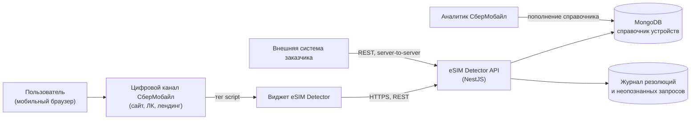
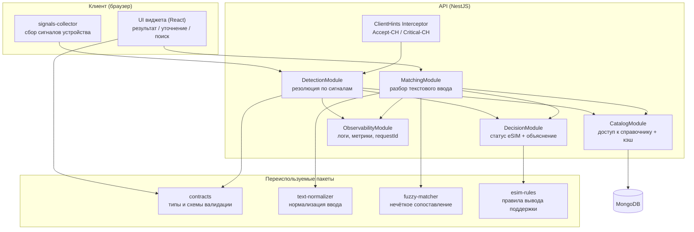
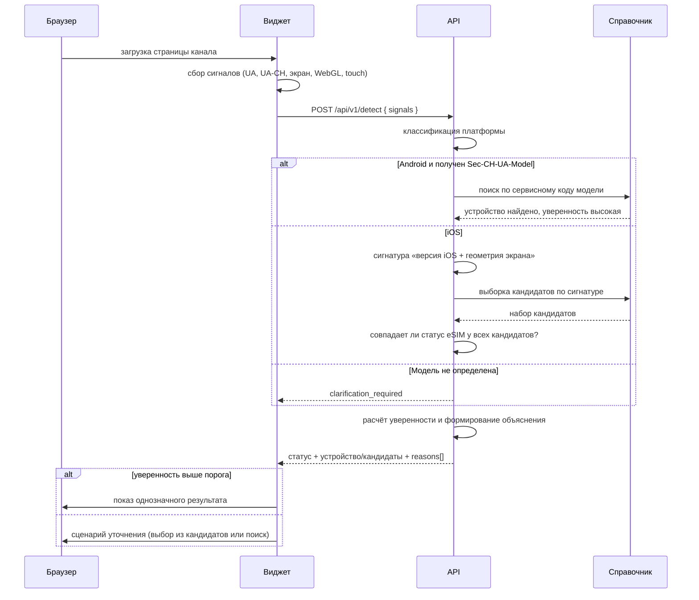
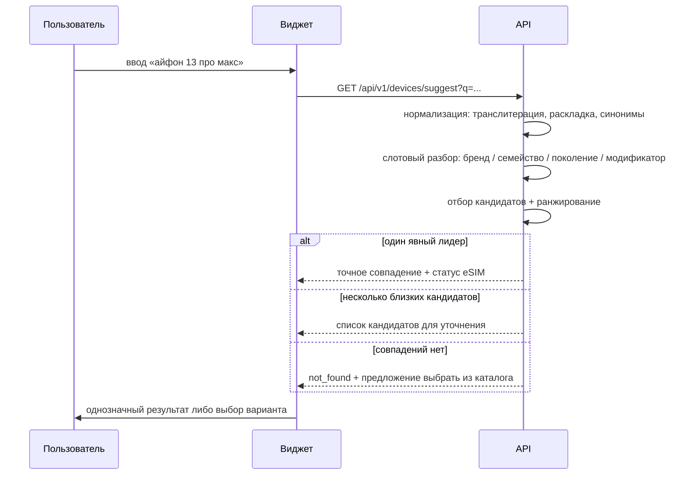

# 2. Архитектура решения

## 2.1. Контекст



Решение состоит из двух самостоятельно потребляемых продуктов:

- **API** — основной интеграционный контракт. Может использоваться заказчиком напрямую, без нашего UI.
- **Виджет** — готовый пользовательский интерфейс, встраиваемый одним тегом. Нужен, чтобы «подключение требовало минимальных усилий со стороны команды заказчика».

Демонстрационное веб-приложение — это тонкая обёртка над виджетом, отдельной бизнес-логики не содержит. Такое разделение гарантирует, что демонстрируемый сценарий и есть тот, который получит заказчик.

## 2.2. Состав компонентов



Ключевое архитектурное решение — вынесение алгоритмической части (`text-normalizer`, `fuzzy-matcher`, `esim-rules`) в отдельные пакеты без зависимостей от NestJS, HTTP и базы данных. Это даёт:

- полное покрытие модульными тестами без поднятия приложения и БД;
- возможность запускать стенд оценки качества (`eval`) как обычный скрипт на эталонной выборке;
- переносимость: при необходимости алгоритм может быть встроен заказчиком в другой рантайм.

## 2.3. Основной поток: автоопределение



## 2.4. Альтернативный поток: пользовательский ввод



## 2.5. Структура репозитория

```
esim-detector/
├── apps/
│   ├── api/                    # NestJS-приложение
│   │   ├── src/
│   │   │   ├── modules/
│   │   │   │   ├── detection/  # автоопределение по сигналам
│   │   │   │   ├── matching/   # обработка текстового ввода
│   │   │   │   ├── catalog/    # справочник устройств, кэш, индексы
│   │   │   │   ├── decision/   # вывод статуса eSIM и объяснения
│   │   │   │   ├── feedback/   # неопознанные запросы
│   │   │   │   └── health/     # проверки готовности
│   │   │   ├── common/         # фильтры ошибок, интерсепторы, requestId
│   │   │   └── config/         # конфигурация из переменных окружения
│   │   └── test/               # e2e-тесты (supertest)
│   ├── web/                    # демонстрационное приложение (React + Vite)
│   └── widget/                 # сборка встраиваемого виджета (Web Component)
├── packages/
│   ├── contracts/              # типы запросов/ответов, схемы валидации
│   ├── text-normalizer/        # нормализация пользовательского ввода
│   ├── fuzzy-matcher/          # нечёткое сопоставление и ранжирование
│   ├── esim-rules/             # правила вывода поддержки eSIM
│   ├── signals-collector/      # сбор сигналов в браузере
│   └── test-utils/             # изолированная тестовая база, фабрики данных
├── data/
│   ├── catalog/                # эталонный справочник устройств (источник истины)
│   └── fixtures/               # эталонные выборки для оценки качества
├── tools/
│   ├── seed/                   # импорт справочника в MongoDB
│   └── eval/                   # стенд оценки качества
├── docs/                       # настоящая документация
├── docker-compose.yml
└── .env.example
```

Источник истины для справочника устройств — файлы в `data/catalog/`, а не база данных. База — рабочая копия, наполняемая импортом. Это даёт ревью изменений справочника через обычный pull request и воспроизводимость демонстрационного контура.

## 2.6. Технологический стек и зависимости

| Слой | Технология | Обоснование выбора |
|---|---|---|
| API | NestJS 11 (Node.js 22 LTS), TypeScript | Модульность, встроенный DI, зрелая генерация OpenAPI, принят как стек проекта |
| Хранилище | MongoDB 7 | Принят как стек проекта; документная модель хорошо подходит для записей справочника с массивами псевдонимов, сервисных кодов и региональных исключений переменной структуры |
| Доступ к данным | Mongoose | ADR-011: вложенные структуры переменного состава, прямые операции импорта и агрегации, отсутствие потребности в наборе реплик |
| Фронтенд | React 19 + Vite + TypeScript | Принят как стек проекта; Vite даёт сборку виджета в единый файл |
| Стилизация | CSS-модули с токенами дизайна из брендбука | Виджет встраивается в чужие страницы: нужна изоляция стилей без тяжёлого рантайма |
| Валидация | class-validator / zod (единая схема с OpenAPI) | Валидация на границе API и автогенерация документации из одного источника |
| Тесты | Jest (модульные), Supertest (e2e API), Vitest + Testing Library (UI), `mongodb-memory-server` (изолированная тестовая база) | Стандарт для стека; изоляция тестовых данных — ADR-017 |
| Документация API | Swagger UI / OpenAPI 3.1 | Требование К4 |
| Развёртывание | Docker + Docker Compose | Требование «запуск в тестовом окружении без правки кода» |

Полный перечень зависимостей с версиями фиксируется в `package.json` и lock-файле; сводка с назначением каждой зависимости — в разделе «Описание зависимостей» корневого `README.md`.

### Язык реализации

Весь код проекта написан на TypeScript: API, интерфейс, виджет, переиспользуемые пакеты, инструменты командной строки и тесты. Файлы на JavaScript, включая конфигурационные скрипты, не допускаются. Конфигурация компилятора единая для монорепозитория, со строгим набором проверок (`strict`, `noUncheckedIndexedAccess`, `exactOptionalPropertyTypes` и далее по ADR-016).

Отдельное правило действует на границах системы. Решение по своей природе обрабатывает недоверенные данные — сигналы браузера, пользовательский ввод, CSV-выгрузки языковой модели, — а типы TypeScript в среде выполнения отсутствуют. Поэтому внешние данные не приводятся к типу утверждением `as`, а проходят валидацию схемой и лишь затем получают тип предметной области. Запрет на `any` и на утверждение типа для внешних данных обеспечивается правилом линтера. Обоснование — ADR-016.

## 2.7. Нефункциональные характеристики

| Характеристика | Целевое значение | Как достигается |
|---|---|---|
| Время ответа `/detect` | p95 < 50 мс | Справочник целиком кэшируется в памяти процесса; обращений к БД в горячем пути нет |
| Время ответа `/devices/search` | p95 < 100 мс | Предпостроенные индексы псевдонимов и триграмм в памяти |
| Масштабирование | горизонтальное, без ограничений | API не хранит состояние между запросами; кэш прогревается при старте |
| Доступность при недоступности БД | сервис продолжает отвечать | Прогретый кэш справочника позволяет обслуживать запросы; `/health/ready` при этом сообщает о деградации |
| Наблюдаемость | сквозной `X-Request-Id`, структурные логи, метрики Prometheus | `ObservabilityModule` |
| Приватность | не собираются персональные данные | Сигналы устройства обезличены; журнал хранит хеш сигнатуры, а не «сырые» значения. См. [10](./10-assumptions-and-limitations.md) |

## 2.8. Границы решения

Сервис отвечает **только** на вопрос о технической поддержке eSIM устройством. Он не проверяет:

- поддержку eSIM конкретным тарифом или оператором;
- разблокирован ли аппарат под другого оператора;
- фактическую доступность eSIM в прошивке конкретного экземпляра устройства (влияние региональной прошивки описано как ограничение);
- статус абонента и возможность выпуска профиля.

Эти проверки — зона ответственности систем заказчика; сервис проектируется так, чтобы его результат можно было передать в них следующим шагом.
