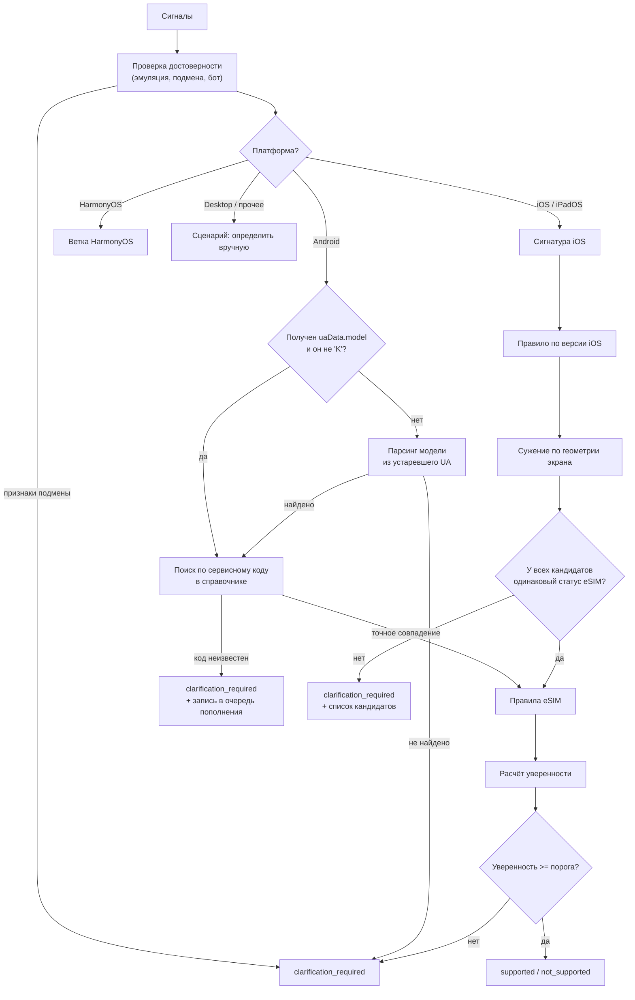

# 3. Алгоритм автоматического определения устройства

## 3.1. Постановка

Требуется, не запрашивая у пользователя никаких действий, определить его устройство настолько точно, чтобы однозначно ответить на вопрос о поддержке eSIM, либо честно признать, что данных недостаточно.

Важное уточнение постановки: целевая функция алгоритма — **не** «угадать точное название модели», а «определить статус поддержки eSIM без ошибок». Это разные задачи, и вторая существенно проще первой. На iOS точную модель установить невозможно, но статус eSIM — можно, и с высокой достоверностью. Формально: мы ищем не одно устройство, а минимальное множество устройств-кандидатов, и если у всех элементов множества статус eSIM одинаков, ответ считается определённым.

## 3.2. Собираемые сигналы

Сбор выполняет пакет `signals-collector` на клиенте; часть сигналов дополнительно проверяется на сервере по заголовкам запроса.

| Сигнал                                              | Источник                                      | Назначение                                                           |
| --------------------------------------------------- | --------------------------------------------- | -------------------------------------------------------------------- |
| `userAgent`                                         | `navigator.userAgent`                         | Классификация платформы, версия iOS, модель на устройствах без UA-CH |
| `uaData.platform`, `uaData.mobile`, `uaData.brands` | `navigator.userAgentData` (низкоэнтропийные)  | Классификация платформы и типа устройства                            |
| `uaData.model`                                      | `getHighEntropyValues(['model'])`             | **Основной сигнал для Android**: сервисный код или название модели   |
| `uaData.platformVersion`                            | `getHighEntropyValues(['platformVersion'])`   | Реальная версия Android                                              |
| `uaData.fullVersionList`, `architecture`, `bitness` | `getHighEntropyValues`                        | Уточнение окружения, выявление подмены                               |
| `screen.width/height`, `availWidth/availHeight`     | `window.screen`                               | Геометрия экрана в CSS-пикселях                                      |
| `devicePixelRatio`                                  | `window.devicePixelRatio`                     | Плотность экрана — ключевой различитель поколений iPhone             |
| `orientation`                                       | `screen.orientation.type`                     | Приведение геометрии к портретной ориентации                         |
| `maxTouchPoints`                                    | `navigator.maxTouchPoints`                    | Отличие реального мобильного устройства от эмуляции в браузере       |
| `hardwareConcurrency`                               | `navigator.hardwareConcurrency`               | Дополнительный различитель классов SoC                               |
| `deviceMemory`                                      | `navigator.deviceMemory`                      | Дополнительный различитель (недоступен в Safari)                     |
| `webgl.vendor`, `webgl.renderer`                    | WebGL, расширение `WEBGL_debug_renderer_info` | Идентификация GPU; выявление десктопной эмуляции                     |
| `Sec-CH-UA-*`                                       | HTTP-заголовки запроса                        | Серверная перекрёстная проверка клиентских сигналов                  |

Заголовки `Accept-CH` и `Critical-CH` выставляются интерсептором API, чтобы высокоэнтропийные подсказки приходили уже с первым запросом. При этом основным каналом получения модели остаётся JavaScript-вызов `getHighEntropyValues`: он работает независимо от того, настроил ли заказчик заголовки на своей странице, что критично для простоты интеграции (см. [07-integration.md](./07-integration.md), раздел о делегировании Client Hints).

Персональные данные не собираются: все сигналы описывают класс устройства, а не пользователя.

## 3.3. Общая схема резолюции



## 3.4. Ветка Android

Основной путь — сопоставление значения `Sec-CH-UA-Model` со справочником. Значение содержит либо сервисный код модели, либо маркетинговое название, в зависимости от вендора:

| Вендор                | Пример значения `Sec-CH-UA-Model`  |
| --------------------- | ---------------------------------- |
| Samsung               | `SM-S928B`, `SM-A556E`, `SM-F956B` |
| Google                | `Pixel 8 Pro`, `Pixel 7a`          |
| Xiaomi / Redmi / POCO | `23090RA98G`, `2312DRA50G`         |
| OPPO / OnePlus        | `CPH2451`, `PJD110`                |
| vivo                  | `V2312DA`                          |
| realme                | `RMX3771`                          |
| Honor                 | `ALI-NX1`                          |
| Huawei                | `ALN-AL00`                         |

Отсюда следуют требования к справочнику: запись устройства должна содержать массив сервисных кодов, а не одно значение (одна маркетинговая модель продаётся под разными кодами в разных регионах), а поиск должен работать как по коду, так и по маркетинговому названию.

Обработка особых случаев:

1. **`model` пустой или равен `K`** — браузер не поддерживает UA-CH (Firefox для Android) либо подсказка не была предоставлена. Пробуем извлечь модель из устаревшего формата User-Agent (в Firefox для Android модель по-прежнему присутствует). При неудаче — уточнение.
2. **Код неизвестен справочнику** — вероятно, новая модель. Отвечаем `clarification_required` и записываем сигнатуру в очередь пополнения справочника. Категорически не применяем эвристику «раз устройство новое, значит eSIM есть»: это прямой путь к ложным положительным результатам, которые штрафуются критерием К1.
3. **Код известен, но поддержка eSIM зависит от региона прошивки** — статус `conditional`, переводится в `clarification_required` с адресным вопросом пользователю (см. 3.7).
4. **WebView внутри приложения** — UA-CH могут быть недоступны; поведение аналогично п. 1.

## 3.5. Ветка iOS

Точная модель недоступна, поэтому строится сигнатура и определяется множество кандидатов.

### Шаг 1. Правило по версии iOS

Версия iOS присутствует в User-Agent Safari (`CPU iPhone OS 18_5 like Mac OS X`) и не подвергается редуцированию. Каждая версия iOS поддерживается ограниченным набором моделей, а самая старая поддерживаемая модель задаёт нижнюю границу «возраста» устройства.

Ключевой факт: первыми iPhone с поддержкой eSIM стали iPhone XS, XS Max и XR (2018). Все модели, вышедшие позднее, а также iPhone SE 2-го и 3-го поколений, поддерживают eSIM. Модели iPhone X и старше — не поддерживают.

Отсюда правило: **если устройство работает на iOS 17 или новее, оно физически не может быть моделью старше iPhone XR/XS, а значит поддерживает eSIM.** Это вывод из ограничений совместимости самой Apple, а не статистическая догадка, поэтому он даёт высокую достоверность при полном отсутствии информации о модели.

| Версия iOS    | Минимальная поддерживаемая модель  | Следствие для eSIM                                    |
| ------------- | ---------------------------------- | ----------------------------------------------------- |
| iOS 26        | iPhone 11, SE (2-го поколения)     | Поддерживается, достоверность высокая                 |
| iOS 18        | iPhone XR, XS, SE (2-го поколения) | Поддерживается, достоверность высокая                 |
| iOS 17        | iPhone XR, XS, SE (2-го поколения) | Поддерживается, достоверность высокая                 |
| iOS 16        | iPhone 8, X, SE (2-го поколения)   | Неоднозначно: требуется сужение по геометрии экрана   |
| iOS 15 и ниже | iPhone 6s, SE (1-го поколения)     | Неоднозначно, в большинстве случаев не поддерживается |

Точные границы совместимости фиксируются данными в справочнике (поля `os.maxVersion` и `os.minVersion` записи устройства), а не константами в коде: при выходе новой версии iOS обновляется только справочник.

### Шаг 2. Сужение по геометрии экрана

Комбинация «ширина × высота в CSS-пикселях (портретная ориентация) + `devicePixelRatio`» задаёт группу моделей iPhone. Ниже — принцип формирования сигнатур; фактические значения хранятся в коллекции сигнатур справочника и подтверждаются эталонной выборкой сигналов реальных устройств.

| Сигнатура (CSS px @ DPR) | Кандидаты                                       | Статус eSIM у группы        |
| ------------------------ | ----------------------------------------------- | --------------------------- |
| 320×568 @2               | iPhone 5/5s/5c, SE (1-го поколения)             | Единый: не поддерживается   |
| 375×667 @2               | iPhone 6/6s/7/8, SE (2-го и 3-го поколений)     | Неоднозначный → нужен шаг 1 |
| 414×736 @3               | iPhone 6/6s/7/8 Plus                            | Единый: не поддерживается   |
| 375×812 @3               | iPhone X, XS, 11 Pro, 12 mini, 13 mini          | Неоднозначный → нужен шаг 1 |
| 414×896 @2               | iPhone XR, 11                                   | Единый: поддерживается      |
| 414×896 @3               | iPhone XS Max, 11 Pro Max                       | Единый: поддерживается      |
| 390×844 @3               | iPhone 12/12 Pro/13/13 Pro/14                   | Единый: поддерживается      |
| 428×926 @3               | iPhone 12 Pro Max, 13 Pro Max, 14 Plus          | Единый: поддерживается      |
| 393×852 @3               | iPhone 14 Pro, 15, 15 Pro, 16, 16e              | Единый: поддерживается      |
| 430×932 @3               | iPhone 14 Pro Max, 15 Plus, 15 Pro Max, 16 Plus | Единый: поддерживается      |
| 402×874 @3               | iPhone 16 Pro                                   | Единый: поддерживается      |
| 440×956 @3               | iPhone 16 Pro Max                               | Единый: поддерживается      |

Шаги 1 и 2 дополняют друг друга и вместе покрывают неоднозначности каждого по отдельности:

- сигнатура `375×667 @2` сама по себе неоднозначна (iPhone 8 без eSIM и SE 2/3 с eSIM), но в сочетании с iOS 17+ однозначно указывает на SE 2/3 → поддерживается;
- сигнатура `375×812 @3` неоднозначна (iPhone X без eSIM), но с iOS 17+ исключает X → поддерживается;
- та же сигнатура с iOS 16 оставляет iPhone X в кандидатах → корректный переход к уточнению.

Дополнительные различители, применяемые при необходимости: `hardwareConcurrency`, строка рендерера WebGL, режим экономии данных, наличие отдельных возможностей CSS/JS, появившихся в конкретных версиях WebKit.

### Шаг 3. Проверка масштабирования экрана

Пользователь мог включить режим «Увеличенный» (Display Zoom), из-за чего геометрия экрана отличается от штатной. Такие значения также описываются в справочнике как отдельные сигнатуры, помеченные признаком масштабирования, чтобы не терять определение.

## 3.6. Расчёт уверенности и объяснение

Уверенность — величина в диапазоне [0, 1], складываемая из вкладов подтверждающих сигналов. Вклады фиксированы, задокументированы и покрыты тестами; итог сравнивается с двумя порогами.

| Свидетельство                                            | Вклад                                |
| -------------------------------------------------------- | ------------------------------------ |
| Точное совпадение сервисного кода модели (Android)       | Решающее (уверенность высокая)       |
| Единый статус eSIM у всех кандидатов после сужения       | Высокий                              |
| Согласованность заголовков запроса и клиентских сигналов | Повышающий                           |
| Модель определена, но с региональными исключениями       | Понижающий (переход к `conditional`) |
| Множество кандидатов с разными статусами eSIM            | Обнуляющий → уточнение               |
| Признаки эмуляции или подмены сигналов                   | Обнуляющий → уточнение               |

Пороги: при уверенности не ниже `CONFIDENCE_ANSWER_THRESHOLD` (значение по умолчанию задаётся в конфигурации) выдаётся однозначный статус, иначе — `clarification_required`. Пороги вынесены в конфигурацию, чтобы заказчик мог настроить баланс «доля автоответов / допустимый риск ошибки» без изменения кода.

Каждый ответ содержит массив `reasons[]` — перечень сработавших правил в машиночитаемом виде, например:

```json
"reasons": [
  { "code": "PLATFORM_DETECTED", "detail": "iOS 18.5" },
  { "code": "IOS_VERSION_IMPLIES_MIN_MODEL", "detail": "iOS 18 не поддерживается моделями старше iPhone XR" },
  { "code": "SCREEN_SIGNATURE_MATCHED", "detail": "393x852@3" },
  { "code": "CANDIDATES_AGREE_ON_ESIM", "detail": "5 кандидатов, статус единый" }
]
```

Это закрывает требование прозрачности решения (К3) и одновременно служит инструментом отладки при разборе расхождений на контрольной выборке заказчика.

## 3.7. Сценарий уточнения

Уточнение — не сообщение об ошибке, а короткий диалог, спроектированный так, чтобы завершиться результатом. Применяется наиболее дешёвый для пользователя из применимых вариантов:

1. **Выбор из кандидатов.** Если множество кандидатов сужено до 2–5 моделей, показываем их списком: «Уточните вашу модель». Пользователю нужен один тап. Это основной сценарий на iOS с iOS 16 и старше.
2. **Один уточняющий вопрос.** Если статус зависит от одного фактора, задаём вопрос именно о нём: «Устройство приобретено в Китае?» (для iPhone с двумя физическими SIM), «Указана ли поддержка eSIM в настройках?».
3. **Поиск по названию.** Если сузить не удалось, предлагаем ввести модель — переход к алгоритму из [04-matching-algorithm.md](./04-matching-algorithm.md) с подсказками при вводе.
4. **Проверка на устройстве.** Крайний случай: краткая инструкция, где в настройках посмотреть наличие eSIM, с одновременным предложением обратиться в поддержку.

## 3.8. Защита от ложных определений

Меры, направленные непосредственно на пункт К1 «отсутствие ложных результатов определения»:

1. **Запрет догадок по умолчанию.** Неизвестный сервисный код никогда не трактуется как «поддерживает».
2. **Обнаружение эмуляции.** Признаки: заявлен iOS при `maxTouchPoints === 0`; строка рендерера WebGL содержит признаки десктопного GPU при мобильном UA; несоответствие заголовков `Sec-CH-UA-*` клиентским сигналам. При срабатывании — уточнение.
3. **Отсечение неподдерживаемых сценариев.** Десктопные браузеры, планшеты, умные часы, ТВ-приставки — отдельные статусы и текстовые формулировки; попытка «определить телефон» для них не предпринимается.
4. **Учёт региональных вариантов.** Модели с региональными исключениями по eSIM в справочнике помечены, что переводит их в `conditional`, а не в `supported`.
5. **Регрессионный контроль.** Каждый разобранный случай ошибки пополняет эталонную выборку. Стенд оценки качества в CI не допускает роста доли ложных определений.

## 3.9а. Реализация агента 5 — принятые уточнения (ADR-024)

Полное обоснование — docs/09-decisions.md, ADR-024. Кратко, для читающего этот раздел без ADR:

- **Уверенность** вычисляется явной константной таблицей (`apps/api/src/modules/detection/confidence.ts`), а не абстрактной формулой: базовые значения по методу определения плюс поправка на согласованность заголовков `Sec-CH-UA-*`, ограниченная `[0, 1]`. Итоговый статус — пересечение категорического вывода `esim-rules` (согласие кандидатов/условия/гейт достоверности данных) и порога `CONFIDENCE_ANSWER_THRESHOLD`: недостаточная уверенность понижает уже определённый статус до уточнения (код `CONFIDENCE_BELOW_THRESHOLD`).
- **Ветка HarmonyOS** обрабатывается тем же кодом, что и Android (сопоставление по `Sec-CH-UA-Model`/устаревшему User-Agent) — в справочнике пока нет ни одной записи этой платформы (приложение А §А.8.3), поэтому специализировать ветку не на чем; открытый пробел на случай, если браузеры HarmonyOS не поддерживают `navigator.userAgentData` вовсе.
- **Обнаружение эмуляции** (§3.8, п.2) использует курируемый в коде список маркеров десктопного/программного рендерера WebGL (`SwiftShader`, `llvmpipe`, семейство `ANGLE (Intel/NVIDIA/AMD`, и т. п.) — заведомо неполный список, открытое ограничение.
- **Резолюция ветки iOS через `screen_signatures`** реализована отдельным сервисом модуля `detection` (`ScreenSignatureModule`), переиспользующим Mongoose-схему `CatalogModule` без изменения самого `CatalogModule` (AGENTS.md запрещает его переписывать). Пересечение кандидатов правила по версии ОС и сигнатуры экрана при пустом результате разрешается в пользу сигнатуры экрана (прямое физическое измерение весит больше вывода по неполноте справочника).

## 3.9. Ограничения ветки автоопределения

Ограничения перечислены полностью и осознанно — их наличие является свойством веб-платформы, а не дефектом реализации. Подробно — в [10-assumptions-and-limitations.md](./10-assumptions-and-limitations.md).

- Модель iPhone принципиально неопределима; определяется группа моделей.
- Региональные варианты одной и той же модели (в частности, версии для рынка КНР) неразличимы средствами браузера.
- Фактическое наличие eSIM в конкретной прошивке проверить нельзя.
- Пользователь может подменить сигналы; часть подмен обнаруживается, но не все.
- В браузерах с усиленной защитой от отслеживания часть сигналов может быть недоступна или искажена, что снижает уверенность и повышает долю уточнений.
