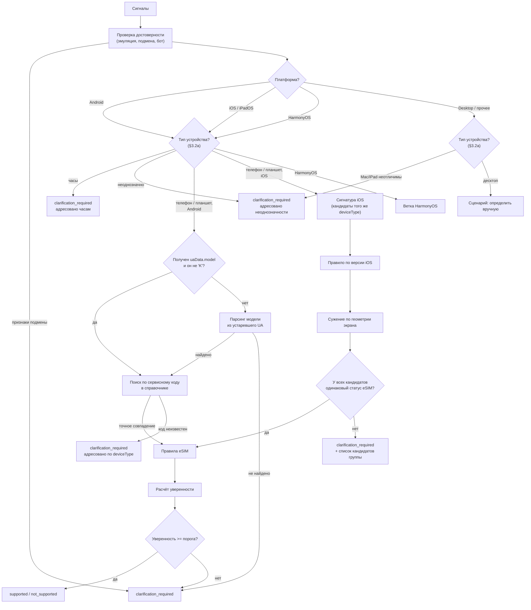

# 3. Алгоритм автоматического определения устройства

## 3.1. Постановка

Требуется, не запрашивая у пользователя никаких действий, определить его устройство настолько точно, чтобы однозначно ответить на вопрос о поддержке eSIM, либо честно признать, что данных недостаточно.

Важное уточнение постановки: целевая функция алгоритма — **не** «угадать точное название модели», а «определить статус поддержки eSIM без ошибок». Это разные задачи, и вторая существенно проще первой. На iOS точную модель установить невозможно, но статус eSIM — можно, и с высокой достоверностью. Формально: мы ищем не одно устройство, а минимальное множество устройств-кандидатов, и если у всех элементов множества статус eSIM одинаков, ответ считается определённым.

## 3.2. Собираемые сигналы

Сбор выполняет пакет `signals-collector` на клиенте; часть сигналов дополнительно проверяется на сервере по заголовкам запроса.

| Сигнал                                              | Источник                                      | Назначение                                                                                                                                                              |
| --------------------------------------------------- | --------------------------------------------- | ----------------------------------------------------------------------------------------------------------------------------------------------------------------------- |
| `userAgent`                                         | `navigator.userAgent`                         | Классификация платформы, версия iOS, модель на устройствах без UA-CH                                                                                                    |
| `uaData.platform`, `uaData.mobile`, `uaData.brands` | `navigator.userAgentData` (низкоэнтропийные)  | Классификация платформы и типа устройства                                                                                                                               |
| `uaData.model`                                      | `getHighEntropyValues(['model'])`             | **Основной сигнал для Android**: сервисный код или название модели                                                                                                      |
| `uaData.platformVersion`                            | `getHighEntropyValues(['platformVersion'])`   | Реальная версия Android                                                                                                                                                 |
| `uaData.fullVersionList`, `architecture`, `bitness` | `getHighEntropyValues`                        | Уточнение окружения, выявление подмены                                                                                                                                  |
| `screen.width/height`, `availWidth/availHeight`     | `window.screen`                               | Геометрия экрана в CSS-пикселях                                                                                                                                         |
| `devicePixelRatio`                                  | `window.devicePixelRatio`                     | Плотность экрана — ключевой различитель поколений iPhone                                                                                                                |
| `orientation`                                       | `screen.orientation.type`                     | Приведение геометрии к портретной ориентации                                                                                                                            |
| `maxTouchPoints`                                    | `navigator.maxTouchPoints`                    | Отличие реального мобильного устройства от эмуляции в браузере; на iOS — единственный различитель iPad в режиме сайта для компьютера от настоящего Mac (§3.2а, ADR-034) |
| `hardwareConcurrency`                               | `navigator.hardwareConcurrency`               | Дополнительный различитель классов SoC                                                                                                                                  |
| `deviceMemory`                                      | `navigator.deviceMemory`                      | Дополнительный различитель (недоступен в Safari)                                                                                                                        |
| `webgl.vendor`, `webgl.renderer`                    | WebGL, расширение `WEBGL_debug_renderer_info` | Идентификация GPU; выявление десктопной эмуляции                                                                                                                        |
| `Sec-CH-UA-*`                                       | HTTP-заголовки запроса                        | Серверная перекрёстная проверка клиентских сигналов                                                                                                                     |

Заголовки `Accept-CH` и `Critical-CH` выставляются интерсептором API, чтобы высокоэнтропийные подсказки приходили уже с первым запросом. При этом основным каналом получения модели остаётся JavaScript-вызов `getHighEntropyValues`: он работает независимо от того, настроил ли заказчик заголовки на своей странице, что критично для простоты интеграции (см. [07-integration.md](./07-integration.md), раздел о делегировании Client Hints).

Персональные данные не собираются: все сигналы описывают класс устройства, а не пользователя.

## 3.2а. Классификация типа устройства (docs/09-decisions.md ADR-034, этап 5.6)

Отдельный шаг ПОСЛЕ классификации платформы (`classifyDeviceType`, `apps/api/src/modules/detection/device-type/`), потому что «какая ОС» и «какой класс устройства» — разные вопросы, отвечать на которые приходится разными сигналами. Результат — `deviceType` (`phone`/`tablet`/`watch`/`other`) плюс флаг `ambiguous`: неоднозначные сигналы дают уточнение, а не догадку о типе (AGENTS.md, предметное правило 1, применённое здесь не к статусу eSIM, а к самому типу устройства — ошибка в типе такой же ложный результат в смысле К1).

Порядок проверок:

1. **Часы — раньше платформы и раньше всего остального.** Признак — слово `watch`/`wear os` в `userAgent` либо в `uaData.model` (Sec-CH-UA-Model может называть модель прямо, например `"SM-L315F Galaxy Watch7"`). У часов почти никогда нет полноценного браузера (§3.9, «Отсечение неподдерживаемых сценариев»), поэтому задача — не попытаться разобрать сигналы как телефон и получить ложный результат не по адресу, а не покрыть часы полнотой (docs/10 О-13, ADR-025 п.4).
2. **iOS.** Явный токен `iPad` в User-Agent → `tablet`; явный `iPhone`/`iPod` → `phone`. **Ловушка iPadOS 13+**: Safari на iPadOS 13 и новее по умолчанию отправляет User-Agent НАСТОЛЬНОГО Safari на macOS (`"Macintosh; Intel Mac OS X ..."`) без единого упоминания iPad — по одному `userAgent` такой iPad неотличим от настоящего Mac. Различитель — `maxTouchPoints`: у Mac (даже с трекпадом Force Touch) он равен `0`, у iPad — больше `0`. Проверка выполнена в `classify-platform.ts` (переключает саму платформу на `ios`, а не только тип — от неё зависит весь дальнейший маршрут оркестрации): Mac-подобный UA классифицируется как iPad ТОЛЬКО когда `maxTouchPoints` получен И достоверно больше `0`. Отсутствие сигнала (`undefined`, а не `0`) не трактуется как признак планшета — это ровно тот случай, когда настоящий Mac с сенсорным экраном и iPad в режиме настольного сайта неразличимы, и результат — `ambiguous: true`, а не молчаливая догадка в пользу десктопа.
3. **Android / HarmonyOS.** `uaData.mobile === false` (`Sec-CH-UA-Mobile: ?0`) → `tablet`; `=== true` → `phone`. При отсутствии сигнала (Firefox для Android, WebView без UA-CH) — резервная проверка по геометрии экрана: меньшая сторона ≥ 600 CSS px (та же граница, что Android использует как `sw600dp` для разметки планшетов в самой платформе) даёт `tablet`, но с флагом `ambiguous: true` — резервный сигнал слабее прямого заявления браузера.

Оркестрация `DetectionService` использует классификацию для АДРЕСАЦИИ ответа, а не взамен проверенных данных: если сигнал сопоставился с записью справочника по точному сервисному коду (ветка Android/HarmonyOS) или по сигнатуре экрана (ветка iOS), тип устройства в ответе (`detection.deviceType`) берётся из самой записи — она уже проверенный факт данных. Классификация по сигналам используется, когда точного сопоставления нет: сообщение об отказе называет предполагаемый тип («похоже, это планшет на Android — уточните вручную») вместо безликого «модель устройства не найдена».

## 3.3. Общая схема резолюции



## 3.4. Ветка Android

Основной путь — сопоставление значения `Sec-CH-UA-Model` со справочником. Значение содержит либо сервисный код модели, либо маркетинговое название, в зависимости от вендора:

| Вендор                | Пример значения `Sec-CH-UA-Model`  |
| --------------------- | ---------------------------------- |
| Samsung               | `SM-S928B`, `SM-A556E`, `SM-F956B` |
| Google                | `Pixel 8 Pro`, `Pixel 7a`          |
| Xiaomi / Redmi / POCO | `23090RA98G`, `2312DRA50G`         |
| OPPO / OnePlus        | `CPH2451`, `PJD110`                |
| vivo                  | `V2312DA`                          |
| realme                | `RMX3771`                          |
| Honor                 | `ALI-NX1`                          |
| Huawei                | `ALN-AL00`                         |

Отсюда следуют требования к справочнику: запись устройства должна содержать массив сервисных кодов, а не одно значение (одна маркетинговая модель продаётся под разными кодами в разных регионах), а поиск должен работать как по коду, так и по маркетинговому названию.

Обработка особых случаев:

1. **`model` пустой или равен `K`** — браузер не поддерживает UA-CH (Firefox для Android) либо подсказка не была предоставлена. Пробуем извлечь модель из устаревшего формата User-Agent (в Firefox для Android модель по-прежнему присутствует). При неудаче — уточнение.
2. **Код неизвестен справочнику** — вероятно, новая модель. Отвечаем `clarification_required` и записываем сигнатуру в очередь пополнения справочника. Категорически не применяем эвристику «раз устройство новое, значит eSIM есть»: это прямой путь к ложным положительным результатам, которые штрафуются критерием К1.
3. **Код известен, но поддержка eSIM зависит от региона прошивки** — статус `conditional`, переводится в `clarification_required` с адресным вопросом пользователю (см. 3.7).
4. **WebView внутри приложения** — UA-CH могут быть недоступны; поведение аналогично п. 1.

## 3.5. Ветка iOS

Точная модель недоступна, поэтому строится сигнатура и определяется множество кандидатов.

### Шаг 1. Правило по версии iOS

Версия iOS присутствует в User-Agent Safari (`CPU iPhone OS 18_5 like Mac OS X`) и не подвергается редуцированию. Каждая версия iOS поддерживается ограниченным набором моделей, а самая старая поддерживаемая модель задаёт нижнюю границу «возраста» устройства.

Ключевой факт: первыми iPhone с поддержкой eSIM стали iPhone XS, XS Max и XR (2018). Все модели, вышедшие позднее, а также iPhone SE 2-го и 3-го поколений, поддерживают eSIM. Модели iPhone X и старше — не поддерживают.

Отсюда правило: **если устройство работает на iOS 17 или новее, оно физически не может быть моделью старше iPhone XR/XS, а значит поддерживает eSIM.** Это вывод из ограничений совместимости самой Apple, а не статистическая догадка, поэтому он даёт высокую достоверность при полном отсутствии информации о модели.

| Версия iOS    | Минимальная поддерживаемая модель  | Следствие для eSIM                                    |
| ------------- | ---------------------------------- | ----------------------------------------------------- |
| iOS 26        | iPhone 11, SE (2-го поколения)     | Поддерживается, достоверность высокая                 |
| iOS 18        | iPhone XR, XS, SE (2-го поколения) | Поддерживается, достоверность высокая                 |
| iOS 17        | iPhone XR, XS, SE (2-го поколения) | Поддерживается, достоверность высокая                 |
| iOS 16        | iPhone 8, X, SE (2-го поколения)   | Неоднозначно: требуется сужение по геометрии экрана   |
| iOS 15 и ниже | iPhone 6s, SE (1-го поколения)     | Неоднозначно, в большинстве случаев не поддерживается |

Точные границы совместимости фиксируются данными в справочнике (поля `os.maxVersion` и `os.minVersion` записи устройства), а не константами в коде: при выходе новой версии iOS обновляется только справочник.

### Шаг 2. Сужение по геометрии экрана

Комбинация «ширина × высота в CSS-пикселях (портретная ориентация) + `devicePixelRatio`» задаёт группу моделей iPhone. Ниже — принцип формирования сигнатур; фактические значения хранятся в коллекции сигнатур справочника и подтверждаются эталонной выборкой сигналов реальных устройств.

| Сигнатура (CSS px @ DPR) | Кандидаты                                       | Статус eSIM у группы              |
| ------------------------ | ----------------------------------------------- | --------------------------------- |
| 320×568 @2               | iPhone 5/5s/5c, SE (1-го поколения)             | Единый: не поддерживается         |
| 375×667 @2               | iPhone 6/6s/7/8, SE (2-го и 3-го поколений)     | Неоднозначный → нужен шаг 1       |
| 414×736 @3               | iPhone 6/6s/7/8 Plus                            | Единый: не поддерживается         |
| 375×812 @3               | iPhone X, XS, 11 Pro, 12 mini, 13 mini          | Неоднозначный → нужен шаг 1       |
| 414×896 @2               | iPhone XR, 11                                   | Единый: условный (регион КНР)     |
| 414×896 @3               | iPhone XS Max, 11 Pro Max                       | Единый: условный (регион КНР)     |
| 390×844 @3               | iPhone 12/12 Pro/13/13 Pro/14, 16e, 17e         | Неоднозначный (17e без условия)   |
| 428×926 @3               | iPhone 12 Pro Max, 13 Pro Max, 14 Plus          | Единый: условный (регион КНР)     |
| 393×852 @3               | iPhone 14 Pro, 15, 15 Pro, 16                   | Единый: условный (регион КНР)     |
| 430×932 @3               | iPhone 14 Pro Max, 15 Plus, 15 Pro Max, 16 Plus | Единый: условный (регион КНР)     |
| 402×874 @3               | iPhone 16 Pro, 17, 17 Pro                       | Единый: условный (регион КНР)     |
| 440×956 @3               | iPhone 16 Pro Max, 17 Pro Max                   | Единый: условный (регион КНР)     |
| 420×912 @3               | iPhone Air                                      | Единый: поддерживается (1 модель) |

Таблица приведена к фактическим данным курируемого ядра этапом 5.3 (ADR-030); фактические значения по-прежнему живут в коллекции сигнатур, а не в этом документе. Три правки существенны для читателя:

- **iPhone 16e и 17e перенесены в группу `390×844 @3`**: их дисплей совпадает с iPhone 14 (2532×1170 физических пикселей при масштабе 3), а не с 14 Pro/15/16. Прежняя строка относила 16e к `393×852 @3` — это была ошибка, дававшая владельцу 16e чужую группу кандидатов.
- **Статус большинства групп — «условный», а не «поддерживается»**: версии для материкового Китая (плюс Гонконга и Макао у части моделей) идут с двумя физическими nano-SIM и eSIM не имеют, поэтому запись такой модели имеет `esim.support: conditional` с условием по региону (docs/05 §5.4, случай 1). Регион не входит в собираемые сигналы (§3.2) вовсе, поэтому по одной сигнатуре экрана такая группа не даёт статуса без ответа пользователя — но, в отличие от прежней реализации, сервис задаёт для этого именно тот вопрос, который разрешает статус, а не список моделей (§3.7, п.2; этап 5.3а), и повторный запрос с ответом (`context.region`) возвращает определённый статус.
- **Правило по КНР не сплошное**: iPhone Air (eSIM-only во всех регионах) и iPhone 17e поддерживают eSIM и в континентальном Китае, а iPhone XS, 12 mini, 13 mini, SE 2/3 не выпускались в версии с двумя nano-SIM — у этих моделей регионального условия нет. Именно поэтому группа `390×844 @3` неоднозначна: 17e без условия стоит рядом с условными 12/13/14/16e.

Шаги 1 и 2 дополняют друг друга и вместе покрывают неоднозначности каждого по отдельности:

- сигнатура `375×667 @2` сама по себе неоднозначна (iPhone 8 без eSIM и SE 2/3 с eSIM), но в сочетании с iOS 17+ однозначно указывает на SE 2/3 → поддерживается;
- сигнатура `375×812 @3` неоднозначна (iPhone X без eSIM), но с iOS 17+ исключает X → поддерживается;
- та же сигнатура с iOS 16 оставляет iPhone X в кандидатах → корректный переход к уточнению.

Дополнительные различители, применяемые при необходимости: `hardwareConcurrency`, строка рендерера WebGL, режим экономии данных, наличие отдельных возможностей CSS/JS, появившихся в конкретных версиях WebKit.

### Шаг 3. Проверка масштабирования экрана

Пользователь мог включить режим «Увеличенный» (Display Zoom), из-за чего геометрия экрана отличается от штатной. Такие значения также описываются в справочнике как отдельные сигнатуры, помеченные признаком масштабирования, чтобы не терять определение.

## 3.6. Расчёт уверенности и объяснение

Уверенность — величина в диапазоне [0, 1], складываемая из вкладов подтверждающих сигналов. Вклады фиксированы, задокументированы и покрыты тестами; итог сравнивается с двумя порогами.

| Свидетельство                                            | Вклад                                |
| -------------------------------------------------------- | ------------------------------------ |
| Точное совпадение сервисного кода модели (Android)       | Решающее (уверенность высокая)       |
| Единый статус eSIM у всех кандидатов после сужения       | Высокий                              |
| Согласованность заголовков запроса и клиентских сигналов | Повышающий                           |
| Модель определена, но с региональными исключениями       | Понижающий (переход к `conditional`) |
| Множество кандидатов с разными статусами eSIM            | Обнуляющий → уточнение               |
| Признаки эмуляции или подмены сигналов                   | Обнуляющий → уточнение               |

Пороги: при уверенности не ниже `CONFIDENCE_ANSWER_THRESHOLD` (значение по умолчанию задаётся в конфигурации) выдаётся однозначный статус, иначе — `clarification_required`. Пороги вынесены в конфигурацию, чтобы заказчик мог настроить баланс «доля автоответов / допустимый риск ошибки» без изменения кода.

**Явное решение (этап 5.3а, ADR-031): наличие ответа пользователя на региональный вопрос (`context.region`/`region`) НЕ добавляет отдельный вклад в таблицу `BASE_CONFIDENCE`.** Прямой ответ пользователя разрешает категорический вывод `esim-rules` (условие сработало/не сработало) полностью — это не сигнал устройства с частичной надёжностью, который стоило бы взвешивать, а точное значение, тем же образом уже участвующее в вычислении статуса, что и любое другое условие `conditional`. Существующая базовая уверенность метода (сервисный код Android, согласие кандидатов iOS по версии/сигнатуре) остаётся ровно той, что была бы без региона, — только сам категорический статус меняется с `clarification_required` на `supported`/`not_supported`. Решение зафиксировано явно, чтобы отсутствие изменения в `apps/api/src/modules/detection/confidence.ts` не читалось как забытый случай.

Каждый ответ содержит массив `reasons[]` — перечень сработавших правил в машиночитаемом виде, например:

```json
"reasons": [
  { "code": "PLATFORM_DETECTED", "detail": "iOS 18.5" },
  { "code": "IOS_VERSION_IMPLIES_MIN_MODEL", "detail": "iOS 18 не поддерживается моделями старше iPhone XR" },
  { "code": "SCREEN_SIGNATURE_MATCHED", "detail": "393x852@3" },
  { "code": "CANDIDATES_AGREE_ON_ESIM", "detail": "5 кандидатов, статус единый" }
]
```

Это закрывает требование прозрачности решения (К3) и одновременно служит инструментом отладки при разборе расхождений на контрольной выборке заказчика.

## 3.7. Сценарий уточнения

Уточнение — не сообщение об ошибке, а короткий диалог, спроектированный так, чтобы завершиться результатом. Применяется наиболее дешёвый для пользователя из применимых вариантов:

1. **Выбор из кандидатов.** Если множество кандидатов сужено до 2–5 моделей и причина расхождения не сводится к одному общему вопросу (см. п.2), показываем их списком: «Уточните вашу модель». Пользователю нужен один тап.
2. **Один уточняющий вопрос.** Если статус ВСЕХ кандидатов группы зависит от одного и того же нерешённого фактора — у всех есть `esim.conditions` одного `scope` и буквально совпадающий `esim.clarifyingQuestion` (docs/05 §5.4) — сервис задаёт именно этот вопрос вместо списка моделей: «Лоток для SIM-карты вашего iPhone вмещает одну nano-SIM или две?» (различитель версии для материкового Китая/Гонконга/Макао, реализовано этапом 5.3а как ветка `apps/api/src/modules/detection/ios/build-ios-clarification.ts`), «Указана ли поддержка eSIM в настройках?». Список моделей здесь вводил бы пользователя в заблуждение о природе вопроса — сервис не знает не модель, а недостающий контекст (регион/версия ОС). Если хотя бы у одного кандидата условий нет либо условия/вопросы кандидатов расходятся (пример — сигнатура `390×844@3`, где iPhone 17e без условия стоит рядом с условными 12/13/14/16e), применяется п.1. Ответ пользователя на этот вопрос передаётся ПОВТОРНЫМ запросом `/detect` или `/devices/search` полем `context.region`/`region` (docs/06 §6.2–6.3) — сервис не хранит состояние между запросами, поэтому клиент присылает ответ заново.
3. **Поиск по названию.** Если сузить не удалось, предлагаем ввести модель — переход к алгоритму из [04-matching-algorithm.md](./04-matching-algorithm.md) с подсказками при вводе.
4. **Проверка на устройстве.** Крайний случай: краткая инструкция, где в настройках посмотреть наличие eSIM, с одновременным предложением обратиться в поддержку.

## 3.8. Защита от ложных определений

Меры, направленные непосредственно на пункт К1 «отсутствие ложных результатов определения»:

1. **Запрет догадок по умолчанию.** Неизвестный сервисный код никогда не трактуется как «поддерживает».
2. **Обнаружение эмуляции.** Признаки: заявлен iOS при `maxTouchPoints === 0`; строка рендерера WebGL содержит признаки десктопного GPU при мобильном UA; несоответствие заголовков `Sec-CH-UA-*` клиентским сигналам. При срабатывании — уточнение.
3. **Отсечение неподдерживаемых сценариев.** Десктопные браузеры, планшеты, умные часы, ТВ-приставки — отдельные статусы и текстовые формулировки; попытка «определить телефон» для них не предпринимается. Планшеты (этап 5.6, ADR-034) резолвятся тем же путём, что и телефоны той же платформы (сервисный код на Android, группа кандидатов сигнатуры экрана на iOS), но по своему множеству кандидатов (`deviceType`-параметр отбора) — ответ адресован планшету, а не наращивает полноту справочника по нему специально. Умные часы почти никогда не открывают произвольные страницы в браузере — их распознавание (по слову `watch`/`wear os` в сигналах) применяется РАНЬШЕ платформы именно для того, чтобы не попытаться разобрать их сигналы как телефон, а не ради охвата статуса eSIM по моделям часов (docs/10 О-13).
4. **Учёт региональных вариантов.** Модели с региональными исключениями по eSIM в справочнике помечены, что переводит их в `conditional`, а не в `supported`.
5. **Регрессионный контроль.** Каждый разобранный случай ошибки пополняет эталонную выборку. Стенд оценки качества в CI не допускает роста доли ложных определений.

## 3.9а. Реализация агента 5 — принятые уточнения (ADR-024)

Полное обоснование — docs/09-decisions.md, ADR-024. Кратко, для читающего этот раздел без ADR:

- **Уверенность** вычисляется явной константной таблицей (`apps/api/src/modules/detection/confidence.ts`), а не абстрактной формулой: базовые значения по методу определения плюс поправка на согласованность заголовков `Sec-CH-UA-*`, ограниченная `[0, 1]`. Итоговый статус — пересечение категорического вывода `esim-rules` (согласие кандидатов/условия/гейт достоверности данных) и порога `CONFIDENCE_ANSWER_THRESHOLD`: недостаточная уверенность понижает уже определённый статус до уточнения (код `CONFIDENCE_BELOW_THRESHOLD`).
- **Ветка HarmonyOS** обрабатывается тем же кодом, что и Android (сопоставление по `Sec-CH-UA-Model`/устаревшему User-Agent). Партия 8 (Huawei, единственный источник платформы `harmonyos`) собрана и загружена этапом 5.5 — в справочнике 33 записи `platform: "harmonyos"` (приложение А §А.8.3, ADR-033), но специализировать ветку по-прежнему не на чем: код общий для Android/HarmonyOS не по недосмотру, а по решению ADR-024 п.2 (сигналы одни и те же), и появление данных в справочнике не меняет само это решение — только даёт ветке кандидатов для сопоставления.
- **Этап 5.5 проверил классификацию платформы на реальном образце UA HarmonyOS NEXT (ArkWeb/Huawei Browser) и нашёл дефект: исправлен.** Реальная строка называет платформу `OpenHarmony`, а не `HarmonyOS` буквально, и при этом рядом содержит токен совместимости `Android 10` — прежняя проверка (`/harmonyos/i`) не совпадала с `OpenHarmony`, и такая строка ошибочно классифицировалась как `android` (docs/09 ADR-024, дополнение этапа 5.5). Исправлено `classify-platform.ts` (`/harmonyos|openharmony/i`), тест с этим образцом добавлен. Ветка обработки (`resolveAndroidDevice`) от этого не менялась — статус eSIM выводился бы верно и раньше, искажалось только поле `platform` ответа. Гипотеза «браузеры HarmonyOS не поддерживают `navigator.userAgentData` вовсе» не подтвердилась: заголовки `Sec-CH-UA-*` присутствуют, но `Sec-CH-UA-Platform`/`uaData.platform` возвращает `"Unknown"`, а не `"HarmonyOS"` — резервная проверка по `uaData.platform` в коде остаётся безвредной подстраховкой, но практически платформа определяется только строкой User-Agent. Осталось не проверено: заполняется ли `Sec-CH-UA-Model` на HarmonyOS реальным сервисным кодом устройства — без реального устройства или партии 8 недостоверно.
- **Обнаружение эмуляции** (§3.8, п.2) использует курируемый в коде список маркеров десктопного/программного рендерера WebGL (`SwiftShader`, `llvmpipe`, семейство `ANGLE (Intel/NVIDIA/AMD`, и т. п.) — заведомо неполный список, открытое ограничение.
- **Резолюция ветки iOS через `screen_signatures`** реализована отдельным сервисом модуля `detection` (`ScreenSignatureModule`), переиспользующим Mongoose-схему `CatalogModule` без изменения самого `CatalogModule` (AGENTS.md запрещает его переписывать). Пересечение кандидатов правила по версии ОС и сигнатуры экрана при пустом результате разрешается в пользу сигнатуры экрана (прямое физическое измерение весит больше вывода по неполноте справочника).
- **Замыкание регионального уточнения (этап 5.3а, ADR-031).** `buildIosClarification` (`apps/api/src/modules/detection/ios/build-ios-clarification.ts`) выбирает между адресным вопросом и списком моделей чистой функцией `findSharedClarifyingQuestion`, не трогая `esim-rules` (ADR-022 п.6). Регион, принятый эндпоинтами полем `context.region`/`region` (docs/06 §6.2–6.3), прокидывается в `EsimResolutionContext` обеих веток (Android/HarmonyOS и iOS) без изменения семантики `resolveEsimConditions`. Код сработавшего условия (`ESIM_CONDITION_MATCHED_REGION`/`ESIM_CONDITION_DEFAULT_SUPPORTED`) на ветке iOS разворачивается из свёртки группы отдельной функцией (`collect-group-condition-reasons.ts`), поскольку `resolveCandidateGroupEsimStatus` при согласии кандидатов сообщает только обобщённый `CANDIDATES_AGREE_ON_ESIM` — без этого шага ответ терял бы машиночитаемость объяснения (ADR-010) именно в случае, когда регион сделал статус группы определённым.

## 3.9б. Реализация агента 5.6 — распознавание типа устройства (ADR-034)

Полное обоснование — docs/09-decisions.md, ADR-034. Кратко, для читающего этот раздел без ADR:

- **Классификация типа (§3.2а) — отдельный шаг, а не расширение классификации платформы**, за одним исключением: сама ловушка iPadOS 13+ (Mac-подобный UA десктопного Safari у iPad в режиме сайта для компьютера) разрешена в `classify-platform.ts`, потому что от неё зависит МАРШРУТ оркестрации (ветка `detectIos` вместо `other`), а не только текст ответа.
- **`deviceType` — параметр отбора кандидатов ветки iOS** (`selectIosCandidates`, значение по умолчанию `'phone'` для обратной совместимости вызовов до этого этапа), а не жёсткий фильтр — до этапа 5.6 функция ВСЕГДА отбирала `deviceType === 'phone'`, и владелец iPad с любым набором сигналов получал пустое множество кандидатов, то есть безликое уточнение вместо адресного ответа. `buildIosClarification` параметризована словом группы (`'iPhone'`/`'iPad'`) по той же причине.
- **Классификация используется для адресации ответа, а не взамен проверенных данных.** Если сигнал сопоставился с записью справочника точно (сервисный код на Android/HarmonyOS, сигнатура экрана на iOS), `detection.deviceType` берётся из самой записи. Классификация по сигналам определяет только текст уточнения, когда точного сопоставления нет.
- **Умные часы распознаются раньше платформы и раньше остальных проверок** — по слову `watch`/`wear os` в `userAgent` ИЛИ `uaData.model`. При уверенном распознавании часов дальнейшая резолюция не предпринимается вовсе: попытка сопоставить сигналы часов с телефоном/планшетом создаёт риск ложного результата не по адресу, а не расширяет охват (docs/10 О-13, ADR-025 п.4).
- **Побочно найденный и исправленный пробел презентации групп iOS**: до этого этапа поле `deviceName` блока `presentation` не заполнялось для групп кандидатов (`exactModelKnown: false`) вовсе, из-за чего ответ по группе iPhone был безлико нейтральным ("Ваше устройство поддерживает eSIM") вместо адресного "Мы определили, что у вас iPhone..." из примера docs/06 §6.2. Исправлено для телефона и планшета одинаково (`iosGroupLabel`).
- **Форма ответа дополнена аддитивно**: `detection.deviceType` (docs/06 §6.2) и коды `reasons[]` `DEVICE_TYPE_TABLET_DETECTED`/`DEVICE_TYPE_WATCH_DETECTED`/`DEVICE_TYPE_AMBIGUOUS` (docs/06 §6.2, реестр стабильных кодов).
- **`packages/signals-collector` остаётся пустой заготовкой** (`export {}`), как и до этого этапа — сигналы, нужные классификации (`maxTouchPoints`, `uaData.mobile`, геометрия экрана), уже входят в контракт `DetectionSignals`/DTO; реальный сбор в браузере привязан к `apps/web`, не существующему как собранное приложение (докс/11, этап 0), и является работой стадии интерфейса (докс/11, этап 4), а не дорожки данных.

## 3.9. Ограничения ветки автоопределения

Ограничения перечислены полностью и осознанно — их наличие является свойством веб-платформы, а не дефектом реализации. Подробно — в [10-assumptions-and-limitations.md](./10-assumptions-and-limitations.md).

- Модель iPhone принципиально неопределима; определяется группа моделей.
- **Региональные варианты одной и той же модели (в частности, версии для материкового Китая, Гонконга и Макао) неразличимы средствами браузера** — регион не входит и не может входить в собираемые сигналы (§3.2: ни один API браузера не раскрывает страну продажи устройства). Условие по региону есть у большинства моделей iPhone от XR до 17 Pro Max (docs/09 ADR-030) и у части моделей Samsung (docs/05 §5.4, случай 3); без ответа пользователя однозначный статус для таких записей недостижим в принципе — это ограничение платформы, а не пробел реализации (этап 5.3а, ADR-031, закрыл именно реализационную часть: адресный вопрос вместо списка моделей там, где он разрешает статус, и приём ответа полем `context.region`/`region`, docs/06 §6.2–6.3). Автоматический однозначный ответ по одной сигнатуре экрана без участия пользователя остаётся только у групп без региональных условий: линейка Plus до появления eSIM (`не поддерживается`), SE 2/3 в сочетании с iOS 17+ (`поддерживается`), iPhone Air (`поддерживается`, единственный кандидат сигнатуры).
- Фактическое наличие eSIM в конкретной прошивке проверить нельзя.
- Пользователь может подменить сигналы; часть подмен обнаруживается, но не все.
- В браузерах с усиленной защитой от отслеживания часть сигналов может быть недоступна или искажена, что снижает уверенность и повышает долю уточнений.
