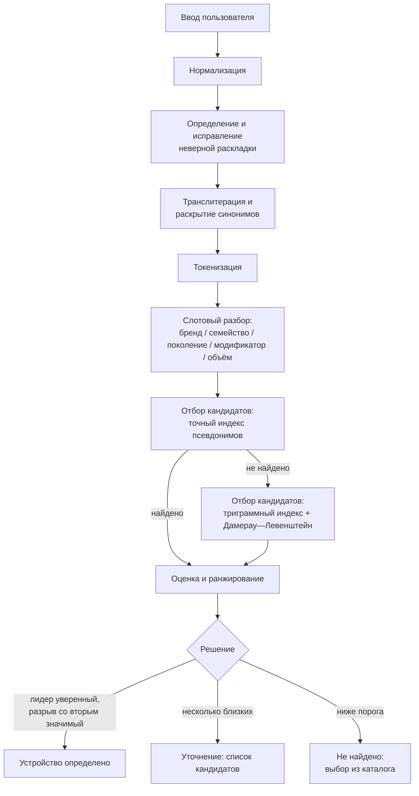

# 4. Алгоритм обработки пользовательского ввода

## 4.1. Постановка

Когда автоопределение невозможно или недостаточно точно, пользователь вводит название устройства своими словами. Задача — привести произвольный ввод к записи эталонного справочника либо корректно перейти к уточнению. Критерий К2 (вес 0,25) оценивает именно это.

Реальный ввод выглядите так (примеры из планируемой эталонной выборки):

```
iPhone 13 Pro Max        айфон 13 про макс      Айфон13ПроМакс
IPHONE 13 PROMAX         iphone-13-pro-max      13 pro max
самсунг с23 ультра       Samsung S23 Ultra      SM-S918B
галакси зет флип 5       galaxy z flip5         Z FLIP 5
редми нот 12 про         Redmi Note 12 Pro+     redmi note12pro
хонор 90                 Honor 90 5G            honor90
Ыфьыгте Ы23              (набрано в неверной раскладке)
пиксель 8 про            Google Pixel 8 Pro     pixel8pro
```

## 4.2. Ключевой принцип: цифры и модификаторы — жёсткие ограничения

Наиболее частая и наиболее дорогая ошибка нечёткого поиска — исправление того, что исправлять нельзя. Расстояние Левенштейна между `iPhone 12` и `iPhone 13` равно единице, но это разные устройства; между `iPhone 1` и `iPhone 11` — тоже единица. Классический нечёткий поиск здесь уверенно выдаст неверный ответ, что для нас — прямая потеря баллов по К1 («отсутствие ложных результатов») и по К2 («корректная обработка неоднозначных запросов»).

Поэтому в нашем алгоритме:

- **числовые токены поколения сравниваются точно**, нечёткое сравнение к ним не применяется;
- **модификаторы линейки** (`Pro`, `Pro Max`, `Plus`, `Ultra`, `mini`, `FE`, `Lite`, `Air`, `Fold`, `Flip`, `a`) сравниваются точно; `Pro` не считается совпадением для `Pro Max`;
- **бренд** используется как жёсткий фильтр отбора кандидатов;
- нечёткое сравнение применяется **только** к текстовым частям: названию бренда и названию семейства (`iphone`, `galaxy`, `redmi note`, `pixel`).

Такое разделение — основное отличие от подхода «отдать всю строку в поиск по схожести» и главная причина, по которой мы не полагаемся ни на встроенный текстовый поиск MongoDB, ни на генеративную модель как на основной механизм.

## 4.3. Конвейер обработки



## 4.4. Нормализация

Последовательность шагов, каждый покрыт модульными тестами:

| Шаг                                                             | Пример входа             | Пример выхода          |
| --------------------------------------------------------------- | ------------------------ | ---------------------- |
| Приведение регистра и Unicode-нормализация (NFKC)               | `ＩＰＨＯＮＥ　１３`     | `iphone 13`            |
| Унификация разделителей (дефисы, подчёркивания, точки, кавычки) | `iphone‑13_pro`          | `iphone 13 pro`        |
| Свёртка пробелов, удаление служебных символов                   | `  iPhone   13  !!`      | `iphone 13`            |
| Разделение слипшихся букв и цифр                                | `iphone13promax`         | `iphone 13 pro max`    |
| Унификация визуально схожих символов                            | `iPh0ne l3`              | `iphone 13`            |
| Исправление неверной раскладки клавиатуры                       | `Ыфьыгке`                | `samsung`              |
| Транслитерация кириллицы в латиницу                             | `айфон`, `самсунг`       | `iphone`, `samsung`    |
| Раскрытие синонимов и сокращений                                | `нот`, `с23`, `макс`     | `note`, `s23`, `max`   |
| Выделение и удаление незначимых атрибутов                       | `iphone 13 128gb черный` | `iphone 13` + атрибуты |

Особое внимание — двум шагам, которые дают наибольший прирост качества на русскоязычном вводе:

**Исправление раскладки.** Строки вида `Ыфьыгте` (это `Samsung`, набранный в русской раскладке) распознаются по признаку: строка состоит из кириллицы, но её посимвольное отображение в раскладку QWERTY даёт последовательность, присутствующую в словаре псевдонимов. Проверка выполняется только при неудаче обычного разбора и требует подтверждения по словарю — это исключает ложные срабатывания.

**Словарь синонимов.** Ведётся как данные (`data/catalog/aliases.*`), а не как код. Включает: русские написания брендов (`айфон`, `эпл`, `самсунг`, `сяоми`, `ксиоми`, `хуавей`, `хонор`, `реалми`, `пиксель`, `ноут`/`нот`), русские написания модификаторов (`про`, `макс`, `плюс`, `ультра`, `мини`, `фолд`, `флип`, `лайт`), устоявшиеся сокращения (`s23u` → `galaxy s23 ultra`, `ipx` → `iphone x`), частые ошибочные написания (`xiomi`, `huawey`, `iphon`).

## 4.5. Слотовый разбор

Нормализованная строка разбирается в структуру:

```json
{
  "brand": "samsung",
  "family": "galaxy-s",
  "generation": 23,
  "modifiers": ["ultra"],
  "modelCode": null,
  "attributes": { "storage": "256gb", "network": "5g" },
  "unparsed": []
}
```

Отдельная ветка — распознавание сервисного кода модели (`SM-S918B`, `CPH2451`, `23090RA98G`). Такие строки определяются по шаблонам и сразу ищутся по индексу кодов: это самый точный вид ввода, и его важно не отправить в нечёткий поиск.

Незначимые атрибуты (объём памяти, цвет, «5G», «Dual SIM», год) извлекаются и исключаются из сопоставления, но сохраняются: `Dual SIM` в запросе — сигнал к уточнению по региональному варианту, а не шум.

### 4.5.1. Поверхность экспортов `text-normalizer`

Нормализация и слотовый разбор (шаги «Нормализация» и «Слотовый разбор» схемы §4.3) реализованы в пакете `text-normalizer` без зависимости от справочника устройств и от приложения (ADR-001, ADR-019). Словарь (`NormalizationDictionary`) приходит в каждую функцию параметром — пакет не читает `data/catalog/aliases.json` сам, разбор этого файла выполняет вызывающий код через `parseNormalizationDictionary` (см. ниже).

| Экспорт                        | Назначение                                                                                                                               |
| ------------------------------ | ---------------------------------------------------------------------------------------------------------------------------------------- |
| `parseNormalizationDictionary` | Разбирает `unknown` (результат `JSON.parse` над `data/catalog/aliases.json`) в `NormalizationDictionary` без утверждений `as` (ADR-016)  |
| `foldCase`                     | Приведение к нижнему регистру                                                                                                            |
| `normalizeUnicode`             | Unicode-нормализация NFKC (полноширинные символы → ASCII; **не** NFKD — ломает кириллические «й»/«ё», см. `unicode.spec.ts`)             |
| `unifyLookalikes`              | Унификация визуально схожих символов (`0`→`o`, `l`→`1`) с учётом контекста слова                                                         |
| `unifySeparators`              | Унификация разделителей (дефисы, подчёркивания, точки, кавычки → пробел)                                                                 |
| `collapseWhitespace`           | Свёртка повторяющихся пробелов и обрезка по краям                                                                                        |
| `stripPunctuation`             | Удаление служебных символов вне букв/цифр/пробелов                                                                                       |
| `splitLettersAndDigits`        | Разделение слипшихся букв и цифр по границе "буква ↔ цифра"                                                                              |
| `mapCyrillicToLatinLayout`     | Посимвольное отображение кириллицы в раскладку QWERTY                                                                                    |
| `correctKeyboardLayout`        | Исправление неверной раскладки — только для полностью кириллических слов, подтверждённых словарём синонимов                              |
| `transliterateCyrillic`        | Транслитерация кириллицы в латиницу по таблице словаря — резервный шаг после раскрытия синонимов                                         |
| `expandSynonyms`               | Раскрытие синонимов и сокращений по словарю (токен → последовательность токенов)                                                         |
| `tokenize`                     | Токенизация строки по пробельным символам                                                                                                |
| `extractAttributes`            | Извлечение незначимых атрибутов (объём, цвет, сеть, Dual SIM, год) из токенов; возвращает `attributes` и `remainingTokens`               |
| `detectModelCode`              | Распознавание сервисного кода модели по вендорским шаблонам на исходной строке целиком, ДО общего конвейера нормализации                 |
| `parseSlots`                   | Слотовый разбор нормализованных токенов в `QuerySlots` (бренд/семейство/поколение/модификаторы/атрибуты/неразобранный остаток)           |
| `normalizeQuery`               | Полный конвейер: сырая строка + `NormalizationDictionary` → `NormalizedQuery` (включает `slots`, `trace`, `tokens`, `normalized`, `raw`) |

Точный тип результата слотового разбора (`QuerySlots`, `packages/text-normalizer/src/types.ts`):

```ts
interface QuerySlots {
  readonly brand?: string;
  readonly family?: string;
  readonly generation?: number;
  readonly modifiers: readonly string[];
  readonly modelCode?: string;
  readonly attributes: QueryAttributes;
  readonly unparsed: readonly string[];
}
```

Существенные детали для тех, кто строит сопоставление поверх `QuerySlots` (агенты `fuzzy-matcher`/`matching`):

- `family` — кебаб-кейс (`galaxy-s`, `redmi-note`), формат обязан совпадать с полем `family` справочника (docs/05-data-model.md, §5.3).
- `brand`/`family` — результат позиционной эвристики по токенам (первый словесный токен → `brand`, остаток → `family`; единственный токен идёт в оба поля), а не поиска по справочнику брендов. `brand` может быть словом, отсутствующим в списке брендов справочника (например, `iphone` вместо `apple`) — сопоставление с реальным брендом остаётся задачей `fuzzy-matcher`.
- Поля `brand`/`family`/`generation`/`modelCode` отсутствуют в объекте (а не равны `undefined`), когда не распознаны — так того требует `exactOptionalPropertyTypes` (ADR-016).
- `modelCode` заполнен — это отдельная ветка результата: `modifiers`/`attributes`/`unparsed` в этом случае пустые, а `brand`/`family`/`generation` отсутствуют, так как сервисный код найден на исходной строке до общего разбора.
- Числа поколения и модификаторы линейки сравниваются точно (§4.2), поэтому вынесены в собственные типизированные поля, а не остаются частью нечёткого текста `family`.

## 4.6. Отбор кандидатов и ранжирование

Отбор — двухступенчатый:

1. **Точный индекс.** Хеш-таблица «нормализованный псевдоним → устройство», построенная в памяти при старте по всем маркетинговым названиям, сервисным кодам и псевдонимам справочника. Покрывает большинство запросов за один поиск.
2. **Нечёткий отбор.** При промахе — инвертированный триграммный индекс даёт множество кандидатов, которые затем оцениваются расстоянием Дамерау—Левенштейна (учитывает транспозицию соседних символов — самый частый тип опечатки при быстром наборе) и мерой Джаро—Винклера (даёт вес совпадению начала строки).

**Оговорка по расстоянию Дамерау—Левенштейна: реализован вариант OSA, а не полный алгоритм.** `damerauLevenshteinDistance` (пакет `fuzzy-matcher`) — это Optimal String Alignment: транспозиция двух соседних символов учитывается по цене 1, как и вставка/удаление/замена, но каждая пара символов может быть переставлена не более одного раза за проход — алгоритм не допускает повторного редактирования подстроки, уже участвовавшей в транспозиции. Полное расстояние Дамерау—Левенштейна снимает это ограничение (допускает неограниченные последовательные транспозиции одной и той же подстроки), но требует более дорогой реализации с учётом последнего вхождения каждого символа. Для задачи этого пакета — распознавание одиночной опечатки вида «переставлены два соседних символа» в названии бренда или семейства — разница между вариантами не проявляется на реальном пользовательском вводе, а только на специально сконструированных строках с несколькими пересекающимися транспозициями. Выбор OSA — сознательное упрощение (ADR-018), а не недосмотр; подробное обоснование — в комментарии `packages/fuzzy-matcher/src/distance/levenshtein.ts`.

Итоговая оценка кандидата — взвешенная сумма. Первые три составляющие таблицы по названию совпадают с жёсткими условиями, но играют в конвейере РАЗНУЮ роль (ADR-020): совпадение бренда, номера поколения и набора модификаторов — это в первую очередь предикаты ОТБОРА (`rejectCandidate`, §4.7.1), исключающие кандидата ДО оценки, а не составляющие, которые могут понизить итоговую сумму до отклонения. У кандидатов, реально дошедших до оценки, эти составляющие поэтому фактически равны максимуму и присутствуют в разбивке только ради прозрачности каждого ответа (ADR-010), а не как реальные различители итоговой оценки:

| Составляющая                              | Роль                                                                                                                                                                                           |
| ----------------------------------------- | ---------------------------------------------------------------------------------------------------------------------------------------------------------------------------------------------- |
| Совпадение бренда                         | Нечёткий фильтр отбора (`rejectCandidate`): несовпадение по порогу схожести исключает кандидата целиком, а не снижает оценку                                                                   |
| Точное совпадение номера поколения        | Жёсткий предикат отбора (`rejectCandidate`, ADR-020) при наличии номера в запросе — несовпадение исключает кандидата целиком, а не снижает оценку                                              |
| Точное совпадение набора модификаторов    | Жёсткий предикат отбора (`rejectCandidate`, ADR-020) при наличии хотя бы одного модификатора в запросе — лишний или отсутствующий модификатор исключает кандидата целиком, а не снижает оценку |
| Схожесть названия семейства               | Нечёткая мера, основной вклад                                                                                                                                                                  |
| Доля покрытых токенов запроса             | Штраф за неразобранный остаток                                                                                                                                                                 |
| Априорная популярность модели на рынке РФ | Малый вклад, разрешает ничьи в пользу более вероятного устройства                                                                                                                              |

### 4.6.1. Поверхность экспортов `fuzzy-matcher`

Отбор кандидатов первой и второй ступени (точный индекс, инвертированный триграммный индекс, меры расстояния и схожести — §4.6) реализован в пакете `fuzzy-matcher` без зависимости от справочника устройств и от приложения (ADR-001, ADR-005). Пакет не читает данные из MongoDB и не хранит состояние сам — индексы строятся вызывающим кодом (агент 2.4 / модуль `matching`) из массива `MatcherDevice`, переданного параметром. Строковые меры и триграммный индекс реализованы без runtime-зависимостей (ADR-018): пакет подключает единственную workspace-зависимость `@esim-detector/text-normalizer` — только ради типа `QuerySlots`, который реэкспортируется отсюда же, чтобы следующим агентам не нужно было знать, из какого пакета он происходит.

| Экспорт                      | Назначение                                                                                                                                                                                                                                                                                                                                                |
| ---------------------------- | --------------------------------------------------------------------------------------------------------------------------------------------------------------------------------------------------------------------------------------------------------------------------------------------------------------------------------------------------------- |
| `damerauLevenshteinDistance` | Расстояние редактирования между двумя строками: вставка/удаление/замена — по цене 1, транспозиция соседних символов — тоже по цене 1 (вариант **OSA**, не полный алгоритм Дамерау—Левенштейна — см. оговорку в §4.6). Применяется только к текстовым частям (бренд/семейство)                                                                             |
| `editSimilarity`             | Схожесть на основе `damerauLevenshteinDistance`, нормированная в `[0, 1]` (`1 - distance / maxLength`)                                                                                                                                                                                                                                                    |
| `jaroSimilarity`             | Мера Джаро: доля совпадающих символов в пределах окна с поправкой на транспозиции, `[0, 1]`                                                                                                                                                                                                                                                               |
| `jaroWinklerSimilarity`      | Мера Джаро—Винклера: мера Джаро с надбавкой за общий префикс строк (даёт вес совпадению начала слова, §4.6); настройки — `JaroWinklerOptions` (`prefixScale`, по умолчанию `0.1`; `maxPrefixLength`, по умолчанию `4`)                                                                                                                                    |
| `extractTrigrams`            | Триграммы (подстроки длины 3) строки с краевыми заполнителями (по два пробела с каждой стороны — вес началу и концу строки)                                                                                                                                                                                                                               |
| `trigramSimilarity`          | Триграммная схожесть двух строк — коэффициент Жаккара по множествам триграмм, `[0, 1]`                                                                                                                                                                                                                                                                    |
| `buildDeviceTrigramKey`      | Строит ключ устройства для триграммного индекса ТОЛЬКО из буквенной части `brand`/`family` — цифра поколения вычёркивается безусловно, модификаторы линейки вычитаются по `device.modifiers` (защитный барьер, AGENTS.md, предметное правило 2)                                                                                                           |
| `buildTrigramIndex`          | Строит инвертированный триграммный индекс (`TrigramIndex`) по массиву `MatcherDevice`, целиком в памяти процесса (ADR-005)                                                                                                                                                                                                                                |
| `findTrigramCandidates`      | Возвращает идентификаторы устройств-кандидатов по общим триграммам с запросом, отсортированные по убыванию числа совпадений и затем по идентификатору (детерминированность); опция `minSharedTrigrams` (по умолчанию `1`)                                                                                                                                 |
| `buildAliasIndex`            | Строит точный индекс (`AliasIndex`) по маркетинговым названиям, псевдонимам (`aliasToDevice`) и сервисным кодам (`modelCodeToDevice`) устройств. Коллизия — один и тот же нормализованный ключ у нескольких разных устройств — не резолвится произвольно: ключ исключается из карты поиска, а коллизия попадает в `aliasCollisions`/`modelCodeCollisions` |
| `lookupAlias`                | Точный поиск устройства по псевдониму или маркетинговому названию (регистр и лишние пробелы не важны)                                                                                                                                                                                                                                                     |
| `lookupModelCode`            | Точный поиск устройства по сервисному коду модели (регистр не важен, внутренние разделители — важны)                                                                                                                                                                                                                                                      |

Точный тип входных данных сопоставления (`MatcherDevice`, `packages/fuzzy-matcher/src/types.ts`) — структурный минимум записи справочника, необходимый этому пакету (не полная схема `devices`, которую вносит агент 3 в `packages/contracts`):

```ts
interface MatcherDevice {
  readonly id: string;
  readonly brand: string;
  readonly family: string;
  readonly generation: number | null;
  readonly modifiers: readonly string[];
  readonly modelCodes: readonly string[];
  readonly aliases: readonly string[];
  readonly marketingName: string;
  readonly popularity: number;
}
```

Существенные детали для тех, кто строит ранжирование и жёсткие ограничения поверх этого пакета (агент 2.4):

- `brand`/`family` — единственные поля `MatcherDevice`, участвующие в нечётких мерах (`jaroWinklerSimilarity`, `editSimilarity`) и в триграммном индексе (AGENTS.md, предметное правило 2). `generation`/`modifiers` в аргументы этих функций и в текст триграммного ключа попадать не должны — это гарантирует `buildDeviceTrigramKey`, но симметричная ответственность за текст запроса (очистка от цифр и модификаторов перед вызовом `findTrigramCandidates`/`jaroWinklerSimilarity`) лежит на вызывающем коде, а не на этом пакете.
- `generation: number | null` (а не `number | undefined`) — как в справочнике (docs/05-data-model.md, §5.3): поле есть всегда, `null` означает «неприменимо», а не «не разобрано».
- Коллизии псевдонимов и сервисных кодов не приводят к ошибке построения индекса — затронутые устройства просто не находятся точным поиском (но остаются доступны нечёткому отбору) и перечисляются в `aliasCollisions`/`modelCodeCollisions` результата `buildAliasIndex`, что позволяет модулю `matching` или инструментам модерации сообщить о проблеме данных, а не упасть.
- Тип `QuerySlots` не переобъявляется в `fuzzy-matcher` — реэкспортируется из `@esim-detector/text-normalizer` (см. §4.5.1) для удобства следующих агентов.

## 4.7. Правило принятия решения

Решение принимается не по абсолютной оценке лидера, а по паре «оценка лидера + разрыв со вторым кандидатом»:

| Условие                                                                    | Результат                                                                       |
| -------------------------------------------------------------------------- | ------------------------------------------------------------------------------- |
| Оценка лидера ≥ порога уверенности **и** разрыв со вторым ≥ порога разрыва | Устройство определено, выдаётся статус eSIM                                     |
| Оценка лидера ≥ порога уверенности, но разрыв мал                          | `clarification_required` со списком близких кандидатов                          |
| Оценка лидера ниже порога уверенности, но кандидаты есть                   | `clarification_required` с предложением выбрать из найденного                   |
| Кандидатов нет                                                             | `not_found` + переход к выбору из каталога, запрос пишется в очередь пополнения |

Правило разрыва — прямой ответ на требование К2 «корректная обработка неоднозначных запросов». Запрос `galaxy s23` при наличии в справочнике `S23`, `S23+`, `S23 Ultra`, `S23 FE` намеренно **не** разрешается в базовую модель молча: пользователю предлагается уточнить. При этом если статус eSIM у всех кандидатов совпадает, ответ выдаётся сразу — уточнение запрашивается только тогда, когда оно влияет на результат. Это важная деталь: мы не задаём пользователю лишних вопросов.

### 4.7.1. Поверхность экспортов `fuzzy-matcher` — ограничения, оценка, ранжирование и решение

Жёсткие ограничения (§4.2, §4.6), оценка кандидата (§4.6), ранжирование и правило принятия решения (§4.7) реализованы в пакете `fuzzy-matcher` поверх отбора кандидатов и мер схожести §4.6.1 — без зависимости от справочника устройств, MongoDB и приложения (ADR-001, ADR-005). Пороги и веса приходят параметром в каждую функцию (.cursor/rules/pure-packages.mdc): пакет не хранит конфигурацию сам.

| Экспорт                    | Назначение                                                                                                                                                                                                                              |
| -------------------------- | --------------------------------------------------------------------------------------------------------------------------------------------------------------------------------------------------------------------------------------- |
| `rejectCandidate`          | Предикат отбора (`constraints.ts`, ADR-020): бренд, номер поколения, набор модификаторов — возвращает причину отклонения либо `null`. Единственное место, где кандидат может быть исключён по этим трём измерениям                      |
| `computeBrandSimilarity`   | Нечёткая схожесть бренда запроса с устройством — максимум схожести с `device.brand` и с `device.family` (мера Джаро—Винклера); используется и в `rejectCandidate`, и в разбивке `scoreCandidate`, чтобы не считать её дважды по-разному |
| `scoreCandidate`           | Оценка кандидата, УЖЕ прошедшего `rejectCandidate` (сама по себе кандидатов не исключает) — взвешенная сумма шести составляющих таблицы §4.6, разбивка по составляющим в `breakdown` (ADR-010)                                          |
| `buildComparableQueryText` | Текст запроса для нечёткого сравнения семейства — бренд и семейство `QuerySlots`, объединённые в одну строку; тот же текст используется для отбора кандидатов по триграммному индексу (симметрия с `buildDeviceTrigramKey`)             |
| `rankCandidates`           | Сортировка оценённых кандидатов по убыванию оценки, затем по убыванию популярности устройства, затем по идентификатору (детерминированность)                                                                                            |
| `decide`                   | Правило принятия решения по таблице §4.7 на основе отранжированных кандидатов: оценка лидера + разрыв со вторым, опциональная группировка по `resolveEquivalenceKey`                                                                    |
| `buildMatchIndex`          | Строит индексы отбора (точный + триграммный, §4.6.1) из массива `MatcherDevice` — единственная точка входа для построения состояния сопоставления (ADR-005: в памяти)                                                                   |
| `matchQuery`               | Полный конвейер §4.6—4.7: точный индекс → (при промахе) триграммный отбор → `rejectCandidate` → `scoreCandidate` → `rankCandidates` → `decide`. Возвращает статус, кандидатов, отклонённых кандидатов и коды причин                     |

**Коды причин (`MatchReasonCode`)** — стабильная часть машиночитаемого объяснения ответа (ADR-010):

| Код                                | Значение                                                                                                                  |
| ---------------------------------- | ------------------------------------------------------------------------------------------------------------------------- |
| `MATCH_EXACT_ALIAS`                | Устройство найдено точным индексом псевдонимов/маркетинговых названий (ступень 1, §4.6)                                   |
| `MATCH_MODEL_CODE`                 | Устройство найдено точным индексом сервисных кодов моделей (самый точный вид ввода, §4.5)                                 |
| `MATCH_FUZZY_FAMILY`               | Кандидаты получены триграммным отбором (ступень 2, §4.6)                                                                  |
| `REJECT_BRAND_MISMATCH`            | Кандидат исключён: бренд запроса не похож на бренд/семейство устройства (`rejectCandidate`)                               |
| `REJECT_GENERATION_MISMATCH`       | Кандидат исключён: номер поколения запроса не равен номеру поколения устройства (`rejectCandidate`)                       |
| `REJECT_MODIFIER_SET_MISMATCH`     | Кандидат исключён: набор модификаторов запроса не равен набору модификаторов устройства как множество (`rejectCandidate`) |
| `DECISION_GAP_TOO_SMALL`           | Оценка лидера выше порога уверенности, но разрыв со вторым кандидатом мал → уточнение                                     |
| `DECISION_BELOW_THRESHOLD`         | Оценка лидера ниже порога уверенности → уточнение из числа найденных кандидатов                                           |
| `DECISION_NO_CANDIDATES`           | Кандидатов не осталось (не найдено ни отбором, ни после `rejectCandidate`) → `not_found`                                  |
| `DECISION_RESOLVED_BY_EQUIVALENCE` | Кандидаты, которые иначе привели бы к уточнению, эквивалентны по `resolveEquivalenceKey` → `determined` без уточнения     |

**Веса оценки по умолчанию (`DEFAULT_SCORING_WEIGHTS`, `scoring.ts`)** — сумма равна `1`, но `scoreCandidate` не полагается на это и нормирует по фактической сумме переданных весов:

| Составляющая       | Вес по умолчанию |
| ------------------ | ---------------- |
| `familySimilarity` | `0.4`            |
| `brandMatch`       | `0.15`           |
| `generationMatch`  | `0.15`           |
| `tokenCoverage`    | `0.15`           |
| `modifierSetMatch` | `0.1`            |
| `popularity`       | `0.05`           |

**Пороги решения по умолчанию (`DEFAULT_DECISION_THRESHOLDS`, `decision.ts`)** — консервативные (ADR-003): требуют и высокой оценки, и заметного разрыва.

| Параметр                     | Значение по умолчанию |
| ---------------------------- | --------------------- |
| `confidenceThreshold`        | `0.72`                |
| `gapThreshold`               | `0.08`                |
| `maxClarificationCandidates` | `5`                   |

## 4.8. Подсказки при вводе

Эндпоинт подсказок работает на том же конвейере с более низкими порогами и возвращает до 10 вариантов. Это одновременно улучшает пользовательский опыт и снижает долю проблемного ввода: пользователь, выбравший подсказку, присылает нам канонический идентификатор устройства. Подсказки — основной, а не вспомогательный элемент интерфейса поиска.

## 4.9. Почему не генеративная модель

Вариант с использованием LLM для нормализации ввода рассматривался и отклонён для основного контура:

| Критерий                                 | Детерминированный алгоритм | LLM                                   |
| ---------------------------------------- | -------------------------- | ------------------------------------- |
| Воспроизводимость на контрольной выборке | Полная                     | Не гарантирована                      |
| Покрытие модульными тестами              | Полное                     | Затруднено                            |
| Объяснимость результата (К3)             | Правила и оценки в ответе  | Ограничена                            |
| Время ответа                             | Единицы миллисекунд        | Сотни миллисекунд и более             |
| Внешние зависимости и стоимость          | Отсутствуют                | Внешний провайдер, тариф, доступность |
| Риск уверенной ошибки                    | Контролируется порогами    | Существенный                          |

Архитектура при этом предусматривает точку расширения: интерфейс `QueryNormalizer` допускает дополнительную реализацию на основе LLM, которую можно включить конфигурацией как резервный обработчик для запросов, не разобранных основным алгоритмом. По умолчанию выключена. Решение зафиксировано как ADR-004 в [09-decisions.md](./09-decisions.md).

## 4.10. Оценка качества

Стенд `npm run eval:matching` прогоняет эталонную выборку запросов (`data/fixtures/queries.golden.json`) и печатает отчёт:

- доля точных попаданий (лидер совпал с ожидаемым устройством);
- доля корректных уточнений (ожидалась неоднозначность — получено уточнение);
- **доля ложных определений** (выдано устройство, отличное от ожидаемого) — целевое значение 0;
- доля промахов (ожидалось устройство — получено «не найдено»);
- разбивка метрик по категориям ввода: латиница, кириллица, слитное написание, опечатки, сокращения, сервисные коды, неоднозначные запросы, посторонний ввод.

Разбивка по категориям позволяет предъявить комиссии результат по каждому из шести пунктов критерия К2 по отдельности. Подробнее — [08-testing-and-quality.md](./08-testing-and-quality.md).
