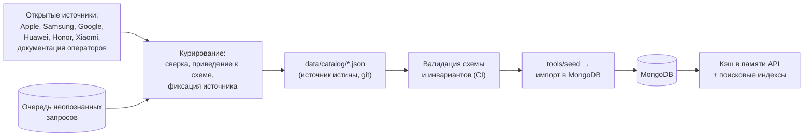

# 5. Модель данных и эталонный справочник устройств

## 5.1. Роль справочника

Справочник устройств — центральный артефакт решения. Алгоритмы определения и сопоставления не содержат знаний о конкретных устройствах: все такие знания вынесены в данные. Практические следствия:

- выход новой модели телефона или новой версии iOS не требует изменения кода;
- корректность решения можно проверять и оспаривать по данным, а не по коду;
- изменения справочника проходят обычное ревью в pull request.

Поскольку публично загружаемого эталона eSIM-совместимых устройств не существует (см. [01-analysis.md](./01-analysis.md), раздел 1.3), справочник создаётся нами. Каждая запись сопровождается ссылкой на источник и датой проверки — это делает данные проверяемыми для комиссии и является частью доказательства по критерию К1.

## 5.2. Источник истины и поток данных

Обратная связь замкнута: неопознанные устройства и запросы попадают в очередь, аналитик разбирает её и пополняет справочник. Это отличает эксплуатируемое решение от демонстрационного прототипа.

## 5.3. Коллекция `devices`

Основная сущность. Одна запись — одна маркетинговая модель устройства.

| Поле                             | Тип            | Назначение                                                                                                                               |
| -------------------------------- | -------------- | ---------------------------------------------------------------------------------------------------------------------------------------- |
| `_id`                            | string         | Стабильный идентификатор вида `apple-iphone-15-pro`, используется в API                                                                  |
| `brand`                          | string         | Нормализованный бренд: `apple`, `samsung`, `xiaomi`                                                                                      |
| `brandTitle`                     | string         | Отображаемое название бренда                                                                                                             |
| `marketingName`                  | string         | Официальное название: `iPhone 15 Pro`                                                                                                    |
| `displayName`                    | string         | Название для пользователя (может отличаться формулировкой)                                                                               |
| `family`                         | string         | Линейка: `iphone`, `galaxy-s`, `redmi-note`                                                                                              |
| `generation`                     | number \| null | Номер поколения для точного сопоставления                                                                                                |
| `modifiers`                      | string[]       | Модификаторы линейки: `["pro"]`, `["pro","max"]`, `["ultra"]`                                                                            |
| `modelCodes`                     | string[]       | Сервисные коды: `["SM-S928B","SM-S928U","SM-S9280"]`                                                                                     |
| `aliases`                        | string[]       | Псевдонимы, включая русские написания и сокращения                                                                                       |
| `platform`                       | enum           | `ios`, `android`, `harmonyos`, `other`                                                                                                   |
| `deviceType`                     | enum           | `phone`, `tablet`, `watch`, `laptop`, `other`                                                                                            |
| `os.minVersion`, `os.maxVersion` | string \| null | Диапазон фактически вышедших версий ОС — основа правила по версии iOS. Обещанная вендором длительность поддержки сюда не записывается    |
| `screenSignatures`               | object[]       | `{ cssWidth, cssHeight, dpr, zoomed }` — сигнатуры для ветки iOS                                                                         |
| `esim`                           | object         | Сведения о поддержке eSIM (см. 5.4)                                                                                                      |
| `releaseYear`                    | number         | Год выхода; используется в априорной популярности и сортировке                                                                           |
| `marketPresenceRu`               | enum           | `official`, `parallel-import`, `none` — влияет на приоритет в подсказках                                                                 |
| `popularity`                     | number         | Априорный вес для разрешения ничьих при ранжировании                                                                                     |
| `sources`                        | object[]       | `{ url, title, checkedAt }` — обоснование записи                                                                                         |
| `dataConfidence`                 | enum           | `verified`, `derived`, `unverified` — достоверность самой записи справочника                                                             |
| `provenance`                     | object         | `{ source, batchId, importedAt, agreementCount }` — происхождение данных: курируемое ядро, правило, импорт из CSV или решение модератора |
| `status`                         | enum           | `active`, `deprecated`                                                                                                                   |
| `createdAt`, `updatedAt`         | Date           | Служебные поля                                                                                                                           |

Поле `provenance` позволяет в любой момент ответить на вопрос, откуда взялось конкретное утверждение о поддержке eSIM у конкретной модели. Это требование возникает из того, что первичное наполнение справочника приходит из внешней выгрузки языковой модели и должно быть отделимо от проверенных данных — подробно в [14-catalog-ingestion.md](./14-catalog-ingestion.md).

**Конвенция `family`/`modifiers` для линейки-буквы `A` (Samsung Galaxy A-серия, Google Pixel `…a`).** Буква `A` — единственная буква линейки, которая одновременно входит в фиксированный словарь модификаторов `text-normalizer` (`LINE_MODIFIERS`, docs/04 §4.2, §4.10.1). Из-за этого запись справочника для такой линейки обязана иметь `family` БЕЗ буквенного суффикса и саму букву в `modifiers`: `samsung-galaxy-a54` → `family: "galaxy"`, `modifiers: ["a"]` (а НЕ `family: "galaxy-a"`, `modifiers: []`); `google-pixel-7a` → `family: "pixel"`, `modifiers: ["a"]`. Подтверждено фактическим прогоном `normalizeQuery` — docs/04-matching-algorithm.md §4.10.1. Это исключение из общего вида `family` (строка 39 таблицы: `iphone`, `galaxy-s`, `redmi-note`) касается ТОЛЬКО буквы `A`: `S`/`Z`/`Note` в словарь модификаторов не входят и по-прежнему естественно уходят в кебаб-`family` (`galaxy-s`, `galaxy-z`, `galaxy-note`). Несоблюдение этой конвенции при наполнении справочника (агент 3+) даёт систематический `REJECT_MODIFIER_SET_MISMATCH` (ADR-020) на каждом запросе вида `galaxy a54`, потому что `rejectCandidate` сравнивает набор модификаторов точно, а не по вхождению буквы в `family`.

Разделение `dataConfidence` и уверенности определения — сознательное: запись справочника может быть непроверенной, и тогда решение обязано понизить уверенность ответа, даже если сопоставление было точным. Устройства со `dataConfidence: unverified` по умолчанию не дают однозначного положительного ответа.

## 5.4. Структура `esim`

Самая содержательная часть записи. Простого булева флага недостаточно: поддержка eSIM зависит от региональной версии устройства.

| Поле                 | Тип            | Назначение                                                                            |
| -------------------- | -------------- | ------------------------------------------------------------------------------------- |
| `support`            | enum           | `supported`, `not_supported`, `conditional`                                           |
| `dualSim`            | enum           | `physical+esim`, `dual-esim`, `esim-only`, `none`                                     |
| `maxProfiles`        | number \| null | Число хранимых профилей                                                               |
| `conditions`         | object[]       | Исключения: `{ scope: "region", value: "CN", support: "not_supported", note: "..." }` |
| `clarifyingQuestion` | object \| null | Вопрос пользователю для разрешения `conditional`                                      |
| `notes`              | string         | Пояснение для аналитика и для текста в интерфейсе                                     |

Типовые случаи, требующие `conditional`:

1. **iPhone для рынка КНР.** Модели с двумя физическими SIM-слотами не имеют eSIM. Средствами браузера не отличимы от прочих. Разрешается уточняющим вопросом.
2. **iPhone для рынка США начиная с iPhone 14.** Физический слот отсутствует, устройство работает только на eSIM. Формально `supported`, но требует отдельной формулировки в интерфейсе.
3. **Модели Samsung с региональными различиями прошивки.** Для части моделей поддержка eSIM зависит от версии прошивки региона; такие записи помечаются `conditional` с указанием региона в `conditions`.
4. **Устройства, где eSIM появилась с обновлением ПО.** Условие по минимальной версии ОС.

Наличие этого механизма — основной способ выполнить требование «отсутствие ложных результатов определения» на реальных данных: вместо усреднённого ответа сервис задаёт один точный вопрос.

## 5.5. Коллекция `screen_signatures`

Производная коллекция для быстрой резолюции ветки iOS: `{ signature: "393x852@3", candidates: ["apple-iphone-14-pro", ...], esimConsensus: "supported" | "mixed" }`. Строится автоматически из `devices` при импорте; поле `esimConsensus` рассчитывается заранее, что позволяет отвечать за один поиск и делает согласованность статусов проверяемым инвариантом.

## 5.6. Коллекции журналов

| Коллекция           | Назначение                                                                                                                                                                                                                                 |
| ------------------- | ------------------------------------------------------------------------------------------------------------------------------------------------------------------------------------------------------------------------------------------ |
| `resolution_logs`   | Обезличенный журнал резолюций: `requestId`, хеш сигнатуры сигналов, платформа, результат, уверенность, сработавшие правила, длительность. Основа для разбора расхождений и для метрик                                                      |
| `moderation_tasks`  | Единая очередь задач модерации: неопознанные сервисные коды, сигнатуры экрана, несопоставленные и неоднозначные запросы, строки карантина импорта, расхождения источников, обращения пользователей. Дедуплицируется со счётчиком обращений |
| `catalog_overrides` | Слой решений модератора, применяемый поверх всех прочих источников и переживающий повторные импорты                                                                                                                                        |
| `catalog_changes`   | Журнал изменений справочника: кто, когда, что изменил, какой источник указал                                                                                                                                                               |

Устройство очереди модерации и порядок работы с ней описаны в [15-moderation.md](./15-moderation.md).

Журналы не содержат персональных данных: сохраняются класс устройства и хеш сигнатуры, а не «сырой» набор сигналов, который потенциально мог бы использоваться для отслеживания. Срок хранения ограничен TTL-индексом.

## 5.7. Индексы

| Коллекция           | Индекс                                  | Назначение                                                     |
| ------------------- | --------------------------------------- | -------------------------------------------------------------- |
| `devices`           | `modelCodes`                            | Точный поиск по сервисному коду — горячий путь ветки Android   |
| `devices`           | `brand`, `family`, `generation`         | Отбор кандидатов при слотовом разборе                          |
| `devices`           | `aliases`                               | Поиск по псевдонимам                                           |
| `devices`           | текстовый по `marketingName`, `aliases` | Резервный поиск (основной нечёткий поиск выполняется в памяти) |
| `devices`           | `platform`, `status`                    | Выборки для прогрева кэша                                      |
| `screen_signatures` | `signature` (уникальный)                | Резолюция ветки iOS                                            |
| `moderation_tasks`  | `kind`, `key` (уникальный составной)    | Дедупликация с инкрементом счётчика обращений                  |
| `moderation_tasks`  | `status`, `occurrences`                 | Очередь, отсортированная по частоте обращений                  |
| `catalog_overrides` | `deviceId` (уникальный)                 | Применение слоя решений модератора                             |
| `resolution_logs`   | `createdAt` (TTL)                       | Ограничение срока хранения                                     |
| `resolution_logs`   | `requestId`                             | Разбор обращений по идентификатору запроса                     |

Нечёткий поиск выполняется по индексам в памяти процесса, а не средствами MongoDB. Причины: полнотекстовый поиск MongoDB не поддерживает нечёткое сравнение с нужными нам жёсткими ограничениями на цифры и модификаторы, а Atlas Search недоступен в локальной установке, которая является целевой средой демонстрационного контура. Объём справочника (порядка тысяч записей) позволяет держать индексы в памяти без затруднений. Решение зафиксировано как ADR-005.

## 5.8. Валидация и инварианты

Проверяются в CI до импорта. Нарушение — ошибка сборки:

1. Соответствие схеме, уникальность `_id`.
2. Уникальность каждого сервисного кода в пределах всего справочника (один код не может принадлежать двум моделям).
3. Отсутствие конфликтов псевдонимов: один псевдоним не указывает на разные устройства с разным статусом eSIM.
4. Для `platform: ios` — заполненные `screenSignatures` и `os.maxVersion`.
5. Для `esim.support: conditional` — непустые `conditions` и заполненный `clarifyingQuestion`.
6. Для `esim.support: supported` — наличие хотя бы одного источника в `sources`.
7. Согласованность `screen_signatures.esimConsensus` с записями устройств.

## 5.9. Наполнение справочника

Первичное наполнение выполняется обработкой CSV-выгрузки, полученной от сторонней языковой модели; конвейер приёма, валидации и тарификации достоверности описан в [14-catalog-ingestion.md](./14-catalog-ingestion.md), схема выгрузки и формулировки запроса — в [приложении А](./appendix-a-llm-csv-request.md). Планируемый охват для рынка РФ:

| Группа                                                       | Оценка числа записей | Приоритет                                              |
| ------------------------------------------------------------ | -------------------- | ------------------------------------------------------ |
| Apple iPhone (все поколения, включая варианты для КНР и США) | ~45                  | Критический                                            |
| Samsung Galaxy S / Note / Z / A / M                          | ~150                 | Критический                                            |
| Xiaomi / Redmi / POCO                                        | ~200                 | Высокий                                                |
| Honor, Huawei                                                | ~120                 | Высокий                                                |
| Google Pixel                                                 | ~30                  | Средний                                                |
| realme, OPPO, OnePlus, vivo, Tecno, Infinix, ZTE             | ~200                 | Средний                                                |
| Прочие бренды, представленные в РФ                           | ~100                 | Низкий                                                 |
| Планшеты и умные часы с eSIM                                 | ~50                  | Низкий (для корректного распознавания типа устройства) |

Существенное замечание о полноте: для ответа «не поддерживает» справочник должен содержать и устройства без eSIM, а их значительно больше, чем устройств с eSIM. Поэтому применяется комбинированный подход: явные записи для распространённых моделей плюс правила уровня семейства (например, «линейка Redmi A не имеет eSIM») с обязательным понижением уверенности при выводе по правилу, а не по явной записи.
