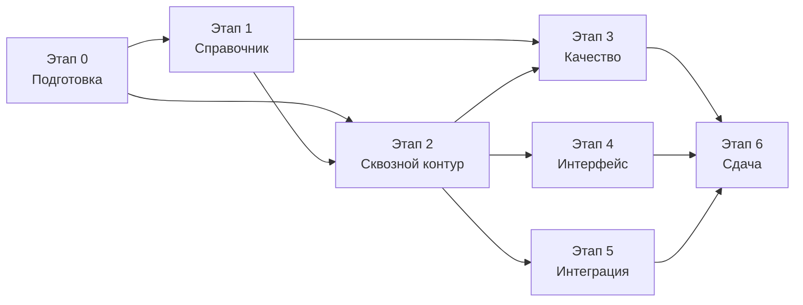

# 11. План реализации

## 11.1. Принципы планирования

1. **Первым делом — самое дорогое по баллам и самое рискованное по срокам.** Критерий К1 (вес 0,40) целиком зависит от справочника устройств, а наполнение справочника — единственная работа, которую нельзя ускорить в конце. Она начинается раньше всего и идёт параллельно разработке.
2. **Работоспособный сквозной сценарий как можно раньше.** После второго этапа существует запускаемый одной командой контур, отвечающий на реальные запросы. Далее качество только наращивается, а риск «не успели собрать всё вместе» снят.
3. **Документация ведётся вместе с кодом, а не после.** Критерий К3 (вес 0,20) на практике теряется чаще всего именно из-за откладывания.
4. **Каждый этап завершается предъявляемым результатом.** Это позволяет остановиться на любом этапе с работающим решением, если сроки окажутся жёстче ожидаемого.

## 11.2. Этапы

### Этап 0. Согласования и подготовка

**Результат:** решены вопросы из [12-open-questions.md](./12-open-questions.md), подготовлен каркас репозитория.

- Ответы на вопросы о доступе к брендбуку и сроках сдачи.
- Монорепозиторий: рабочие пространства, единая строгая конфигурация TypeScript, ESLint с запретом `any` и утверждений типа на внешних данных, Prettier, Jest, конвейер CI.
- Каркас приложений: `apps/api` (NestJS), `apps/web` (React + Vite), пустые пакеты.
- Пакет `test-utils`: изолированная тестовая база на `mongodb-memory-server`, защитная проверка имени базы, фабрики тестовых данных. Делается до первого теста, обращающегося к базе, а не после.
- `docker-compose.yml` с MongoDB, `.env.example`.
- Схема записи справочника (Mongoose + типы TypeScript из одного объявления) и валидатор.

### Этап 1. Справочник устройств (начинается на этапе 0 и идёт параллельно)

**Результат:** наполненный, валидируемый справочник с известным происхождением и измеренным качеством данных.

Работа делится на две независимые дорожки, которые можно вести параллельно разными людьми.

**Дорожка А — конвейер приёма данных** (разработка, описана в [14-catalog-ingestion.md](./14-catalog-ingestion.md)):

- схема записи, инварианты, валидация в CI;
- устойчивый разбор CSV, нормализация, валидация по кодам проверок, шаблоны сервисных кодов вендоров;
- сверка с эталоном, консенсус независимых выгрузок, слияние по приоритетам источников, тарификация достоверности;
- скрипт `tools/seed` с подкомандами и режимом `--dry-run`, отчёт об импорте;
- пересборка сигнатур экранов, идемпотентная загрузка в MongoDB.

**Дорожка Б — данные** (аналитика, распараллеливается по брендам):

- запросы выгрузок по партиям из [приложения А](./appendix-a-llm-csv-request.md) у двух-трёх разных моделей; перед массовым прогоном — проверка пригодности источника на одной партии (§А.8). **Состояние:** собрано десять основных партий у четырёх источников плюс партия 16 (суффиксы кодов) у пяти источников (§А.6, столбец «Состояние»); что осталось и в каком порядке — §А.9, чего в массиве нет вообще — §А.8.3;
- курируемое ядро (ADR-026: только по реальным вендорским страницам со ссылкой и датой сверки, знание языковой модели источником не считается): Apple и Google Pixel целиком вручную (перечни короткие, правила детерминированные), затем наиболее распространённые модели Samsung и Xiaomi. **Состояние:** Apple заведён этапом 5.3 — `data/catalog/curated/apple-iphone.json`, 44 записи (ADR-030); Google Pixel предстоит агенту 5.4 (см. §11.2а);
- сопоставление «суффикс сервисного кода → регион продажи» для брендов с региональной зависимостью eSIM: пилот показал, что языковые модели полного набора суффиксов не дают, а без него весь модельный ряд Samsung остаётся в статусе `conditional` и требует уточняющего вопроса там, где ответ выводится из кода автоматически. Партия 16 (§А.10) собрана и разобрана (§А.10.4) — она не вход правила консенсуса, а генератор перечня кандидатов «суффикс → регион» для ручной сверки (ADR-013 дополнение, ADR-026); сама таблица `data/catalog/code-suffixes.json` несёт только регион, без влияния на статус eSIM (ADR-028) — эта работа ещё предстоит;
- контрольная выборка фактов `catalog.reference.json` — не менее 150 моделей, подтверждённых по вендорским источникам, формируется агентом 5.4 (решение вопроса 13, ADR-013 дополнение); при недостижении 150 записей публикуется фактическое число как измеренный факт, а не как невыполненный критерий. Это одновременно инструмент измерения качества выгрузки;
- сигнатуры экранов iPhone и диапазоны поддерживаемых версий iOS;
- региональные исключения и уточняющие вопросы для статуса `conditional`;
- словари псевдонимов, синонимов и шаблонов транслитерации;
- разбор карантина после первого импорта.

Дорожка Б — самая трудоёмкая по объёму рутинной работы часть проекта и главный кандидат на распараллеливание внутри команды. Курируемое ядро важнее объёма: контрольная выборка заказчика с большой вероятностью состоит из распространённых моделей, а не из длинного хвоста.

Измерение собранного массива подтвердило этот приоритет и дало конкретный порядок работ (§А.9). Первыми идут не самые крупные партии, а те, что закрывают целую ветку алгоритма. Курируемое ядро Apple, дающее платформу `ios`, заведено этапом 5.3 (44 записи, ADR-030). Остаются нулевыми: платформа `harmonyos` (партия 8, Huawei — единственный её источник), флагманы Xiaomi (партия 5) и все типы устройств, кроме `phone` (партии 13–14), поэтому владелец планшета по-прежнему получил бы ответ про телефон — это ложный результат в смысле К1, а не пробел в охвате. Отсутствие запроса к языковой модели по партии 9 (Google Pixel) сделанной работой не является: по §А.1 этот перечень ведётся вручную, и он не заведён. Полный состав цепочки данных и обоснование порядка — §11.2а.

### Этап 2. Сквозной работоспособный контур

**Результат:** `docker compose up` — работает автоопределение и поиск по названию, три статуса результата.

- `CatalogModule`: загрузка, кэш в памяти, построение индексов, `/health/ready`.
- `esim-rules`: вывод статуса, правило по версии iOS, региональные условия.
- `detection`: сбор сигналов на клиенте, ветки Android и iOS, расчёт уверенности, интерсептор `Accept-CH`.
- `text-normalizer` и `fuzzy-matcher` в базовом объёме, `matching`.
- Эндпоинты `detect`, `devices/search`, `devices/suggest`, `devices/{id}`, `health`.
- Интерфейс: экран проверки, три состояния результата, поиск с подсказками.
- Модульные тесты на всё перечисленное — обязательное условие завершения этапа.

### Этап 3. Качество определения

**Результат:** измеренное качество, отчёт стенда оценки, доля ложных определений — ноль.

- Эталонные выборки `signals.golden.json` (не менее 120 записей) и `queries.golden.json` (не менее 300 записей).
- Стенд оценки качества и отчёт в Markdown, включение в CI.
- Доработка нормализации: неверная раскладка, слипшиеся написания, схожие символы, расширение словарей.
- Доработка ранжирования: жёсткие ограничения на цифры и модификаторы, правило разрыва, априорная популярность.
- Обнаружение эмуляции и подмены сигналов.
- Полный сценарий уточнения: выбор из кандидатов, уточняющий вопрос, ручной поиск, проверка на устройстве.
- Разбор расхождений на эталонной выборке до достижения целевых метрик.

### Этап 4. Интерфейс и брендирование

**Результат:** интерфейс, соответствующий брендбуку, понятный без обучения.

- Слой токенов дизайна, заполнение значениями брендбука.
- Проработка всех состояний: загрузка, результат, уточнение, поиск, ошибка, недоступность сервиса.
- Доступность: работа с клавиатуры, экранный диктор, контрастность, увеличенный шрифт.
- Адаптивность, проверка на реальных устройствах.
- Сборка виджета в самодостаточный файл, теневой DOM, публикация событий.

### Этап 5. Готовность к интеграции

**Результат:** пакет материалов для интегратора, демонстрационный контур.

- Спецификация OpenAPI, Swagger UI с примерами, коллекция Postman.
- Реестр кодов ошибок, ограничение частоты запросов, CORS, ключи API.
- Пакет React, примеры подключения для обычного HTML и React.
- Страница отладки для контрольных испытаний.
- Метрики, структурные журналы, сквозной идентификатор запроса.
- Эндпоинт обратной связи.
- Модерация ([15-moderation.md](./15-moderation.md)): очередь задач с дедупликацией и счётчиком обращений, раздел `/admin`, автоматические подсказки специалисту, журнал изменений, экспорт решений в файлы каталога, демонстрационный сценарий пополнения справочника.
- Тесты e2e для API и трёх ключевых сценариев интерфейса.

### Этап 6. Сдача

**Результат:** решение, готовое к предъявлению комиссии.

- Проверка запуска из чистого клона на машине, где проект не собирался.
- Финальная сверка документации с фактической реализацией (расхождения между документацией и кодом — типовое замечание, снижающее оценку по К3).
- Прогон контрольного списка ручных проверок из [08-testing-and-quality.md](./08-testing-and-quality.md), раздел 8.8.
- Итоговый отчёт стенда оценки качества как приложение к документации.
- Сценарий демонстрации: последовательность из нескольких кейсов, показывающая автоопределение, устойчивость ввода и корректное уточнение.
- Самопроверка по всем пунктам критериев К1–К4 из [01-analysis.md](./01-analysis.md), разделы 1.4 и 1.5.

## 11.2а. Этап данных: цепочка 5.1–5.7

Этапы 0–6 выше описывают объём по функциональности. Дорожка Б первого этапа («данные», §11.2) при этом оказалась крупнее любого из них по числу отдельных работ и выполняется отдельной цепочкой агентов 5.1–5.7 уже после того, как сквозной контур заработал. Этот раздел — единственная общая память цепочки: каждый следующий агент начинает без контекста предыдущего и читает только `docs/`.

### Состав цепочки

| Агент | Объём                                                                                                                                                                                                                                                                                                                                                                                             | Состояние |
| ----- | ------------------------------------------------------------------------------------------------------------------------------------------------------------------------------------------------------------------------------------------------------------------------------------------------------------------------------------------------------------------------------------------------- | --------- |
| 5.1   | Закрытие открытых вопросов организационного характера и по данным справочника: ADR-025…ADR-028, переписан [12-open-questions.md](./12-open-questions.md)                                                                                                                                                                                                                                          | выполнено |
| 5.2   | Справочник становится загружаемым: карантин нарушителей инвариантов вместо отказа целиком, инвариант 6 приведён к формулировке правила, POCO/Redmi против Xiaomi разрешены данными (ADR-029)                                                                                                                                                                                                      | выполнено |
| 5.3   | Курируемое ядро Apple: 44 записи iPhone с сигнатурами экранов и диапазонами версий iOS, приём массива записей в файле курируемого ядра, загрузка ядра без строк CSV (ADR-030)                                                                                                                                                                                                                     | выполнено |
| 5.3а  | Не этап дорожки данных, а точечное закрытие пробела реализации `detection`/`matching`, обнаруженного этапом 5.3 (ADR-030 «Последствия»): адресный вопрос вместо списка моделей на iOS при общем региональном условии, приём ответа пользователя (`context.region`/`region`) в `/detect` и `/devices/search`, исправление состава регионов курируемого ядра Apple по вендорскому перечню (ADR-031) | выполнено |
| 5.4   | Курируемое ядро Google Pixel (партия 9) и контрольная выборка `catalog.reference.json` по вендорским страницам (решение вопроса 13)                                                                                                                                                                                                                                                               | предстоит |
| 5.5   | Импорт оставшихся партий выгрузок: флагманы Xiaomi (5), Huawei (8) — единственный источник платформы `harmonyos`, складные Samsung (3), прочие бренды (12)                                                                                                                                                                                                                                        | предстоит |
| 5.6   | Планшеты и умные часы (партии 13–14) в объёме, достаточном для распознавания типа устройства (ADR-025, вопрос 8), а не полноты статуса eSIM                                                                                                                                                                                                                                                       | предстоит |
| 5.7   | Таблица «суффикс сервисного кода → регион» (`data/catalog/code-suffixes.json`, ADR-026/ADR-028) и схема эталонной выборки сигналов `signals.golden.json`                                                                                                                                                                                                                                          | предстоит |

### Какой пробел охвата закрывает каждый агент

Пробелы перечислены в [приложении А](./appendix-a-llm-csv-request.md) §А.8.3 как «ноль записей», то есть ветка алгоритма без единого примера, а не «мало данных».

| Пробел §А.8.3                                       | Закрывает | Чем именно                                                                              |
| --------------------------------------------------- | --------- | --------------------------------------------------------------------------------------- |
| Платформа `ios` — 0 записей                         | 5.3       | Курируемое ядро Apple: 44 записи, сигнатуры экранов, диапазоны версий iOS               |
| Apple и Google Pixel — 0 записей                    | 5.3 и 5.4 | Apple — курируемым ядром 5.3, Pixel — курируемым ядром 5.4                              |
| Платформа `harmonyos` — 0 записей                   | 5.5       | Партия 8 (Huawei) — единственный источник этой платформы                                |
| Флагманы Xiaomi — 0 записей                         | 5.5       | Партия 5                                                                                |
| Samsung Galaxy Z Fold, Z Flip, Note — 0 записей     | 5.5       | Партия 3                                                                                |
| Nothing, Motorola, ASUS, Sony, Fairphone, HMD/Nokia | 5.5       | Партия 12                                                                               |
| Типы `tablet`, `watch`, `laptop` — 0 записей        | 5.6       | Партии 13–14; критерий — корректно классифицированный, а не телефонный ответ            |
| Контрольная выборка эталона отсутствует             | 5.4       | `catalog.reference.json` по вендорским страницам: без неё шаг 4 конвейера не измеряется |
| Связка «суффикс кода → регион» не проверена         | 5.7       | `code-suffixes.json` уровня `verified` — снимает уточнение по региону у Android         |

### Почему порядок именно такой

**Загрузка справочника раньше данных для него (5.2 перед 5.3–5.6).** До этапа 5.2 `pnpm seed load` отказывался писать в MongoDB целиком при любом нарушении инвариантов у одной записи (ADR-023 → ADR-029). Заводить данные в такой конвейер бессмысленно: каждая новая партия с высокой вероятностью содержит хотя бы одну проблемную запись, то есть обнуляла бы результат всей предыдущей работы, а отладка данных велась бы по отчёту, который не доходит до базы. Сначала конвейер должен уметь принимать данные частично — потом в него имеет смысл вкладывать объём.

**Курируемое ядро Apple раньше остатка Android (5.3 перед 5.5).** Три причины, все измеримые. Во-первых, доля: целевой сценарий сервиса — телефон, а доля iPhone среди телефонов велика, тогда как остаток Android — это партии, добавляющие строки к уже покрытому сегменту (Xiaomi, Samsung и остальные бренды в справочнике уже есть). Во-вторых, ветка алгоритма: до 5.3 ветка iOS модуля `detection` не имела ни одной реальной записи и была проверена только на фикстурах, подготовленных самим агентом 5 (ADR-024) — то есть проверена была реализация, но не данные, на которых она работает. В-третьих, стоимость ошибки: курируемое ядро — единственный источник уровня `verified`, он не проходит ни через один фильтр конвейера CSV (консенсус, сверка с эталоном, тарификация достоверности), поэтому ошибка в нём не обнаруживается автоматически ничем, кроме тестов файла данных — и делать эту работу лучше раньше, пока есть время на её перепроверку, а не в последний день.

**Контрольная выборка (5.4) не первая, хотя измеряет качество.** Её ценность — доля расхождений выгрузки с эталоном (шаг 4 конвейера), и она тем полезнее, чем больше выгрузок уже принято. При этом сама выборка формируется по вендорским страницам вручную и по трудоёмкости сопоставима с курируемым ядром, поэтому идёт после Apple, но до массового приёма оставшихся партий — иначе новые партии окажутся неизмеренными.

## 11.3. Порядок работ и зависимости

Этапы 3, 4 и 5 после завершения второго этапа выполняются параллельно и не зависят друг от друга — это основной ресурс сокращения календарного срока при работе командой.

## 11.4. Распределение усилий относительно веса критериев

| Направление                           | Доля усилий | Обоснование                                                           |
| ------------------------------------- | ----------- | --------------------------------------------------------------------- |
| Справочник устройств и правила вывода | ~30%        | Критерий К1, вес 0,40; наибольший вклад в оценку                      |
| Обработка ввода и эталонные выборки   | ~25%        | Критерий К2, вес 0,25                                                 |
| Документация и прозрачность           | ~15%        | Критерий К3, вес 0,20; ведётся параллельно                            |
| Интеграция и демонстрационный контур  | ~15%        | Критерий К4, вес 0,15                                                 |
| Интерфейс и брендирование             | ~15%        | Влияет на К2 (понятность результата) и на восприятие при демонстрации |

## 11.5. Риски

| Риск                                                                     | Влияние                                                          | Мера                                                                                                                                                                                                   |
| ------------------------------------------------------------------------ | ---------------------------------------------------------------- | ------------------------------------------------------------------------------------------------------------------------------------------------------------------------------------------------------ |
| Справочник не успевает наполниться в нужном объёме                       | Прямая потеря баллов по К1                                       | Начинается первым, распараллеливается; приоритет по доле устройств на рынке; правила уровня семейства как страховка                                                                                    |
| Контрольная выборка заказчика содержит устройства вне нашего справочника | Расхождение по К1                                                | Приоритет по популярности на рынке РФ; безопасная деградация в уточнение вместо ошибки; очередь пополнения                                                                                             |
| Ошибки в данных о поддержке eSIM                                         | Ложные определения; К1 является ещё и правилом разрешения ничьей | Выгрузка языковой модели трактуется как кандидаты, а не как справочник: валидация с карантином, сверка с эталоном, консенсус источников, уровни достоверности, отказ отвечать по непроверенным записям |
| Выгрузка содержит выдуманные сервисные коды моделей                      | Неверное автоопределение на Android — самый дорогой вид ошибки   | Валидация кодов по вендорским шаблонам, отбраковка коллизий, приоритет реально наблюдаемых значений из эталонной выборки сигналов над данными выгрузки                                                 |
| Отставание справочника от выхода новых моделей                           | Рост доли уточнений                                              | Модерация с сортировкой очереди по частоте обращений; частичное распознавание по бренду вместо пустого ответа                                                                                          |
| Комиссия ожидает точное определение модели iPhone                        | Замечание по К1                                                  | Ограничение описано явно с обоснованием невозможности; показывается, что статус eSIM определяется верно                                                                                                |
| Нет доступа к брендбуку                                                  | Замечание при демонстрации                                       | Слой токенов дизайна: замена значений в одном файле; работа не блокируется                                                                                                                             |
| Недооценка объёма работ по интеграции                                    | Потеря баллов по К4 при малом весе критерия                      | Пятый этап начинается параллельно, не переносится в конец                                                                                                                                              |
| Расхождение документации и реализации                                    | Замечание по К3                                                  | Финальная сверка вынесена в отдельный пункт этапа сдачи                                                                                                                                                |
