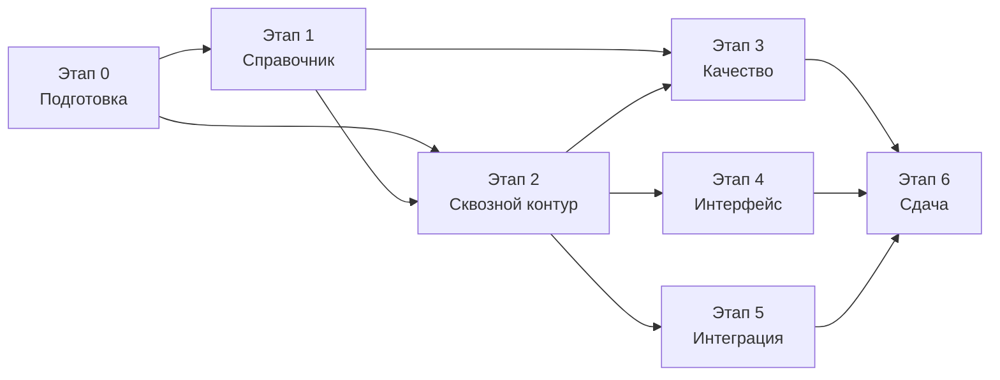

# 11. План реализации

## 11.1. Принципы планирования

1. **Первым делом — самое дорогое по баллам и самое рискованное по срокам.** Критерий К1 (вес 0,40) целиком зависит от справочника устройств, а наполнение справочника — единственная работа, которую нельзя ускорить в конце. Она начинается раньше всего и идёт параллельно разработке.
2. **Работоспособный сквозной сценарий как можно раньше.** После второго этапа существует запускаемый одной командой контур, отвечающий на реальные запросы. Далее качество только наращивается, а риск «не успели собрать всё вместе» снят.
3. **Документация ведётся вместе с кодом, а не после.** Критерий К3 (вес 0,20) на практике теряется чаще всего именно из-за откладывания.
4. **Каждый этап завершается предъявляемым результатом.** Это позволяет остановиться на любом этапе с работающим решением, если сроки окажутся жёстче ожидаемого.

## 11.2. Этапы

### Этап 0. Согласования и подготовка

**Результат:** решены вопросы из [12-open-questions.md](./12-open-questions.md), подготовлен каркас репозитория.

- Ответы на вопросы о доступе к брендбуку и сроках сдачи.
- Монорепозиторий: рабочие пространства, единая строгая конфигурация TypeScript, ESLint с запретом `any` и утверждений типа на внешних данных, Prettier, Jest, конвейер CI.
- Каркас приложений: `apps/api` (NestJS), `apps/web` (React + Vite), пустые пакеты.
- Пакет `test-utils`: изолированная тестовая база на `mongodb-memory-server`, защитная проверка имени базы, фабрики тестовых данных. Делается до первого теста, обращающегося к базе, а не после.
- `docker-compose.yml` с MongoDB, `.env.example`.
- Схема записи справочника (Mongoose + типы TypeScript из одного объявления) и валидатор.

### Этап 1. Справочник устройств (начинается на этапе 0 и идёт параллельно)

**Результат:** наполненный, валидируемый справочник с известным происхождением и измеренным качеством данных.

Работа делится на две независимые дорожки, которые можно вести параллельно разными людьми.

**Дорожка А — конвейер приёма данных** (разработка, описана в [14-catalog-ingestion.md](./14-catalog-ingestion.md)):

- схема записи, инварианты, валидация в CI;
- устойчивый разбор CSV, нормализация, валидация по кодам проверок, шаблоны сервисных кодов вендоров;
- сверка с эталоном, консенсус независимых выгрузок, слияние по приоритетам источников, тарификация достоверности;
- скрипт `tools/seed` с подкомандами и режимом `--dry-run`, отчёт об импорте;
- пересборка сигнатур экранов, идемпотентная загрузка в MongoDB.

**Дорожка Б — данные** (аналитика, распараллеливается по брендам):

- запросы выгрузок по партиям из [приложения А](./appendix-a-llm-csv-request.md) у двух-трёх разных моделей; перед массовым прогоном — проверка пригодности источника на одной партии (§А.8). **Состояние:** собрано десять основных партий у четырёх источников плюс партия 16 (суффиксы кодов) у пяти источников (§А.6, столбец «Состояние»); что осталось и в каком порядке — §А.9, чего в массиве нет вообще — §А.8.3;
- курируемое ядро (ADR-026: только по реальным вендорским страницам со ссылкой и датой сверки, знание языковой модели источником не считается): Apple и Google Pixel целиком вручную (перечни короткие, правила детерминированные), затем наиболее распространённые модели Samsung и Xiaomi. **Состояние:** Apple заведён этапом 5.3 — `data/catalog/curated/apple-iphone.json`, 44 записи (ADR-030); Google Pixel заведён этапом 5.4 — `data/catalog/curated/google-pixel.json`, 32 записи, от Pixel (2016) до Pixel 10 Pro Fold (ADR-032);
- сопоставление «суффикс сервисного кода → регион продажи» для брендов с региональной зависимостью eSIM: пилот показал, что языковые модели полного набора суффиксов не дают, а без него весь модельный ряд Samsung остаётся в статусе `conditional` и требует уточняющего вопроса там, где ответ выводится из кода автоматически. Партия 16 (§А.10) собрана и разобрана (§А.10.4) — она не вход правила консенсуса, а генератор перечня кандидатов «суффикс → регион» для ручной сверки (ADR-013 дополнение, ADR-026); сама таблица `data/catalog/code-suffixes.json` несёт только регион, без влияния на статус eSIM (ADR-028). **Заведена этапом 5.7** (ADR-035): 10 связок `verified` (китайские окончания Samsung/Huawei/Honor, суффиксы США Samsung, глобальная схема Xiaomi `G`/`C`/`I` — подтверждена корпусом собранных выгрузок, §А.10.5), код применения (резолюция региона по коду в модуле `detection`) не входит в объём дорожки данных и остаётся следующему агенту;
- контрольная выборка фактов `catalog.reference.json` — не менее 150 моделей, подтверждённых по вендорским источникам. **Состояние: заведена этапом 5.4 — 196 записей** (44 Apple + 32 Pixel + 120 Samsung, из них граница появления eSIM у Samsung из §А.8.1 вывод 4 и остаток Samsung по единой вендорской странице, ADR-032); доля расхождений выгрузки с эталоном на пересечении измерена — 19,0%. Это одновременно инструмент измерения качества выгрузки (docs/14 §14.4 шаг 4);
- сигнатуры экранов iPhone и диапазоны поддерживаемых версий iOS;
- региональные исключения и уточняющие вопросы для статуса `conditional`;
- словари псевдонимов, синонимов и шаблонов транслитерации;
- разбор карантина после первого импорта.

Дорожка Б — самая трудоёмкая по объёму рутинной работы часть проекта и главный кандидат на распараллеливание внутри команды. Курируемое ядро важнее объёма: контрольная выборка заказчика с большой вероятностью состоит из распространённых моделей, а не из длинного хвоста.

Измерение собранного массива подтвердило этот приоритет и дало конкретный порядок работ (§А.9). Первыми идут не самые крупные партии, а те, что закрывают целую ветку алгоритма. Курируемое ядро Apple, дающее платформу `ios`, заведено этапом 5.3 (44 записи, ADR-030); курируемое ядро Google Pixel заведено этапом 5.4 (32 записи, ADR-032). Платформа `harmonyos` (партия 8), флагманы Xiaomi (партия 5), складные Samsung (партия 3) и бренды партии 12 заведены этапом 5.5 (ADR-033, приложение А §А.6/§А.8.3) — 33/27/19/148 записей соответственно, справочник вырос с 645 до 1049 записей. Все типы устройств, кроме `phone`, оставались нулевыми в выгрузках (партии 13–14) — владелец планшета получал бы ответ про телефон, что ложный результат в смысле К1, а не пробел в охвате. **Закрыто этапом 5.6 (ADR-034)**: не выгрузкой партий 13–14 (сознательно не запрошены), а минимальным курируемым ядром (8 записей `verified`) и классификацией типа устройства по сигналам, параметризовавшей отбор кандидатов iOS. Дорожка Б (наполнение справочника) полностью закрыта; полный состав цепочки данных и обоснование порядка — §11.2а.

### Этап 2. Сквозной работоспособный контур

**Результат:** `docker compose up` — работает автоопределение и поиск по названию, три статуса результата.

- `CatalogModule`: загрузка, кэш в памяти, построение индексов, `/health/ready`.
- `esim-rules`: вывод статуса, правило по версии iOS, региональные условия.
- `detection`: сбор сигналов на клиенте, ветки Android и iOS, расчёт уверенности, интерсептор `Accept-CH`.
- `text-normalizer` и `fuzzy-matcher` в базовом объёме, `matching`.
- Эндпоинты `detect`, `devices/search`, `devices/suggest`, `devices/{id}`, `health`.
- Интерфейс: экран проверки, три состояния результата, поиск с подсказками.
- Модульные тесты на всё перечисленное — обязательное условие завершения этапа.

### Этап 3. Качество определения

**Результат:** измеренное качество, отчёт стенда оценки, доля ложных определений — ноль.

- Эталонные выборки `signals.golden.json` (не менее 120 записей) и `queries.golden.json` (не менее 300 записей).
- Стенд оценки качества и отчёт в Markdown, включение в CI.
- Доработка нормализации: неверная раскладка, слипшиеся написания, схожие символы, расширение словарей.
- Доработка ранжирования: жёсткие ограничения на цифры и модификаторы, правило разрыва, априорная популярность.
- Обнаружение эмуляции и подмены сигналов.
- Полный сценарий уточнения: выбор из кандидатов, уточняющий вопрос, ручной поиск, проверка на устройстве.
- Разбор расхождений на эталонной выборке до достижения целевых метрик.

### Этап 4. Интерфейс и брендирование

**Результат:** интерфейс, соответствующий брендбуку, понятный без обучения.

- Слой токенов дизайна, заполнение значениями брендбука.
- Проработка всех состояний: загрузка, результат, уточнение, поиск, ошибка, недоступность сервиса.
- Доступность: работа с клавиатуры, экранный диктор, контрастность, увеличенный шрифт.
- Адаптивность, проверка на реальных устройствах.
- Сборка виджета в самодостаточный файл, теневой DOM, публикация событий.

### Этап 5. Готовность к интеграции

**Результат:** пакет материалов для интегратора, демонстрационный контур.

- Спецификация OpenAPI, Swagger UI с примерами, коллекция Postman.
- Реестр кодов ошибок, ограничение частоты запросов, CORS, ключи API.
- Пакет React, примеры подключения для обычного HTML и React.
- Страница отладки для контрольных испытаний.
- Метрики, структурные журналы, сквозной идентификатор запроса.
- Эндпоинт обратной связи.
- Модерация ([15-moderation.md](./15-moderation.md)): очередь задач с дедупликацией и счётчиком обращений, раздел `/admin`, автоматические подсказки специалисту, журнал изменений, экспорт решений в файлы каталога, демонстрационный сценарий пополнения справочника.
- Тесты e2e для API и трёх ключевых сценариев интерфейса.

### Этап 6. Сдача

**Результат:** решение, готовое к предъявлению комиссии.

- Проверка запуска из чистого клона на машине, где проект не собирался.
- Финальная сверка документации с фактической реализацией (расхождения между документацией и кодом — типовое замечание, снижающее оценку по К3).
- Прогон контрольного списка ручных проверок из [08-testing-and-quality.md](./08-testing-and-quality.md), раздел 8.8.
- Итоговый отчёт стенда оценки качества как приложение к документации.
- Сценарий демонстрации: последовательность из нескольких кейсов, показывающая автоопределение, устойчивость ввода и корректное уточнение.
- Самопроверка по всем пунктам критериев К1–К4 из [01-analysis.md](./01-analysis.md), разделы 1.4 и 1.5.

## 11.2а. Этап данных: цепочка 5.1–5.7

Этапы 0–6 выше описывают объём по функциональности. Дорожка Б первого этапа («данные», §11.2) при этом оказалась крупнее любого из них по числу отдельных работ и выполняется отдельной цепочкой агентов 5.1–5.7 уже после того, как сквозной контур заработал. Этот раздел — единственная общая память цепочки: каждый следующий агент начинает без контекста предыдущего и читает только `docs/`.

### Состав цепочки

| Агент | Объём                                                                                                                                                                                                                                                                                                                                                                                             | Состояние                                                                                                                                                                                                                                                                                                                                                                                                                                                                                                                                                                                                                                                                                                                                                                                                                              |
| ----- | ------------------------------------------------------------------------------------------------------------------------------------------------------------------------------------------------------------------------------------------------------------------------------------------------------------------------------------------------------------------------------------------------- | -------------------------------------------------------------------------------------------------------------------------------------------------------------------------------------------------------------------------------------------------------------------------------------------------------------------------------------------------------------------------------------------------------------------------------------------------------------------------------------------------------------------------------------------------------------------------------------------------------------------------------------------------------------------------------------------------------------------------------------------------------------------------------------------------------------------------------------- |
| 5.1   | Закрытие открытых вопросов организационного характера и по данным справочника: ADR-025…ADR-028, переписан [12-open-questions.md](./12-open-questions.md)                                                                                                                                                                                                                                          | выполнено                                                                                                                                                                                                                                                                                                                                                                                                                                                                                                                                                                                                                                                                                                                                                                                                                              |
| 5.2   | Справочник становится загружаемым: карантин нарушителей инвариантов вместо отказа целиком, инвариант 6 приведён к формулировке правила, POCO/Redmi против Xiaomi разрешены данными (ADR-029)                                                                                                                                                                                                      | выполнено                                                                                                                                                                                                                                                                                                                                                                                                                                                                                                                                                                                                                                                                                                                                                                                                                              |
| 5.3   | Курируемое ядро Apple: 44 записи iPhone с сигнатурами экранов и диапазонами версий iOS, приём массива записей в файле курируемого ядра, загрузка ядра без строк CSV (ADR-030)                                                                                                                                                                                                                     | выполнено                                                                                                                                                                                                                                                                                                                                                                                                                                                                                                                                                                                                                                                                                                                                                                                                                              |
| 5.3а  | Не этап дорожки данных, а точечное закрытие пробела реализации `detection`/`matching`, обнаруженного этапом 5.3 (ADR-030 «Последствия»): адресный вопрос вместо списка моделей на iOS при общем региональном условии, приём ответа пользователя (`context.region`/`region`) в `/detect` и `/devices/search`, исправление состава регионов курируемого ядра Apple по вендорскому перечню (ADR-031) | выполнено                                                                                                                                                                                                                                                                                                                                                                                                                                                                                                                                                                                                                                                                                                                                                                                                                              |
| 5.4   | Курируемое ядро Google Pixel (партия 9) и контрольная выборка `catalog.reference.json` по вендорским страницам (решение вопроса 13)                                                                                                                                                                                                                                                               | выполнено                                                                                                                                                                                                                                                                                                                                                                                                                                                                                                                                                                                                                                                                                                                                                                                                                              |
| 5.5   | Импорт оставшихся партий выгрузок: флагманы Xiaomi (5), Huawei (8) — единственный источник платформы `harmonyos`, складные Samsung (3), прочие бренды (12)                                                                                                                                                                                                                                        | **выполнено.** Файлы партий 3/5/8/12 поступили от пользователя в ходе этапа (первый проход зафиксировал их отсутствие, второй — принял и обработал); собраны у пяти источников, три дефекта конвейера найдены и исправлены (`BRAND_UNKNOWN` по Fairphone/HMD/Nokia/iQOO, ложный `NAME_UNPARSEABLE` и ложный `CONFLICTING_ALIAS` на голых числовых названиях Xiaomi/iQOO/realme/OnePlus — ADR-033); также исправлен дефект классификации HarmonyOS по User-Agent, найденный до появления партии 8 (docs/09 ADR-024, дополнение этапа 5.5). `pnpm seed load` — 1049 записей (было 645), карантин по инвариантам §5.8 — 3,4% (порог 20%). Подтверждено запросом к базе: `harmonyos` — 33, `family: xiaomi` — 27, `galaxy-z`/`galaxy-note` — 19, бренды партии 12 — 148. lint/typecheck/test/build проходят                                |
| 5.6   | Планшеты и умные часы (партии 13–14) в объёме, достаточном для распознавания типа устройства (ADR-025, вопрос 8), а не полноты статуса eSIM                                                                                                                                                                                                                                                       | **выполнено.** Партии 13–14 у языковых моделей сознательно не запрошены — наращивание охвата не входило в объём. Вместо них: минимальное курируемое ядро вне выгрузки (8 записей `verified` — 4 iPad, 2 Apple Watch, 1 Galaxy Tab, 1 Galaxy Watch), классификация типа устройства по сигналам (`classifyDeviceType`), параметризация отбора кандидатов iOS по `deviceType` (был жёсткий фильтр `'phone'`), решение ловушки iPadOS 13+ (десктопный User-Agent Safari без сигнала `maxTouchPoints` неотличим от Mac). Новый код причины (`DEVICE_TYPE_TABLET_DETECTED`/`DEVICE_TYPE_WATCH_DETECTED`/`DEVICE_TYPE_AMBIGUOUS`) и поле `detection.deviceType` в контракте. Подробности — ADR-034, docs/09-decisions.md. Тексты уточнения — черновые, ждут утверждения пользователем (ADR-025 п.3), как и региональный вопрос iOS этапа 5.3а |
| 5.7   | Таблица «суффикс сервисного кода → регион» (`data/catalog/code-suffixes.json`, ADR-026/ADR-028) и схема эталонной выборки сигналов `signals.golden.json`                                                                                                                                                                                                                                          | **выполнено.** `code-suffixes.json` — 10 связок `verified` (китайские окончания Samsung/Huawei/Honor, суффиксы США Samsung, глобальная схема Xiaomi, ADR-035), два правила против ложного отрицания реализованы на уровне типов (`resolveSuffixOutcome`, docs/08 §8.2), партия 16 подключена к отчёту конвейера без входа в консенсус (ADR-036, критерий «строка в отчёте про партию 16» выполнен буквально). Схема `signals.golden.json` заведена типом/разборщиком/тестом (`tools/eval/src/signals-golden.ts`, ADR-037) — наполнение файла не входит в объём (канал сбора — виджет и стенд отладки, объём агента 6). Региональная связка «КНР → eSIM отсутствует» зафиксирована как устаревшая после реформы МПТ КНР октября 2025 года (docs/10 О-3)                                                                                 |

### Какой пробел охвата закрывает каждый агент

Пробелы перечислены в [приложении А](./appendix-a-llm-csv-request.md) §А.8.3 как «ноль записей», то есть ветка алгоритма без единого примера, а не «мало данных».

| Пробел §А.8.3                                                | Закрывает | Чем именно                                                                                                                                                                                                                                                                                                                                                  |
| ------------------------------------------------------------ | --------- | ----------------------------------------------------------------------------------------------------------------------------------------------------------------------------------------------------------------------------------------------------------------------------------------------------------------------------------------------------------- |
| Платформа `ios` — 0 записей                                  | 5.3       | Курируемое ядро Apple: 44 записи, сигнатуры экранов, диапазоны версий iOS                                                                                                                                                                                                                                                                                   |
| Apple и Google Pixel — 0 записей                             | 5.3 и 5.4 | Apple — курируемым ядром 5.3 (44 записи), Pixel — курируемым ядром 5.4 (32 записи)                                                                                                                                                                                                                                                                          |
| Платформа `harmonyos` — 0 записей                            | 5.5       | **Закрыто.** Партия 8 (Huawei) собрана и загружена: 33 записи `platform: "harmonyos"` (Huawei P50 и новее). Ветка `detection` проверена на реальном образце UA (docs/09 ADR-024, дополнение этапа 5.5), но не на реальном устройстве HarmonyOS — остаточный пробел                                                                                          |
| Флагманы Xiaomi — 0 записей                                  | 5.5       | **Закрыто.** Партия 5 собрана и загружена: 27 записей с `family: "xiaomi"` (голые номера поколений 12–15, Mix Fold/Flip) — требовало исправления `NAME_UNPARSEABLE`, ADR-033                                                                                                                                                                                |
| Samsung Galaxy Z Fold, Z Flip, Note — 0 записей              | 5.5       | **Закрыто.** Партия 3 собрана и загружена: 19 записей линеек `galaxy-z`/`galaxy-note`; доля расхождений выгрузки с эталоном пересчитана — docs/08 §8.4                                                                                                                                                                                                      |
| Nothing, Motorola, ASUS, Sony, Fairphone, HMD/Nokia          | 5.5       | **Закрыто.** Партия 12 собрана и загружена: 148 записей шести брендов — требовало добавления `Fairphone`/`HMD`/`Nokia` в словарь известных брендов, ADR-033                                                                                                                                                                                                 |
| ~~Типы `tablet`, `watch`, `laptop` — 0 записей~~ **закрыто** | 5.6       | Партии 13–14 сознательно не собраны — закрыто минимальным курируемым ядром вне выгрузки (8 записей `verified`) и классификацией типа по сигналам (`classifyDeviceType`, параметризация `select-ios-candidates` по `deviceType`, ADR-034). Критерий выполнен: владелец планшета/часов получает корректно классифицированный, адресный ответ, а не телефонный |
| ~~Контрольная выборка эталона отсутствует~~ **закрыто**      | 5.4       | `catalog.reference.json` — 196 записей (44 Apple + 32 Pixel + 120 Samsung), доля расхождений выгрузки с эталоном на пересечении измерена — 19,0% (ADR-032)                                                                                                                                                                                                  |
| ~~Связка «суффикс кода → регион» не проверена~~ **закрыто**  | 5.7       | `code-suffixes.json` уровня `verified` — 10 связок (ADR-035); подключение к резолюции региона у Android остаётся кодом следующего агента, работающего с `detection` — таблица данных сама по себе ответ не меняет, пока не подключена (см. «Чего не делать» в передаче этапа 5.7)                                                                           |

### Почему порядок именно такой

**Загрузка справочника раньше данных для него (5.2 перед 5.3–5.6).** До этапа 5.2 `pnpm seed load` отказывался писать в MongoDB целиком при любом нарушении инвариантов у одной записи (ADR-023 → ADR-029). Заводить данные в такой конвейер бессмысленно: каждая новая партия с высокой вероятностью содержит хотя бы одну проблемную запись, то есть обнуляла бы результат всей предыдущей работы, а отладка данных велась бы по отчёту, который не доходит до базы. Сначала конвейер должен уметь принимать данные частично — потом в него имеет смысл вкладывать объём.

**Курируемое ядро Apple раньше остатка Android (5.3 перед 5.5).** Три причины, все измеримые. Во-первых, доля: целевой сценарий сервиса — телефон, а доля iPhone среди телефонов велика, тогда как остаток Android — это партии, добавляющие строки к уже покрытому сегменту (Xiaomi, Samsung и остальные бренды в справочнике уже есть). Во-вторых, ветка алгоритма: до 5.3 ветка iOS модуля `detection` не имела ни одной реальной записи и была проверена только на фикстурах, подготовленных самим агентом 5 (ADR-024) — то есть проверена была реализация, но не данные, на которых она работает. В-третьих, стоимость ошибки: курируемое ядро — единственный источник уровня `verified`, он не проходит ни через один фильтр конвейера CSV (консенсус, сверка с эталоном, тарификация достоверности), поэтому ошибка в нём не обнаруживается автоматически ничем, кроме тестов файла данных — и делать эту работу лучше раньше, пока есть время на её перепроверку, а не в последний день.

**Контрольная выборка (5.4) не первая, хотя измеряет качество.** Её ценность — доля расхождений выгрузки с эталоном (шаг 4 конвейера), и она тем полезнее, чем больше выгрузок уже принято. При этом сама выборка формируется по вендорским страницам вручную и по трудоёмкости сопоставима с курируемым ядром, поэтому идёт после Apple, но до массового приёма оставшихся партий — иначе новые партии окажутся неизмеренными.

## 11.2б. Этап интерфейса: цепочка 6.1–6.6

По тому же принципу, что и дорожка данных (§11.2а): этап 4 «Интерфейс и брендирование» выполняется отдельной цепочкой агентов 6.1–6.6, каждый следующий начинает без контекста предыдущего и читает только `docs/`. Разбивка на шесть агентов и точный объём 6.4/6.5 (запрет на установку Playwright и создание `apps/web/Dockerfile` до соответствующего агента) зафиксированы агентом 6.1 в промпте, полученном от пользователя; объём 6.6 на момент этапа 6.1 не уточнён и будет определён по факту того, что останется невыполненным после 6.2–6.5.

| Агент | Объём                                                                                                                                                                                                                                                    | Состояние                                                                                                                                                                                                                                                                                                                                                                                                                                                                                                                                                                                                                                                                                                                                                                                                                                                                                                                                                                                                                                                                                                                                                                            |
| ----- | -------------------------------------------------------------------------------------------------------------------------------------------------------------------------------------------------------------------------------------------------------- | ------------------------------------------------------------------------------------------------------------------------------------------------------------------------------------------------------------------------------------------------------------------------------------------------------------------------------------------------------------------------------------------------------------------------------------------------------------------------------------------------------------------------------------------------------------------------------------------------------------------------------------------------------------------------------------------------------------------------------------------------------------------------------------------------------------------------------------------------------------------------------------------------------------------------------------------------------------------------------------------------------------------------------------------------------------------------------------------------------------------------------------------------------------------------------------ |
| 6.1   | Основание: слой токенов дизайна (`packages/ui-tokens`), реальный сбор сигналов в браузере (`packages/signals-collector`), браузерное тестовое окружение (Jest + jsdom + Testing Library), перенос утверждённых текстов интерфейса в документацию (§13.6) | **выполнено.** `packages/ui-tokens` — шесть групп токенов, нейтральная плейсхолдер-палитра (доступа к брендбуку СберМобайл нет — §13.3), генерация CSS-переменных, тест контраста AA по WCAG. `packages/signals-collector` — `collectSignals`/`createBrowserSignalsSource` над внедряемым источником, ни один сбор не бросает исключение. Оба пакета — 100% покрытия тестами. `apps/web`/`apps/widget` получили `jest.config.ts` (jsdom, `passWithNoTests`) и скрипт `test`. docs/13 §13.6 и ADR-038 добавлены                                                                                                                                                                                                                                                                                                                                                                                                                                                                                                                                                                                                                                                                       |
| 6.2   | Клиент API и компоненты интерфейса (экран проверки, ручной поиск, уточнение, состояния ошибок) на основе `packages/ui-tokens`/`packages/signals-collector` и текстов §13.6                                                                               | **выполнено.** `apps/widget/src` — единственный исходник компонентов (ADR-038 п.4, зафиксировано отдельно ADR-039): клиент API (`api/*`) разбирает `/detect`, `/devices/search`, `/devices/suggest` и конверт ошибки предикатами без `as` (образец — `tools/eval/src/signals-golden.ts`), отдельная ветка сетевой ошибки. Компонент `EsimChecker` — автоопределение, три статуса результата дословно из `presentation`, все четыре значения `clarification.kind`, ручной поиск с доступным автодополнением (`role="combobox"`), адресные подписи по типу устройства. Выбор кандидата уточнения обходится нереализованным `/clarify` через `POST /devices/search` по подписи варианта (ADR-039). `context.region` уходит только по клику — отдельный тест утверждает отсутствие поля в первом запросе. `apps/web` подключает `@esim-detector/widget` рабочим пространством, `App.tsx` — тонкая обёртка, `vite.config.ts` проксирует `/api`. 125 тестов, покрытие `apps/widget` 90–94% по всем метрикам (порог §8.2 — 80%).                                                                                                                                                            |
| 6.3   | Сборка виджета: Web Component с теневым DOM, публикация событий (docs/07 §7.2)                                                                                                                                                                           | **выполнено.** `apps/widget/src/web-component/` — пользовательский элемент `<esim-detector-widget>` (теневой DOM, `IntersectionObserver`-автозапуск с деградацией без него), точка входа сборки `bootstrap.ts` (читает `data-target`/`data-api-base`/`data-theme`/`data-channel` тега `<script>`), шесть событий (`esim:ready`/`esim:detected`/`esim:clarification`/`esim:result`/`esim:error`/`esim:action`) с `bubbles: true, composed: true`, формы всех пяти определены и зафиксированы ADR-040/docs/07 §7.2. `apps/widget/vite.config.mts` — сборка в один файл `widget/v1/esim-widget.js` (IIFE, React внутри, CSS через `vite-plugin-css-injected-by-js` в теневой DOM, без отдельного файла стилей). CORS включён в `apps/api/src/configure-app.ts` (найденный дефект закрытого этапа 6.2, ADR-040) — `app.enableCors`/`Access-Control-Expose-Headers: X-Request-Id`. Статическая страница-пример (`apps/widget/example/`) на отдельном порту для агента 6.5. 154 теста в `apps/widget` (было 126), покрытие 92–94%; 256 в `apps/api`. Живой прогон в браузере (Playwright) подтвердил изоляцию стилей вычисленными стилями и кросс-доменный `POST /detect` с реальным CORS. |
| 6.4   | `apps/web/Dockerfile`, сервис `web` в `docker-compose.yml`, маршрут `/debug` и экспорт черновика записи `signals.golden.json` (ADR-027, ADR-041)                                                                                                         | **выполнено.** `apps/web/src/debug/` — стенд отладки: редактируемые сигналы в формате тела `/detect`, полный ответ сервиса (`detection`/`device`/`candidates`/`clarification`), таблица `reasons[]`, блок уверенности, `presentation`, версия справочника (`GET /api/v1/catalog/meta`, новый клиент `apps/widget/src/api/catalog-meta.ts`), `requestId` с копированием, обработка ошибок разбора JSON и кодов docs/06 §6.5. Кнопка экспорта строит черновик `SignalsGoldenEntry` (`tools/eval/src/signals-golden.ts`, ранее не имевший точки публичного импорта — заведена этим этапом) с полем `expected`, явно помеченным как требующее ручной проверки; факт успешного разбора `parseSignalsGolden` подтверждён тестом на настоящей функции, а не имитацией. Маршрутизация `/` и `/debug` — по `location.pathname`, без библиотеки. `apps/web/Dockerfile` (две стадии, nginx с шаблоном `envsubst` для адреса API) и сервис `web` в `docker-compose.yml` — весь контур поднят и проверен живым прогоном в реальном браузере (Playwright): автоопределение, три статуса, стенд отладки, страница-пример виджета. Решения — ADR-041                                                 |
| 6.5   | Playwright: e2e-тесты трёх ключевых сценариев интерфейса (docs/11 §11.2 «Этап 5»)                                                                                                                                                                        | **выполнено.** Пакет `apps/e2e` (`@esim-detector/e2e`), команда `pnpm test:e2e`, отдельная от `pnpm test` (не требует Docker/Mongo при чистом клоне). 11 тестов, все шесть сценариев docs/08 §8.3: автоопределение (Pixel 7/Pixel 2), уточнение выбором кандидата (iPhone 13/12), ручной поиск с опечаткой, изоляция стилей и события виджета на сторонней странице, недоступный API, доступность только с клавиатуры. Находка этапа — подмена WebGL-рендерера (`apps/e2e/test/support/gpu-spoof.ts`) обязательна для воспроизводимости мобильных сценариев без dGPU. Один пункт критерия не подтверждён и передан дальше: негативный контроль `composed: true` (сценарий событий) не воспроизводит ожидаемое падение теста на текущей структуре страницы-примера (докстринг `scenario-4-widget-embedding/default.spec.ts`, docs/08 §8.3).                                                                                                                                                                                                                                                                                                                                           |
| 6.6   | Наполнение `data/fixtures/signals.golden.json`, разовая сверка выборки с фактическим ответом сервиса, документация этапа (ADR-037/ADR-041 задавали объём заранее)                                                                                        | **выполнено.** На момент этапа: 121 запись (целевой объём — 120), все девять групп непусты, два канала из трёх (`browser-emulation` 80; `public-ua-database` 41, включая 26 составных `android-vendor-ua-ch`; 0 `real-device`). `expected` из правил docs/03 и справочника до API; сверка — 121/121 (100%) после четырёх правок собственного вывода. ADR-042. Позже (полевое тестирование 2026-08-25): `real-device` Pixel 9; S25 Ultra; S24 SM-S9210; Redmi Note 13 Pro; Redmi Note 9 Pro; Galaxy A21s SM-A217F; Galaxy A10 SM-A105F; Mi 8 Pro / Яндекс.Браузер; iPhone 14 Pro Max / Яндекс.Браузер; iPhone 12 Pro Max / Safari; iPhone 12 Pro Max / YaApp_iOS; iPhone 11 / Chrome CriOS → **133** записи; попутно S25 Ultra / S24 SM-S9210 / Note 13 Pro / Note 9 Pro / A21s / A10 / Mi 8 Pro curated, см. docs/08 §8.4. Инструкция публикации — docs/16-deployment.md. Вне этапа на момент 6.6 оставались: массовый сбор с реальных устройств (docs/08 §8.8), фирменные токены (docs/13 §13.3), негативный контроль `composed` со стороны 6.5.                                                                                                                                    |

## 11.3. Порядок работ и зависимости

Этапы 3, 4 и 5 после завершения второго этапа выполняются параллельно и не зависят друг от друга — это основной ресурс сокращения календарного срока при работе командой.

## 11.4. Распределение усилий относительно веса критериев

| Направление                           | Доля усилий | Обоснование                                                           |
| ------------------------------------- | ----------- | --------------------------------------------------------------------- |
| Справочник устройств и правила вывода | ~30%        | Критерий К1, вес 0,40; наибольший вклад в оценку                      |
| Обработка ввода и эталонные выборки   | ~25%        | Критерий К2, вес 0,25                                                 |
| Документация и прозрачность           | ~15%        | Критерий К3, вес 0,20; ведётся параллельно                            |
| Интеграция и демонстрационный контур  | ~15%        | Критерий К4, вес 0,15                                                 |
| Интерфейс и брендирование             | ~15%        | Влияет на К2 (понятность результата) и на восприятие при демонстрации |

## 11.5. Риски

| Риск                                                                     | Влияние                                                          | Мера                                                                                                                                                                                                   |
| ------------------------------------------------------------------------ | ---------------------------------------------------------------- | ------------------------------------------------------------------------------------------------------------------------------------------------------------------------------------------------------ |
| Справочник не успевает наполниться в нужном объёме                       | Прямая потеря баллов по К1                                       | Начинается первым, распараллеливается; приоритет по доле устройств на рынке; правила уровня семейства как страховка                                                                                    |
| Контрольная выборка заказчика содержит устройства вне нашего справочника | Расхождение по К1                                                | Приоритет по популярности на рынке РФ; безопасная деградация в уточнение вместо ошибки; очередь пополнения                                                                                             |
| Ошибки в данных о поддержке eSIM                                         | Ложные определения; К1 является ещё и правилом разрешения ничьей | Выгрузка языковой модели трактуется как кандидаты, а не как справочник: валидация с карантином, сверка с эталоном, консенсус источников, уровни достоверности, отказ отвечать по непроверенным записям |
| Выгрузка содержит выдуманные сервисные коды моделей                      | Неверное автоопределение на Android — самый дорогой вид ошибки   | Валидация кодов по вендорским шаблонам, отбраковка коллизий, приоритет реально наблюдаемых значений из эталонной выборки сигналов над данными выгрузки                                                 |
| Отставание справочника от выхода новых моделей                           | Рост доли уточнений                                              | Модерация с сортировкой очереди по частоте обращений; частичное распознавание по бренду вместо пустого ответа                                                                                          |
| Комиссия ожидает точное определение модели iPhone                        | Замечание по К1                                                  | Ограничение описано явно с обоснованием невозможности; показывается, что статус eSIM определяется верно                                                                                                |
| Нет доступа к брендбуку                                                  | Замечание при демонстрации                                       | Слой токенов дизайна: замена значений в одном файле; работа не блокируется                                                                                                                             |
| Недооценка объёма работ по интеграции                                    | Потеря баллов по К4 при малом весе критерия                      | Пятый этап начинается параллельно, не переносится в конец                                                                                                                                              |
| Расхождение документации и реализации                                    | Замечание по К3                                                  | Финальная сверка вынесена в отдельный пункт этапа сдачи                                                                                                                                                |
