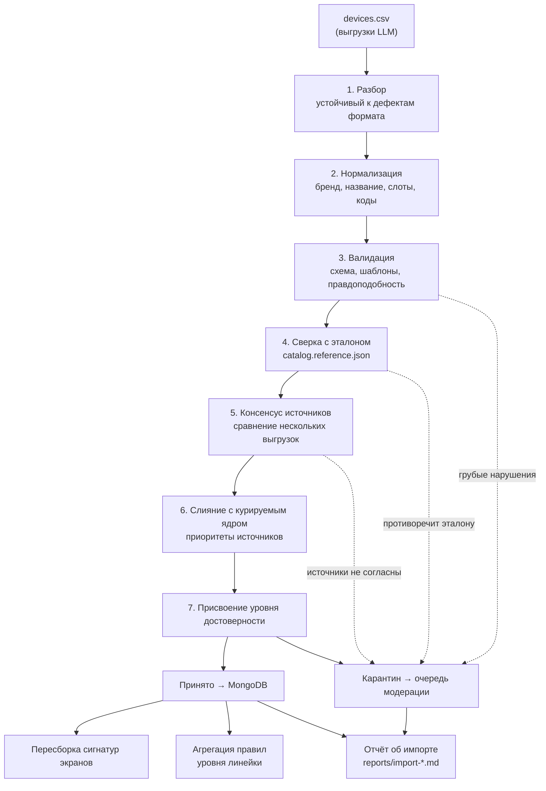
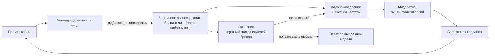

# 14. Приём справочника из CSV и наполнение базы данных

## 14.1. Исходная ситуация и главный риск

Первичное наполнение справочника формируется запросом к сторонней языковой модели с выгрузкой в CSV. Это решение принято, и задача — обработать такой CSV и загрузить его в базу.

Риск нужно назвать прямо, потому что он определяет всю конструкцию этого раздела: **языковая модель выдаёт правдоподобные, а не проверенные данные.** Она уверенно назовёт несуществующий сервисный код, укажет eSIM у устройства без eSIM и сошлётся на несуществующую страницу вендора. При этом критерий К1 (вес 0,40) проверяется на контрольной выборке заказчика и служит тай-брейком при равенстве баллов, а по правилам оценки «характеристики, которые не могут быть объективно подтверждены, самостоятельной оценке не подлежат».

Отсюда принцип: **данные из CSV не являются справочником — они являются кандидатами в справочник.** Между CSV и ответом пользователю стоит конвейер проверки, тарификация достоверности и модерация. Ни одна строка не начинает влиять на ответы пользователю только потому, что она пришла из CSV.

Такой подход даёт и побочную выгоду для оценки: конвейер печатает отчёт с числами, а отчёт — объективно подтверждаемый артефакт, который можно предъявить комиссии вместе с исходным кодом проверок.

## 14.2. Две независимые оси идентификации

Пользователь прямо указал ключевую проблему: имя модели от языковой модели может не соответствовать тому, что приходит в заголовках запроса. Это не дефект конкретной выгрузки, а структурное свойство задачи — в мире устройства называются двумя разными способами:

| Ось                    | Что это                             | Откуда берётся в проде                          | Надёжность данных от LLM                                             |
| ---------------------- | ----------------------------------- | ----------------------------------------------- | -------------------------------------------------------------------- |
| Сервисный код модели   | `SM-S928B`, `CPH2451`, `23090RA98G` | Заголовок `Sec-CH-UA-Model` при автоопределении | **Низкая.** Коды выдумываются, путаются между региональными версиями |
| Маркетинговое название | `Galaxy S24 Ultra`, `iPhone 15 Pro` | Пользовательский ввод                           | Средняя. Названия распространённых моделей модель знает хорошо       |

Следствия для конвейера:

1. Записи справочника хранят обе оси независимо; отсутствие одной не блокирует работу другой.
2. Сервисные коды из CSV проходят строгую валидацию по вендорским шаблонам, а непрошедшие — отбрасываются с сохранением остальной записи. Запись без кодов остаётся полезной: она работает в сценарии пользовательского ввода.
3. Достоверный источник сопоставления «код → устройство» — не языковая модель, а реально наблюдаемые значения: эталонная выборка сигналов с устройств команды, значения, накопленные стендом, и вендорские перечни, сверенные вручную. Конвейер CSV лишь предлагает варианты.
4. Псевдонимы и русские написания генерируются нашим кодом по правилам, а не запрашиваются у языковой модели: правила транслитерации детерминированы и покрыты тестами, тогда как список псевдонимов от LLM был бы ещё одним непроверяемым массивом.

## 14.3. Контракт CSV

Формат запроса к сторонней модели и точная схема столбцов — [приложение А](./appendix-a-llm-csv-request.md). Запрашивается одна выгрузка — `devices.csv`, построчно по моделям.

Правила уровня линейки («линейка Redmi A, 2019–2025, eSIM отсутствует») отдельной выгрузкой `families.csv` не запрашиваются: по ADR-021 они вычисляются агрегацией принятых записей, потому что длинный хвост, ради которого задумывался второй файл, уже перечислен поштучно. Схема `families.csv` (§А.3) остаётся резервом, и разбор второго формата в конвейере не реализуется.

Парсер намеренно устойчив к типовым дефектам выгрузок языковых моделей: символ BOM, обёртка в блок кода Markdown, пояснительный текст до и после таблицы, отсутствие строки заголовка, разделитель `;` вместо `,`, `Да`/`Нет`/`true`/`1` вместо `yes`/`no`, неразрывные пробелы, обрыв строки на середине, повторный заголовок в середине файла, сокращение перечня многоточием. Все отклонения фиксируются в отчёте, а не приводят к падению.

Граница устойчивости проходит там, где восстановление данных превращается в догадку о намерении модели. Отсутствие заголовка восстановимо: порядок столбцов задан схемой. Неверное число полей в строке восстановимо частично, и правило здесь тонкое, потому что на полном прогоне выгрузок неверное число полей имели 39% строк — отбрасывать их целиком означало бы потерять две пятых массива (§А.8.2 приложения А).

Восстановление опирается на то, что перечислимые поля имеют известные замкнутые наборы значений: `android`, `phone`, `conditional`, `high`, `official`. Конвейер перебирает допустимые выравнивания строки — склейку хвоста в `notes` при незакрытой кавычке или неэкранированной запятой, вставку пропущенного пустого поля, удаление лишнего пустого поля — и оставляет те, при которых значения всех перечислимых полей попадают в свои наборы. Дальше решает не число вариантов, а их согласие:

| Ситуация                                                                                               | Действие                                                                                            |
| ------------------------------------------------------------------------------------------------------ | --------------------------------------------------------------------------------------------------- |
| Допустимого выравнивания не существует                                                                 | Карантин строки, код `FIELD_COUNT_MISMATCH`                                                         |
| Все допустимые выравнивания дают одни и те же бренд, название, коды, платформу, тип, год и статус eSIM | Строка принимается по этим полям; поля, значение которых зависит от выбора выравнивания, обнуляются |
| Выравнивания расходятся в статусе eSIM либо в опознании устройства                                     | Карантин строки                                                                                     |

Ключевое свойство второго случая: это не догадка, а отказ от неопределённой части при сохранении определённой. Взять значение из неоднозначного столбца было бы догадкой; обнулить его — потеря сведений, но не ошибка. На фактических выгрузках так восстанавливается 779 строк из 977 проблемных, причём во всех этих случаях неоднозначность приходится на поля после статуса eSIM — `dual_sim`, `ru_market`, `source_url` и подобные, — а опознание устройства и сам статус определены однозначно.

Отдельный случай — `esim_conditions` (49 строк): если при статусе `conditional` условие оказалось в неоднозначной части, обнулять его нельзя, потому что запись со статусом `conditional` обязана иметь непустые `conditions` (§5.8, инвариант 5). Такая строка уходит в карантин.

## 14.4. Конвейер обработки



### Шаг 2. Нормализация

Бренд приводится к канону по словарю (`Самсунг`, `SAMSUNG`, `Samsung Electronics` → `samsung`). Маркетинговое название разбирается на слоты — семейство, номер поколения, модификаторы — тем же кодом, что используется для пользовательского ввода (`text-normalizer`, [04-matching-algorithm.md](./04-matching-algorithm.md)). Это важная деталь: справочник и запросы нормализуются одним алгоритмом, поэтому расхождений в написании между ними по построению не возникает. Идентификатор записи формируется детерминированно из бренда и слотов: `samsung-galaxy-s24-ultra`.

Из этого же свойства следует, что **консенсус сходится по идентификатору, а не по строке названия**, и разное написание одной модели в разных выгрузках проблемой не является. Пилот проверил это на живом случае: одна модель перечислила устройства как `Galaxy S21`, другая — как `Galaxy S21 5G`; при сравнении по строке совпало бы 20 названий из 38, при сравнении по идентификатору — 25 из 29. Признак сети `5G` — незначимый атрибут (§4.5 в [04-matching-algorithm.md](./04-matching-algorithm.md)), в идентификатор он не входит.

Плата за это — слияние тех устройств 2019–2021 годов, у которых версии 4G и 5G были разными артикулами: `Galaxy S10` и `Galaxy S10 5G` дают один идентификатор. Слияние безопасно по построению: при совпадении статуса eSIM записи объединяются и сохраняют оба сервисных кода, при расхождении срабатывает `NAME_COLLISION_CONFLICT` и обе уходят в карантин. Ложного ответа этот случай не порождает, поэтому классификация `5G` как незначимого атрибута не пересматривается.

### Шаг 3. Валидация

Каждая проверка имеет стабильный код, попадающий в отчёт и в задачу модерации.

| Код                        | Проверка                                                 | Действие при нарушении                  |
| -------------------------- | -------------------------------------------------------- | --------------------------------------- |
| `HEADER_MISSING`           | Первая строка файла — заголовок с ожидаемыми столбцами   | Разбор по схеме, пометка в отчёте       |
| `FIELD_COUNT_MISMATCH`     | Число полей в строке равно числу столбцов схемы          | Карантин строки, без выравнивания       |
| `ENUM_INVALID`             | Значения перечислимых полей в допустимом наборе          | Карантин строки                         |
| `CONDITION_SYNTAX_INVALID` | `esim_conditions` разбирается на пары `ключ:значение`    | Условие отброшено, статус в карантин    |
| `BRAND_UNKNOWN`            | Бренд есть в словаре известных                           | Карантин строки                         |
| `NAME_UNPARSEABLE`         | Название разбирается на слоты                            | Карантин строки                         |
| `CODE_PATTERN_INVALID`     | Сервисный код соответствует шаблону вендора              | Код отброшен, строка сохранена          |
| `CODE_COLLISION`           | Один код не встречается у двух разных устройств          | Карантин обеих строк                    |
| `CODE_FILL_RATE_ANOMALY`   | Доля заполненных кодов у источника сопоставима с другими | Пометка источника в отчёте              |
| `NAME_COLLISION_CONFLICT`  | Дубликаты названия совпадают по статусу eSIM             | Слияние либо карантин при конфликте     |
| `YEAR_IMPLAUSIBLE`         | Год выпуска в диапазоне 2007…текущий+1                   | Карантин строки                         |
| `OS_VERSION_IMPLAUSIBLE`   | Версия ОС не превышает последнюю фактически вышедшую     | Поле отброшено, строка сохранена        |
| `ESIM_ANACHRONISM`         | Не заявлена eSIM у устройства, выпущенного до 2017 года  | Карантин строки                         |
| `APPLE_RULE_CONFLICT`      | Для платформы iOS статус не противоречит нашему правилу  | Правило приоритетнее, строка помечена   |
| `BUDGET_LINE_SUSPICION`    | Заявлена eSIM у линейки, где её типично нет              | Пометка, задача модерации               |
| `SOURCE_MISSING`           | Для статуса «поддерживает» указан источник               | Уровень достоверности не выше `derived` |
| `IOS_FIELDS_MISSING`       | Для iOS заполнен диапазон версий ОС                      | Дозаполнение из курируемого ядра        |

Проверка `OS_VERSION_IMPLAUSIBLE` ловит не выдумку, а подмену понятия: модель, знающая об обещании производителя выпустить семь обновлений, складывает его с версией на момент выпуска и записывает в `os_max_version` версию Android, которой ещё не существует. Обещание поддержки и фактически вышедшая версия — разные сведения, а на статус eSIM у iPhone влияет второе (§5.2 в [05-data-model.md](./05-data-model.md)), поэтому значение выше последней вышедшей версии отбрасывается.

Проверка `ESIM_ANACHRONISM` заслуживает отдельного упоминания: массовая eSIM в смартфонах появилась в 2017–2018 годах, поэтому утверждение о её поддержке у устройства 2015 года — надёжный признак того, что модель придумала данные. Эта проверка отлавливает целый класс галлюцинаций одним условием.

Проверка `CODE_FILL_RATE_ANOMALY` — источниковая, а не строковая, и появилась по факту: на полном прогоне выгрузок источник, заполнивший `model_codes` в 98% строк против 14–20% у остальных, дал одновременно все 29 нарушений вендорских шаблонов и 10 коллизий кодов, тогда как самый скупой источник не дал ни одного нарушения (§А.8.2 приложения А). Полнота этого поля обратно связана с его достоверностью, поэтому аномально высокая заполненность попадает в отчёт как повод не повышать приоритет источника по кодам.

Шаблоны сервисных кодов по вендорам ведутся как данные (`data/catalog/code-patterns.json`), а не константами в коде: `SM-[A-Z]\d{3,4}[A-Z0-9]*` для Samsung, `(CPH|PJ[A-Z])\d{3,4}` для OPPO и OnePlus, `RMX\d{4}` для realme, `V\d{4}[A-Z0-9]*` для vivo, `[A-Z]{3}-[A-Z0-9]{2,6}` для Huawei и Honor, `Pixel .+` для Google.

Рядом лежит `data/catalog/code-suffixes.json` — соответствие «суффикс кода → регион продажи», которым региональное условие `conditional` разрешается автоматически вместо уточняющего вопроса. Это часть курируемого ядра: значение из выгрузки языковой модели даёт только кандидата уровня `derived`, а заменять уточнение однозначным ответом разрешено лишь проверенным вручную связкам (шаг 7). Схема выгрузки-кандидата и текст запроса — §А.10 приложения А.

Отдельно, `data/catalog/subbrands.json` (docs/09-decisions.md ADR-029) — соответствие официальных подбрендов материнскому бренду (`{"poco": "xiaomi", "redmi": "xiaomi"}`). Собранные партии называют один и тот же реальный телефон то через `brand: "POCO"`/`"Redmi"`, то через `brand: "Xiaomi"` со словом подбренда внутри `marketing_name` — без этого файла обе строки получают РАЗНЫЕ детерминированные `_id` (`poco-f3` против `poco-poco-f3`; `xiaomi-redmi-9` против `redmi-redmi-9`). Конвейер (`tools/seed/src/pipeline/subbrand-merge.ts`) сводит такие пары к одному подбрендовому `id`, снимая повторный префикс из `marketing_name`, но ТОЛЬКО когда у пары есть общий сервисный код — совпадение одного текста названия без подтверждения кодом не считается доказательством того, что речь об одном устройстве (AGENTS.md).

### Шаг 4. Сверка с эталоном

`data/fixtures/catalog.reference.json` — выборка устройств со статусом eSIM, подтверждённым вручную по вендорским источникам. Конвейер сверяет с ней пересекающиеся строки CSV и выводит долю расхождений.

Это даёт не просто фильтр, а **измеренную оценку качества выгрузки**: если на пересечении с эталоном (скажем, 150 моделей) выгрузка расходится в 4% случаев, разумно ожидать сопоставимую долю ошибок и на остальном массиве. Число попадает в отчёт об импорте и в документацию. Утверждение «данные из языковой модели проверены на контрольной выборке, доля расхождений составила N%» объективно подтверждается исходным кодом проверки и её выводом — в отличие от утверждения «данные корректны».

### Шаг 5. Консенсус источников

Если выгрузка запрошена у двух или трёх разных языковых моделей независимо, конвейер сравнивает их между собой:

| Ситуация                                                     | Разрешение                                          | Уровень       |
| ------------------------------------------------------------ | --------------------------------------------------- | ------------- |
| Источники согласны по статусу eSIM                           | Значение источников                                 | `derived`     |
| Источник ответил `unknown`                                   | Воздержание: в сравнении не участвует               | по остальным  |
| Среди значений есть `conditional`                            | Более осторожное значение, то есть `conditional`    | `derived`     |
| `yes` против `no` и ни один источник не сказал `conditional` | Автоматически не разрешается, все варианты в задаче | `quarantined` |
| Расхождение в поле, не влияющем на статус eSIM               | Значение большинства, при равенстве — пустое        | не влияет     |
| Источник остался один после исключения воздержавшихся        | Значение источника                                  | `unverified`  |

Три правила этой таблицы требуют обоснования, потому что каждое можно было решить иначе.

**Почему `unknown` — воздержание, а не расхождение.** Модель, которой разрешено отвечать «не знаю», пользуется этим неравномерно: одна воздерживается на старых устройствах, другая отвечает. Если считать воздержание расхождением, честный ответ «не знаю» начинает работать против источника, который его дал: самой полезной оказывается модель, которая уверена всегда. Это ровно тот отбор, которого мы избегаем, разрешая моделям отвечать `unknown`.

**Почему при расхождении берётся более осторожное значение, а не голосование большинства.** Мажоритарное правило «двое из трёх сказали `yes`» — это догадка, а догадки запрещены ADR-003 и штрафуются критерием К1. Осторожное разрешение догадкой не является: `conditional` ничего не утверждает о поддержке eSIM, он ведёт пользователя в сценарий уточнения, поэтому ложного ответа при ошибке не возникает. Порядок осторожности: `conditional` перекрывает и `yes`, и `no`. Это верно и для трёхстороннего расклада, когда один источник говорит `yes`, другой `no`, а третий `conditional`: третий не добавляет противоречия, а объясняет первых двух, потому что региональная зависимость — единственное известное объяснение того, как одно устройство может и поддерживать, и не поддерживать eSIM. Прямое противоречие `yes` против `no` разрешается человеком, но только когда `conditional` не назвал никто — по такому раскладу безопасного варианта нет. Цена решения измерена на пилоте (§А.8 приложения А): строгое единогласие отправило бы в карантин 19 записей из 28, причём ни одна из них не была противоречием `yes`/`no` — все они были разной строгостью формулировки одного и того же факта о региональной зависимости.

Осторожное разрешение не бесплатно, и цена у него не в риске ложного ответа, а в охвате: если один источник знает, что eSIM нет, а другой ошибочно считает статус региональным, запись получает `conditional` и начинает задавать уточняющий вопрос там, где ответ был известен. Поэтому **запись, разрешённая правилом осторожности, помечается и заводит задачу модерации `source_disagreement`** ([15-moderation.md](./15-moderation.md)) — но не блокирует ответ до разбора: до решения специалиста запись работает как `conditional` уровня `derived`. Очередь таких задач сортируется по частоте обращений, поэтому специалист первым делом уточняет то, что чаще спрашивают.

**Почему расхождение в остальных полях не отправляет строку в карантин.** Год выпуска, `dual_sim`, `ru_market` и `notes` на ответ пользователю о поддержке eSIM не влияют. Терять запись целиком из-за того, что один источник ошибся в годе выпуска на единицу, значит платить охватом за точность в поле, которое в ответе не участвует. Расхождение попадает в отчёт как пометка.

Согласие независимых моделей — не доказательство, но существенно лучший показатель, чем ответ одной модели, и он воспроизводим. Практическая рекомендация: запросить выгрузку у двух-трёх разных моделей от разных разработчиков. Стоимость для команды — несколько запросов, выигрыш в достоверности данных значительный. При этом два прогона одной модели считаются одним источником, а источник, не выдержавший схему CSV, отбраковывается целиком, а не частично — обоснование и результат такой проверки в §А.7 и §А.8 приложения А.

### Шаг 6. Слияние с курируемым ядром

Приоритет источников при конфликте, от высшего к низшему:

1. **Решение модератора** (`data/catalog/overrides/`) — переживает любые повторные импорты.
2. **Курируемое ядро** (`data/catalog/curated/`) — записи, сверенные вручную.
3. **Детерминированные правила** — например, правило Apple: iPhone XR, XS, XS Max и новее, а также SE 2-го и 3-го поколений поддерживают eSIM; iPhone X и старше — нет.
4. **Импорт из CSV.**

Для Apple и Google Pixel языковая модель практически не нужна: перечни короткие, правила простые, проверяются вручную за считанные минуты. Основную пользу CSV приносит на длинном хвосте Android, где моделей тысячи.

#### Формат файлов курируемого ядра

Каждый файл `data/catalog/curated/*.json` (без рекурсии по подкаталогам) содержит **либо одну запись `Device`, либо массив записей** — обе формы равноправны и разбираются одним и тем же кодом (`parseCuratedDevices`, `tools/seed/src/pipeline/merge.ts`). Массив введён этапом 5.3 (ADR-030) ради обозримости диффа: модельный ряд Apple iPhone — это 44 записи, и в виде 44 файлов по одной записи ревью такого пополнения превращается в перебор файлов вместо чтения одной таблицы. Никаких обёрток и метаданных вокруг массива нет: элемент массива — та же запись, что и содержимое файла с одной записью.

Требования к записи курируемого ядра, проверяемые тестом файла данных (`tools/seed/src/pipeline/curated-apple.spec.ts`):

- полная запись по `deviceSchema` (`packages/contracts`) без пропущенных полей — файл читается как недоверенные внешние данные (ADR-016);
- `provenance.source: "curated"`, `provenance.batchId: null`, `provenance.agreementCount: null` — шаги консенсуса к этой записи неприменимы;
- `dataConfidence: "verified"` допустим только вместе с непустым `sources[]`, где `url` ведёт на реальную вендорскую страницу, а `checkedAt` — дата сверки (ADR-026, инвариант §5.8 п.6).

**Курируемая запись попадает в справочник и тогда, когда ни один источник CSV о ней не упоминал.** Это не следствие приоритета из списка выше, а отдельное свойство: приоритет решает конфликт двух источников об одном устройстве, а курируемое ядро обязано работать и при полном отсутствии CSV-строк по своей платформе — ровно в такой ситуации находится iOS (в собранных выгрузках ноль строк `platform: ios`, [приложение А](./appendix-a-llm-csv-request.md) §А.8.3). Реализация: `buildCatalog` после основного цикла по кандидатам консенсуса добавляет остаток курируемого ядра — записи, чей `id` не встретился ни у одного источника (ADR-030). Такие записи проходят те же инварианты §5.8, что и любые другие, и при нарушении карантинятся так же (ADR-029).

### Шаг 7. Уровни достоверности

| Уровень       | Как присваивается                                                                                | Влияние на ответ пользователю                                                      |
| ------------- | ------------------------------------------------------------------------------------------------ | ---------------------------------------------------------------------------------- |
| `verified`    | Курируемое ядро, детерминированное правило либо подтверждение модератором со ссылкой на источник | Однозначный ответ, полная уверенность                                              |
| `derived`     | Прошло валидацию и согласовано между источниками либо не противоречит эталону                    | Однозначный ответ с пониженной уверенностью                                        |
| `unverified`  | Единственный источник, валидация пройдена, подтверждения нет                                     | В ответах не участвует: устройство определяется, но статус eSIM уходит в уточнение |
| `quarantined` | Нарушены проверки                                                                                | В базу рабочего справочника не попадает, только в очередь модерации                |

Управление — параметрами `ALLOW_DERIVED_CATALOG_ANSWERS` (по умолчанию включён) и `ALLOW_UNVERIFIED_CATALOG_ANSWERS` (по умолчанию выключен). Так заказчик управляет балансом «полнота против риска ошибки», не меняя код.

Существенное уточнение по правилам уровня линейки: они используются для распознавания устройства и сужения набора кандидатов, но самостоятельно дают статус `not_supported` только после подтверждения модератором. Причина в том, что ошибочное «не поддерживает» — такой же ложный результат, как ошибочное «поддерживает», и штрафуется тем же пунктом К1.

Сами правила не приходят из выгрузки, а вычисляются из принятых записей (ADR-021). Записи группируются по паре «бренд + семейство» — семейство уже выделено слотовым разбором на шаге 2, поэтому дополнительных данных не требуется. Линейка получает `yes` или `no`, если статус eSIM совпадает у всех записей с уровнем не ниже `derived`, иначе `mixed`; уровень достоверности агрегата не выше уровня записей, из которых он получен, а минимальное число записей в линейке задаётся параметром импорта. Такое правило согласовано с поштучными записями по построению: оно из них и получено, поэтому расхождения «линейка против устройства», требующего разбора модератором, не возникает.

**Реализация агента 4 (`tools/seed`) — принятые уточнения зафиксированы как ADR-023** (docs/09-decisions.md): общее ядро конвейера для команд `import`/`consensus`/`load` вместо трёх независимых реализаций, `data/catalog/code-patterns.json` и `data/catalog/os-version-ceilings.json` созданы этим агентом, `BUDGET_LINE_SUSPICION` не реализован (закрывается агрегацией правил линейки), расширение известных брендов на `POCO`/`Redmi`/`Nubia` и найденное этим расширением реальное расхождение идентификаторов между источниками, `aliases` без генерации русской транслитерации (открытый пробел). Отчёт полного прогона агента 4 на собранных партиях — в передаче агенту 5 (`agent-handoff`).

## 14.5. Скрипт наполнения базы

Отдельный инструмент командной строки `tools/seed`, не часть запуска API. Подкоманды и реально читаемые ими флаги командной строки (`tools/seed/src/cli.ts`) — только `--source`, `--sources`, `--dry-run`; флага `--input` нет: пути к файлам выгрузок не передаются аргументом, а вычисляются программно (`tools/seed/src/defaults.ts`, `defaultPipelinePaths()`) от расположения инструмента в репозитории — `import`/`consensus` без `--source` разбирают ВСЕ источники `data/catalog/import/<источник>/*.csv` целиком (ADR-023: реальная выгрузка разбита на 46 файлов по источникам и партиям, а не на один `devices.csv`, как в упрощённом примере ниже).

```bash
pnpm seed import --source gpt-5-6-luna --dry-run   # один источник, без записи файла отчёта
pnpm seed import --source gpt-5-6-luna              # один источник, отчёт пишется в reports/
pnpm seed import                                    # все источники data/catalog/import/
pnpm seed consensus --sources gpt-5-6-luna,deepseek-3-1,gemini-3-6-flash
pnpm seed load                 # загрузка принятых записей в MongoDB
pnpm seed load --max-quarantine-ratio 0.3  # свой порог отказа целиком (по умолчанию 20%)
pnpm seed rebuild-signatures   # пересборка сигнатур экранов
pnpm seed export-overrides     # выгрузка решений модератора в файлы каталога
pnpm seed verify               # сверка базы с эталоном, код возврата для CI
```

Свойства реализации:

- **Режим `--dry-run` обязателен в конвейере CI.** Он печатает отчёт без записи в базу: так изменения справочника видны в pull request до применения.
- **Нарушение инвариантов §5.8 карантинит запись, а не отменяет загрузку целиком** (docs/09-decisions.md ADR-029). `load` отказывает писать в MongoDB только если доля карантинированных по инвариантам записей относительно всех, прошедших консенсус, выше порога — `--max-quarantine-ratio` (по умолчанию 20%, `DEFAULT_INVARIANT_QUARANTINE_RATIO_THRESHOLD`, `tools/seed/src/defaults.ts`).
- **Идемпотентность.** Повторный запуск не создаёт дубликатов и не затирает решения модератора: обновление выполняется по детерминированному идентификатору, слой `overrides` применяется последним.
- **Происхождение данных.** Каждая запись хранит `provenance`: источник, идентификатор партии импорта, дата, уровень достоверности. Всегда можно ответить на вопрос, откуда взялось конкретное утверждение о поддержке eSIM. Это прямой вклад в прозрачность решения по К3.
- **Транзакционность не требуется.** Загрузка построена как идемпотентный upsert, поэтому набор реплик MongoDB для демонстрационного контура не нужен.
- **Автоматический запуск в демонстрационном контуре.** В `docker-compose.yml` загрузка выполняется отдельным разовым шагом до старта API, поэтому `docker compose up` даёт готовый к работе сервис без ручных действий.

## 14.6. Отчёт об импорте

Формируется в `reports/import-<дата>.md` и в машиночитаемом виде. Состав:

- строк разобрано, принято, слито с существующими, отправлено в карантин;
- разбивка карантина по кодам нарушений с примерами строк — включая нарушения инвариантов §5.8, найденные ПОСЛЕ построения устройств (коды самих инвариантов, ADR-029), и долю такого карантина относительно порога отказа;
- сколько сервисных кодов отброшено по шаблону, с разбивкой по вендорам;
- результат сверки с эталоном: размер пересечения, число и перечень расхождений, доля расхождений;
- результат консенсуса: согласованные, расходящиеся, покрытые одним источником;
- распределение итоговых записей по уровням достоверности и по брендам;
- правила уровня линейки, полученные агрегацией: линейка, число записей, итоговое значение;
- сравнение с предыдущим импортом: что добавилось, что изменило статус.

Отчёт — предъявляемый артефакт. Он превращает утверждение «мы обработали данные от языковой модели» в проверяемое описание того, что именно было отброшено и почему.

## 14.7. Что происходит с неизвестным устройством в проде

Замыкание обратной связи, о котором говорил пользователь: новая модель отсутствует в справочнике.



Два момента важны практически. Во-первых, **частичное распознавание**: даже неизвестный код `SM-S9410` по шаблону однозначно опознаётся как Samsung, что позволяет предложить пользователю короткий список актуальных моделей бренда вместо пустого поля ввода. Во-вторых, **счётчик частоты**: задачи модерации сортируются по числу обращений, поэтому специалист сначала закрывает пробелы, затрагивающие наибольшее число пользователей.

## 14.8. Объём выгрузки: что собрано и чего в данных нет

Формулировки запросов к языковой модели, разбивка на партии по брендам и ограничения на размер ответа — [приложение А](./appendix-a-llm-csv-request.md). Ключевая рекомендация к формулировке: требовать значение `unknown` вместо предположения и запрещать выдумывать сервисные коды и ссылки. Модель, которой разрешено отвечать «не знаю», даёт существенно меньше ложных утверждений, а пробелы мы закрываем модерацией.

Состояние сбора — §А.6, столбец «Состояние»; что осталось собрать и в каком порядке — §А.9. Для реализации конвейера важен отдельный факт из §А.8.3: в собранном массиве нет ни одной строки с платформой `ios` или `harmonyos` и ни одной строки с типом устройства, отличным от `phone`. Следствие практическое: проверки `APPLE_RULE_CONFLICT` и `IOS_FIELDS_MISSING` реализуются и покрываются модульными тестами на искусственных строках, а не на фактических выгрузках — данных для них в `data/catalog/import/` пока не существует. Отсутствие таких строк не повод считать проверки ненужными: как только появится курируемое ядро Apple, они начнут работать на каждом импорте.
