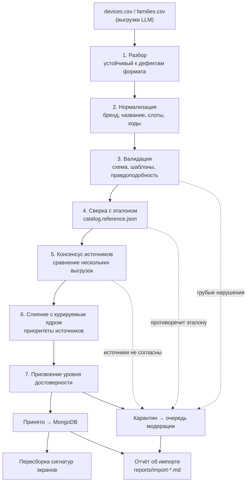
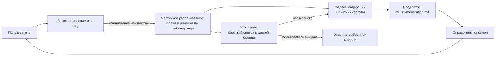

# 14. Приём справочника из CSV и наполнение базы данных

## 14.1. Исходная ситуация и главный риск

Первичное наполнение справочника формируется запросом к сторонней языковой модели с выгрузкой в CSV. Это решение принято, и задача — обработать такой CSV и загрузить его в базу.

Риск нужно назвать прямо, потому что он определяет всю конструкцию этого раздела: **языковая модель выдаёт правдоподобные, а не проверенные данные.** Она уверенно назовёт несуществующий сервисный код, укажет eSIM у устройства без eSIM и сошлётся на несуществующую страницу вендора. При этом критерий К1 (вес 0,40) проверяется на контрольной выборке заказчика и служит тай-брейком при равенстве баллов, а по правилам оценки «характеристики, которые не могут быть объективно подтверждены, самостоятельной оценке не подлежат».

Отсюда принцип: **данные из CSV не являются справочником — они являются кандидатами в справочник.** Между CSV и ответом пользователю стоит конвейер проверки, тарификация достоверности и модерация. Ни одна строка не начинает влиять на ответы пользователю только потому, что она пришла из CSV.

Такой подход даёт и побочную выгоду для оценки: конвейер печатает отчёт с числами, а отчёт — объективно подтверждаемый артефакт, который можно предъявить комиссии вместе с исходным кодом проверок.

## 14.2. Две независимые оси идентификации

Пользователь прямо указал ключевую проблему: имя модели от языковой модели может не соответствовать тому, что приходит в заголовках запроса. Это не дефект конкретной выгрузки, а структурное свойство задачи — в мире устройства называются двумя разными способами:

| Ось | Что это | Откуда берётся в проде | Надёжность данных от LLM |
|---|---|---|---|
| Сервисный код модели | `SM-S928B`, `CPH2451`, `23090RA98G` | Заголовок `Sec-CH-UA-Model` при автоопределении | **Низкая.** Коды выдумываются, путаются между региональными версиями |
| Маркетинговое название | `Galaxy S24 Ultra`, `iPhone 15 Pro` | Пользовательский ввод | Средняя. Названия распространённых моделей модель знает хорошо |

Следствия для конвейера:

1. Записи справочника хранят обе оси независимо; отсутствие одной не блокирует работу другой.
2. Сервисные коды из CSV проходят строгую валидацию по вендорским шаблонам, а непрошедшие — отбрасываются с сохранением остальной записи. Запись без кодов остаётся полезной: она работает в сценарии пользовательского ввода.
3. Достоверный источник сопоставления «код → устройство» — не языковая модель, а реально наблюдаемые значения: эталонная выборка сигналов с устройств команды, значения, накопленные стендом, и вендорские перечни, сверенные вручную. Конвейер CSV лишь предлагает варианты.
4. Псевдонимы и русские написания генерируются нашим кодом по правилам, а не запрашиваются у языковой модели: правила транслитерации детерминированы и покрыты тестами, тогда как список псевдонимов от LLM был бы ещё одним непроверяемым массивом.

## 14.3. Контракт CSV

Формат запроса к сторонней модели и точная схема столбцов — [приложение А](./appendix-a-llm-csv-request.md). Запрашиваются две выгрузки:

- `devices.csv` — построчно по моделям, основной массив;
- `families.csv` — правила уровня линейки (например, «линейка Redmi A, 2019–2025, eSIM отсутствует»), чтобы покрыть длинный хвост бюджетных устройств без перечисления тысяч моделей.

Парсер намеренно устойчив к типовым дефектам выгрузок языковых моделей: символ BOM, обёртка в блок кода Markdown, пояснительный текст до и после таблицы, разделитель `;` вместо `,`, `Да`/`Нет`/`true`/`1` вместо `yes`/`no`, неразрывные пробелы, обрыв строки на середине, повторный заголовок в середине файла, сокращение перечня многоточием. Все отклонения фиксируются в отчёте, а не приводят к падению.

## 14.4. Конвейер обработки



### Шаг 2. Нормализация

Бренд приводится к канону по словарю (`Самсунг`, `SAMSUNG`, `Samsung Electronics` → `samsung`). Маркетинговое название разбирается на слоты — семейство, номер поколения, модификаторы — тем же кодом, что используется для пользовательского ввода (`text-normalizer`, [04-matching-algorithm.md](./04-matching-algorithm.md)). Это важная деталь: справочник и запросы нормализуются одним алгоритмом, поэтому расхождений в написании между ними по построению не возникает. Идентификатор записи формируется детерминированно из бренда и слотов: `samsung-galaxy-s24-ultra`.

### Шаг 3. Валидация

Каждая проверка имеет стабильный код, попадающий в отчёт и в задачу модерации.

| Код | Проверка | Действие при нарушении |
|---|---|---|
| `ENUM_INVALID` | Значения перечислимых полей в допустимом наборе | Карантин строки |
| `BRAND_UNKNOWN` | Бренд есть в словаре известных | Карантин строки |
| `NAME_UNPARSEABLE` | Название разбирается на слоты | Карантин строки |
| `CODE_PATTERN_INVALID` | Сервисный код соответствует шаблону вендора | Код отброшен, строка сохранена |
| `CODE_COLLISION` | Один код не встречается у двух разных устройств | Карантин обеих строк |
| `NAME_COLLISION_CONFLICT` | Дубликаты названия совпадают по статусу eSIM | Слияние либо карантин при конфликте |
| `YEAR_IMPLAUSIBLE` | Год выпуска в диапазоне 2007…текущий+1 | Карантин строки |
| `ESIM_ANACHRONISM` | Не заявлена eSIM у устройства, выпущенного до 2017 года | Карантин строки |
| `APPLE_RULE_CONFLICT` | Для платформы iOS статус не противоречит нашему правилу | Правило приоритетнее, строка помечена |
| `BUDGET_LINE_SUSPICION` | Заявлена eSIM у линейки, где её типично нет | Пометка, задача модерации |
| `SOURCE_MISSING` | Для статуса «поддерживает» указан источник | Уровень достоверности не выше `derived` |
| `IOS_FIELDS_MISSING` | Для iOS заполнен диапазон версий ОС | Дозаполнение из курируемого ядра |

Проверка `ESIM_ANACHRONISM` заслуживает отдельного упоминания: массовая eSIM в смартфонах появилась в 2017–2018 годах, поэтому утверждение о её поддержке у устройства 2015 года — надёжный признак того, что модель придумала данные. Эта проверка отлавливает целый класс галлюцинаций одним условием.

Шаблоны сервисных кодов по вендорам ведутся как данные (`data/catalog/code-patterns.json`), а не константами в коде: `SM-[A-Z]\d{3,4}[A-Z0-9]*` для Samsung, `(CPH|PJ[A-Z])\d{3,4}` для OPPO и OnePlus, `RMX\d{4}` для realme, `V\d{4}[A-Z0-9]*` для vivo, `[A-Z]{3}-[A-Z0-9]{2,6}` для Huawei и Honor, `Pixel .+` для Google.

### Шаг 4. Сверка с эталоном

`data/fixtures/catalog.reference.json` — выборка устройств со статусом eSIM, подтверждённым вручную по вендорским источникам. Конвейер сверяет с ней пересекающиеся строки CSV и выводит долю расхождений.

Это даёт не просто фильтр, а **измеренную оценку качества выгрузки**: если на пересечении с эталоном (скажем, 150 моделей) выгрузка расходится в 4% случаев, разумно ожидать сопоставимую долю ошибок и на остальном массиве. Число попадает в отчёт об импорте и в документацию. Утверждение «данные из языковой модели проверены на контрольной выборке, доля расхождений составила N%» объективно подтверждается исходным кодом проверки и её выводом — в отличие от утверждения «данные корректны».

### Шаг 5. Консенсус источников

Если выгрузка запрошена у двух или трёх разных языковых моделей независимо, конвейер сравнивает их между собой:

| Ситуация | Уровень достоверности |
|---|---|
| Источники согласны по статусу eSIM | `derived` |
| Источники расходятся | Карантин, задача модерации с показом всех вариантов |
| Источник один | `unverified` при отсутствии подтверждения эталоном |

Согласие независимых моделей — не доказательство, но существенно лучший показатель, чем ответ одной модели, и он воспроизводим. Практическая рекомендация: запросить выгрузку у двух-трёх разных моделей. Стоимость для команды — несколько запросов, выигрыш в достоверности данных значительный.

### Шаг 6. Слияние с курируемым ядром

Приоритет источников при конфликте, от высшего к низшему:

1. **Решение модератора** (`data/catalog/overrides/`) — переживает любые повторные импорты.
2. **Курируемое ядро** (`data/catalog/curated/`) — записи, сверенные вручную.
3. **Детерминированные правила** — например, правило Apple: iPhone XR, XS, XS Max и новее, а также SE 2-го и 3-го поколений поддерживают eSIM; iPhone X и старше — нет.
4. **Импорт из CSV.**

Для Apple и Google Pixel языковая модель практически не нужна: перечни короткие, правила простые, проверяются вручную за считанные минуты. Основную пользу CSV приносит на длинном хвосте Android, где моделей тысячи.

### Шаг 7. Уровни достоверности

| Уровень | Как присваивается | Влияние на ответ пользователю |
|---|---|---|
| `verified` | Курируемое ядро, детерминированное правило либо подтверждение модератором со ссылкой на источник | Однозначный ответ, полная уверенность |
| `derived` | Прошло валидацию и согласовано между источниками либо не противоречит эталону | Однозначный ответ с пониженной уверенностью |
| `unverified` | Единственный источник, валидация пройдена, подтверждения нет | В ответах не участвует: устройство определяется, но статус eSIM уходит в уточнение |
| `quarantined` | Нарушены проверки | В базу рабочего справочника не попадает, только в очередь модерации |

Управление — параметрами `ALLOW_DERIVED_CATALOG_ANSWERS` (по умолчанию включён) и `ALLOW_UNVERIFIED_CATALOG_ANSWERS` (по умолчанию выключен). Так заказчик управляет балансом «полнота против риска ошибки», не меняя код.

Существенное уточнение по правилам уровня линейки из `families.csv`: они используются для распознавания устройства и сужения набора кандидатов, но самостоятельно дают статус `not_supported` только после подтверждения модератором. Причина в том, что ошибочное «не поддерживает» — такой же ложный результат, как ошибочное «поддерживает», и штрафуется тем же пунктом К1.

## 14.5. Скрипт наполнения базы

Отдельный инструмент командной строки `tools/seed`, не часть запуска API. Подкоманды:

```bash
pnpm seed import --input data/catalog/import/devices.csv --source llm:model-a --dry-run
pnpm seed import --input data/catalog/import/devices.csv --source llm:model-a
pnpm seed consensus --sources llm:model-a,llm:model-b,llm:model-c
pnpm seed load                 # загрузка принятых записей в MongoDB
pnpm seed rebuild-signatures   # пересборка сигнатур экранов
pnpm seed export-overrides     # выгрузка решений модератора в файлы каталога
pnpm seed verify               # сверка базы с эталоном, код возврата для CI
```

Свойства реализации:

- **Режим `--dry-run` обязателен в конвейере CI.** Он печатает отчёт без записи в базу: так изменения справочника видны в pull request до применения.
- **Идемпотентность.** Повторный запуск не создаёт дубликатов и не затирает решения модератора: обновление выполняется по детерминированному идентификатору, слой `overrides` применяется последним.
- **Происхождение данных.** Каждая запись хранит `provenance`: источник, идентификатор партии импорта, дата, уровень достоверности. Всегда можно ответить на вопрос, откуда взялось конкретное утверждение о поддержке eSIM. Это прямой вклад в прозрачность решения по К3.
- **Транзакционность не требуется.** Загрузка построена как идемпотентный upsert, поэтому набор реплик MongoDB для демонстрационного контура не нужен.
- **Автоматический запуск в демонстрационном контуре.** В `docker-compose.yml` загрузка выполняется отдельным разовым шагом до старта API, поэтому `docker compose up` даёт готовый к работе сервис без ручных действий.

## 14.6. Отчёт об импорте

Формируется в `reports/import-<дата>.md` и в машиночитаемом виде. Состав:

- строк разобрано, принято, слито с существующими, отправлено в карантин;
- разбивка карантина по кодам нарушений с примерами строк;
- сколько сервисных кодов отброшено по шаблону, с разбивкой по вендорам;
- результат сверки с эталоном: размер пересечения, число и перечень расхождений, доля расхождений;
- результат консенсуса: согласованные, расходящиеся, покрытые одним источником;
- распределение итоговых записей по уровням достоверности и по брендам;
- сравнение с предыдущим импортом: что добавилось, что изменило статус.

Отчёт — предъявляемый артефакт. Он превращает утверждение «мы обработали данные от языковой модели» в проверяемое описание того, что именно было отброшено и почему.

## 14.7. Что происходит с неизвестным устройством в проде

Замыкание обратной связи, о котором говорил пользователь: новая модель отсутствует в справочнике.



Два момента важны практически. Во-первых, **частичное распознавание**: даже неизвестный код `SM-S9410` по шаблону однозначно опознаётся как Samsung, что позволяет предложить пользователю короткий список актуальных моделей бренда вместо пустого поля ввода. Во-вторых, **счётчик частоты**: задачи модерации сортируются по числу обращений, поэтому специалист сначала закрывает пробелы, затрагивающие наибольшее число пользователей.

## 14.8. Открытый вопрос по объёму выгрузки

Формулировки запросов к языковой модели, разбивка на партии по брендам и ограничения на размер ответа — [приложение А](./appendix-a-llm-csv-request.md). Ключевая рекомендация к формулировке: требовать значение `unknown` вместо предположения и запрещать выдумывать сервисные коды и ссылки. Модель, которой разрешено отвечать «не знаю», даёт существенно меньше ложных утверждений, а пробелы мы закрываем модерацией.
