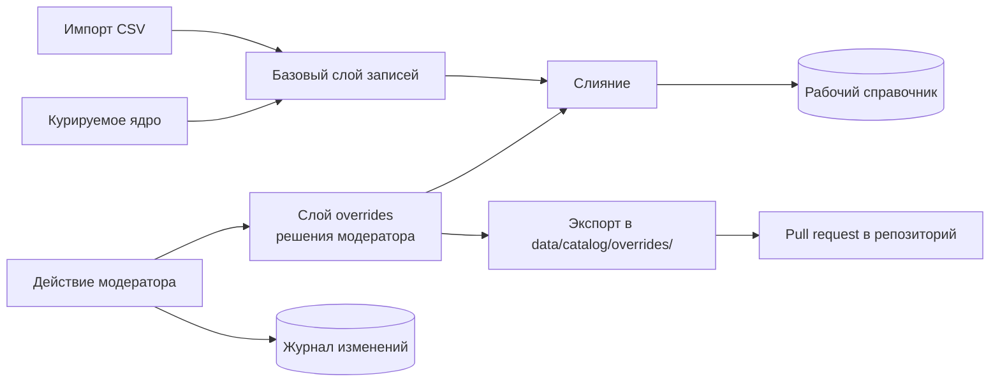

# 15. Модерация и пополнение справочника

## 15.1. Зачем это в объёме работ

Изначально административный интерфейс был исключён из объёма (ограничение О-11). Решение пересмотрено по двум причинам.

Первая — содержательная: любой справочник устройств устаревает с выходом новых моделей, и без процедуры пополнения решение остаётся демонстрационным прототипом, а не сервисом. Худший сценарий — пользователь с моделью, отсутствующей в справочнике — не исключение, а регулярное событие.

Вторая — процедурная. По правилам оценки учитываются только характеристики, подтверждаемые демонстрацией на стенде, контрольными сценариями, документацией или исходным кодом. Описанный на словах, но не предъявляемый процесс модерации «самостоятельной оценке не подлежит». Поэтому модерация реализуется как работающий интерфейс на демонстрационном контуре, а не как раздел документации.

## 15.2. Что попадает в очередь

Единая очередь `moderation_tasks` с типизированными задачами. Единая — сознательно: у специалиста одно рабочее место, а не четыре разных экрана.

| Тип задачи                 | Источник                                                                | Что видит модератор                                                              |
| -------------------------- | ----------------------------------------------------------------------- | -------------------------------------------------------------------------------- |
| `unknown_model_code`       | Автоопределение получило `Sec-CH-UA-Model`, отсутствующий в справочнике | Код, распознанный по шаблону бренд, число обращений, похожие коды из справочника |
| `unknown_screen_signature` | Сигнатура экрана iOS не найдена                                         | Сигнатура, версия iOS, ближайшие известные сигнатуры                             |
| `unmatched_query`          | Текстовый запрос не сопоставлен ни с одним устройством                  | Исходный и нормализованный вид запроса, ближайшие кандидаты с оценками           |
| `ambiguous_query`          | Запрос устойчиво уходит в уточнение                                     | Запрос и конкурирующие кандидаты — сигнал, что нужен новый псевдоним             |
| `csv_quarantine`           | Строка выгрузки не прошла валидацию при импорте                         | Строка, коды нарушений, значения из разных источников при расхождении            |
| `source_disagreement`      | Источники выгрузки противоречат друг другу                              | Все варианты статуса eSIM с указанием источника                                  |
| `user_feedback`            | Пользователь сообщил о неверном результате                              | Ответ сервиса, сигналы, комментарий пользователя                                 |

Задачи дедуплицируются: повторное обращение увеличивает счётчик, а не создаёт новую запись. Очередь по умолчанию отсортирована по числу обращений — специалист закрывает пробелы, затрагивающие наибольшее число пользователей, первыми.

## 15.3. Подсказки модератору

Ручная работа сокращается автоматическими предложениями, и это существенно для практической применимости:

- **По сервисному коду.** Неизвестный `SM-S9280` сопоставляется по префиксу с известным `SM-S928B`, поэтому система предлагает готовый вариант «добавить код к записи Galaxy S24 Ultra» — решение в один клик вместо заполнения формы.
- **По названию.** Для несопоставленного запроса показываются ближайшие кандидаты с оценками и указанием, какое именно жёсткое ограничение не выполнилось: часто нужно просто добавить псевдоним, а не создавать устройство.
- **По сигнатуре экрана.** Показываются известные сигнатуры с наименьшим отличием: обычно это включённый пользователем режим увеличенного экрана, и достаточно отметить сигнатуру как масштабированный вариант существующей модели.
- **Заготовка записи.** При создании нового устройства форма предзаполняется разбором названия на слоты и данными из карантина CSV, если они есть.

## 15.4. Действия модератора

| Действие                                               | Результат                                                                                         |
| ------------------------------------------------------ | ------------------------------------------------------------------------------------------------- |
| Привязать код или сигнатуру к существующему устройству | Обновление записи, уровень достоверности `verified`                                               |
| Создать запись устройства                              | Новая запись; поле со ссылкой на источник обязательно для статуса «поддерживает»                  |
| Изменить статус eSIM                                   | Обновление с сохранением предыдущего значения в журнале                                           |
| Добавить псевдоним или синоним                         | Пополнение словаря, применяется без перезапуска                                                   |
| Подтвердить или отклонить строку карантина             | Перевод в справочник либо окончательное отклонение с причиной                                     |
| Отметить «не телефон»                                  | Устройство классифицируется как планшет, часы, ТВ-приставка — исключается из телефонного сценария |
| Отклонить задачу                                       | Закрытие без изменений с указанием причины                                                        |

Обязательное правило: **статус `verified` присваивается только при указании ссылки на источник.** Без источника максимум — `derived`. Это то же требование, что предъявляется к импортируемым данным, и оно распространяется на людей так же, как на автоматику.

## 15.5. Сохранение решений при повторных импортах

Ключевое техническое требование: решение модератора не должно затираться следующей загрузкой CSV.

Решения хранятся отдельным слоем `overrides` и применяются последними, поверх всех остальных источников. Порядок приоритетов — в [14-catalog-ingestion.md](./14-catalog-ingestion.md), раздел «Слияние с курируемым ядром».

Отдельно предусмотрен экспорт слоя решений в файлы каталога (`pnpm seed export-overrides`). Это сохраняет принцип «источник истины — репозиторий» (ADR-006): работа модератора на стенде превращается в файлы, попадающие в репозиторий обычным pull request. Иначе знания жили бы только в базе конкретного экземпляра и терялись при развёртывании нового.

## 15.6. Журнал изменений

Каждое действие пишется в `catalog_changes`: кто, когда, какая задача, какое поле, предыдущее и новое значение, указанный источник, комментарий. Журнал доступен только для чтения и служит двум целям — разбор ошибочных правок и демонстрация комиссии того, что процесс существует и оставляет след.

## 15.7. Интерфейс

Отдельный раздел `/admin` демонстрационного приложения, русскоязычный, за простой авторизацией по токену (`ADMIN_TOKEN`), с закрытым по умолчанию доступом при пустом значении токена.

Экраны: очередь задач с фильтрами по типу и сортировкой по частоте; карточка задачи с подсказками и действиями в один клик; поиск и редактирование записи справочника; журнал изменений; сводка состояния справочника (число записей по брендам и уровням достоверности, дата последнего импорта, размер очереди).

Объём интерфейса намеренно ограничен: это рабочий инструмент технического специалиста, а не полноценная система управления данными. Оценивается наличие работающего процесса, а не богатство административной панели.

## 15.8. Эндпоинты модерации

Отдельная группа в API, требующая токена администратора; в спецификации OpenAPI выделена в отдельный тег.

| Метод и путь                                       | Назначение                                              |
| -------------------------------------------------- | ------------------------------------------------------- |
| `GET /api/v1/admin/moderation/tasks`               | Очередь с фильтрами, сортировкой и постраничной выдачей |
| `GET /api/v1/admin/moderation/tasks/{id}`          | Задача с автоматическими подсказками                    |
| `POST /api/v1/admin/moderation/tasks/{id}/resolve` | Применение решения                                      |
| `POST /api/v1/admin/devices`                       | Создание записи устройства                              |
| `PATCH /api/v1/admin/devices/{id}`                 | Изменение записи (пишется в слой `overrides`)           |
| `POST /api/v1/admin/aliases`                       | Добавление псевдонима                                   |
| `GET /api/v1/admin/changes`                        | Журнал изменений                                        |
| `GET /api/v1/admin/catalog/stats`                  | Сводка состояния справочника                            |
| `POST /api/v1/admin/catalog/reload`                | Перечитывание кэша справочника без перезапуска          |

## 15.9. Демонстрационный сценарий

Сценарий для показа комиссии, выполняемый на стенде целиком и подтверждающий работу цикла пополнения:

1. Запрос к сервису с сервисным кодом устройства, отсутствующего в справочнике, — сервис отвечает `clarification_required`, распознав бренд, и не выдаёт догадку.
2. В очереди модерации появляется задача с этим кодом и счётчиком обращений.
3. Специалист видит подсказку с похожим кодом, указывает источник и подтверждает привязку.
4. Повторный запрос с тем же кодом — сервис отвечает однозначно, уровень достоверности `verified`.
5. В журнале изменений видна запись о правке; экспорт даёт файл для pull request.

Сценарий занимает около минуты и показывает три вещи одновременно: отсутствие ложных ответов на неизвестных данных, работоспособность модерации и сохранение знаний в репозитории.
