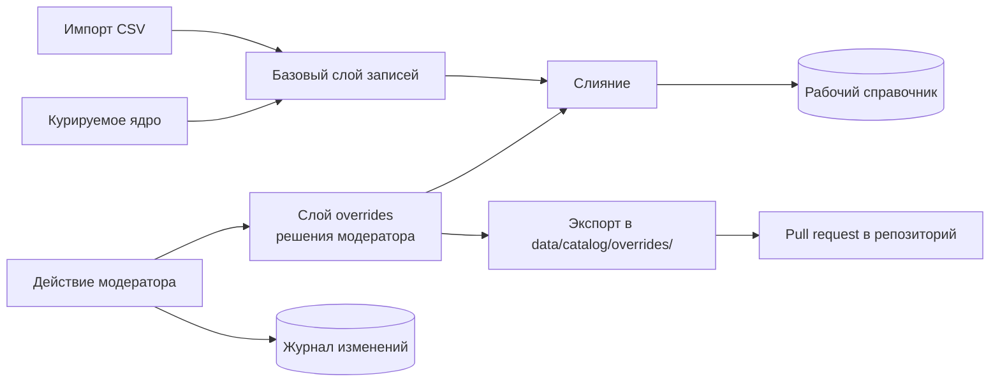

# 15. Модерация и пополнение справочника

## 15.1. Зачем это в объёме работ

Изначально административный интерфейс был исключён из объёма (ограничение О-11). Решение пересмотрено по двум причинам.

Первая — содержательная: любой справочник устройств устаревает с выходом новых моделей, и без процедуры пополнения решение остаётся демонстрационным прототипом, а не сервисом. Худший сценарий — пользователь с моделью, отсутствующей в справочнике — не исключение, а регулярное событие.

Вторая — процедурная. По правилам оценки учитываются только характеристики, подтверждаемые демонстрацией на стенде, контрольными сценариями, документацией или исходным кодом. Описанный на словах, но не предъявляемый процесс модерации «самостоятельной оценке не подлежит». Поэтому модерация реализуется как работающий интерфейс на демонстрационном контуре, а не как раздел документации.

## 15.2. Что попадает в очередь

Единая очередь `moderation_tasks` с типизированными задачами. Единая — сознательно: у специалиста одно рабочее место, а не четыре разных экрана.

| Тип задачи                 | Источник                                                                | Что видит модератор                                                              |
| -------------------------- | ----------------------------------------------------------------------- | -------------------------------------------------------------------------------- |
| `unknown_model_code`       | Автоопределение получило `Sec-CH-UA-Model`, отсутствующий в справочнике | Код, распознанный по шаблону бренд, число обращений, похожие коды из справочника |
| `unknown_screen_signature` | Сигнатура экрана iOS не найдена                                         | Сигнатура, версия iOS, ближайшие известные сигнатуры                             |
| `unmatched_query`          | Текстовый запрос не сопоставлен ни с одним устройством                  | Исходный и нормализованный вид запроса, ближайшие кандидаты с оценками           |
| `ambiguous_query`          | Запрос устойчиво уходит в уточнение                                     | Запрос и конкурирующие кандидаты — сигнал, что нужен новый псевдоним             |
| `csv_quarantine`           | Строка выгрузки не прошла валидацию при импорте                         | Строка, коды нарушений, значения из разных источников при расхождении            |
| `source_disagreement`      | Источники выгрузки противоречат друг другу                              | Все варианты статуса eSIM с указанием источника                                  |
| `user_feedback`            | Пользователь сообщил о неверном результате                              | Ответ сервиса, сигналы, комментарий пользователя                                 |

Задачи дедуплицируются: повторное обращение увеличивает счётчик, а не создаёт новую запись. Очередь по умолчанию отсортирована по числу обращений — специалист закрывает пробелы, затрагивающие наибольшее число пользователей, первыми.

## 15.3. Подсказки модератору

Ручная работа сокращается автоматическими предложениями, и это существенно для практической применимости:

- **По сервисному коду.** Неизвестный `SM-S9280` сопоставляется по префиксу с известным `SM-S928B`, поэтому система предлагает готовый вариант «добавить код к записи Galaxy S24 Ultra» — решение в один клик вместо заполнения формы.
- **По названию.** Для несопоставленного запроса показываются ближайшие кандидаты с оценками и указанием, какое именно жёсткое ограничение не выполнилось: часто нужно просто добавить псевдоним, а не создавать устройство.
- **По сигнатуре экрана.** Показываются известные сигнатуры с наименьшим отличием: обычно это включённый пользователем режим увеличенного экрана, и достаточно отметить сигнатуру как масштабированный вариант существующей модели.
- **Заготовка записи.** При создании нового устройства форма предзаполняется разбором названия на слоты и данными из карантина CSV, если они есть.

## 15.4. Действия модератора

| Действие                                               | Результат                                                                                                    |
| ------------------------------------------------------ | ------------------------------------------------------------------------------------------------------------ |
| Привязать код или сигнатуру к существующему устройству | Обновление записи, уровень достоверности `verified`                                                          |
| Создать запись устройства                              | Новая запись; поле со ссылкой на источник обязательно для статуса «поддерживает»                             |
| Изменить статус eSIM                                   | Обновление с сохранением предыдущего значения в журнале                                                      |
| Добавить псевдоним или синоним                         | Пополнение словаря, применяется без перезапуска                                                              |
| Подтвердить или отклонить строку карантина             | Добавление псевдонима существующему устройству (см. уточнение ниже) либо окончательное отклонение с причиной |
| Отметить «не телефон»                                  | Устройство классифицируется как планшет, часы, ТВ-приставка — исключается из телефонного сценария            |
| Отклонить задачу                                       | Закрытие без изменений с указанием причины                                                                   |

Обязательное правило: **статус `verified` присваивается только при указании ссылки на источник.** Без источника максимум — `derived`. Это то же требование, что предъявляется к импортируемым данным, и оно распространяется на людей так же, как на автоматику.

**Реализация правила о `verified` (ADR-044).** Ссылку на источник несёт отдельное поле решения (`sourceUrl`/`sourceTitle` в `.../resolve`, `sources[]` в `PATCH /api/v1/admin/devices/{id}`), а не текст обоснования (`reason`, он идёт в журнал §15.6). Правило проверяется в единственной точке записи (`CatalogWriteService`), поэтому распространяется на все действия сразу: решение, поднимающее уровень до `verified` без ссылки, отклоняется с кодом 400, а ссылка добавляется к уже известным источникам записи, не заменяя их. Действие привязки БЕЗ ссылки выполняется — код или сигнатура привязывается, устройство перестаёт быть неизвестным, — но уровень достоверности не меняется: «без источника максимум `derived`» прочитано как запрет повышать уверенность, а не как запрет применять решение.

**Уточнение фактического поведения «Подтвердить строку карантина» (docs/09-decisions.md ADR-047 п.3).** `csv_quarantine` несёт только `code`/`source`/`batchId`/`lineNumber`/`detail`/`rawBrand?`/`rawMarketingName?` (§15.2, форма `moderation_tasks` ниже) — не платформу, не статус eSIM, не источник. Полноценный «перевод в справочник» (создание НОВОЙ записи `Device` из строки карантина) этими данными не реализуем без догадки об остальных полях, поэтому `confirm_quarantine` буквально добавляет распознанное маркетинговое название строки (`rawMarketingName`) как псевдоним к УЖЕ существующему устройству, указанному специалистом (`deviceId`), — тот же механизм, что «Добавить псевдоним или синоним» (следующая строка таблицы), но с отдельным кодом действия в журнале (`confirm_quarantine`, а не `add_alias`). Строка карантина без распознанного названия (например, `FIELD_COUNT_MISMATCH`, где само название не разобралось) этим действием подтверждена быть не может — сервер отклоняет запрос с понятным сообщением, специалист использует «Отклонить строку карантина». Если строка карантина требует ПОЛНОЦЕННОГО заведения новой модели — путь для этого уже существует: «Создать запись устройства» (первая строка ниже по факту действий, `POST /api/v1/admin/devices`) с параметром `resolvesTaskId`, закрывающим задачу автоматически.

**Реализация этапа 7 (`POST /api/v1/admin/moderation/tasks/{id}/resolve`, `ModerationResolutionService`).** Семь строк таблицы выше сведены к машиночитаемым кодам `action`, проверяемым против `kind` задачи: `link_model_code` и `link_screen_signature` — привязка (первая строка); `confirm_quarantine`/`reject_quarantine` — пятая строка; `resolve_source_disagreement` — «изменить статус eSIM» применительно к задаче расхождения источников; `acknowledge_feedback` — рассмотрение `user_feedback`, с опциональным изменением статуса устройства тем же механизмом, что и `resolve_source_disagreement`; `reject` — универсальное закрытие без изменений (последняя строка), применимо к задаче любого типа. Добавление псевдонима/синонима (`POST /api/v1/admin/aliases`) и правка произвольного набора полей (`PATCH /api/v1/admin/devices/{id}`) — отдельные действия, не привязанные к конкретной задаче очереди.

**Журнал `catalog_changes` пишется КАЖДЫМ из семи кодов действий, включая те, что не касаются записи `devices` (docs/09-decisions.md ADR-047 п.1).** `reject` пишет запись с `action: "reject_task"`, `confirm_quarantine`/`reject_quarantine` — со своими одноимёнными кодами (а не переиспользуют `add_alias`/ничего) — все три кода объявлены схемой `catalog_changes` (§15.6) с этапа 7 (ADR-043 п.2), но реально не записывались до этой правки.

## 15.5. Сохранение решений при повторных импортах

Ключевое техническое требование: решение модератора не должно затираться следующей загрузкой CSV.

Решения хранятся отдельным слоем `overrides` и применяются последними, поверх всех остальных источников. Порядок приоритетов — в [14-catalog-ingestion.md](./14-catalog-ingestion.md), раздел «Слияние с курируемым ядром».

Отдельно предусмотрен экспорт слоя решений в файлы каталога (`pnpm seed export-overrides`). Это сохраняет принцип «источник истины — репозиторий» (ADR-006): работа модератора на стенде превращается в файлы, попадающие в репозиторий обычным pull request. Иначе знания жили бы только в базе конкретного экземпляра и терялись при развёртывании нового.

## 15.6. Журнал изменений

Каждое действие пишется в `catalog_changes`: кто, когда, какая задача, какое поле, предыдущее и новое значение, указанный источник, комментарий. Журнал доступен только для чтения и служит двум целям — разбор ошибочных правок и демонстрация комиссии того, что процесс существует и оставляет след.

## 15.7. Интерфейс

Отдельный раздел `/admin` демонстрационного приложения, русскоязычный, за простой авторизацией по токену (`ADMIN_TOKEN`), с закрытым по умолчанию доступом при пустом значении токена.

Экраны: очередь задач с фильтрами по типу и сортировкой по частоте; карточка задачи с подсказками и действиями в один клик; поиск и редактирование записи справочника; журнал изменений; сводка состояния справочника (число записей по брендам и уровням достоверности, дата последнего импорта, размер очереди, число записей `screen_signatures` в кэше); стенд оценки качества; справка модератора.

Объём интерфейса намеренно ограничен: это рабочий инструмент технического специалиста, а не полноценная система управления данными. Оценивается наличие работающего процесса, а не богатство административной панели.

**Число сигнатур экрана в сводке (ADR-045).** Добавлено к перечисленным показателям: ноль сигнатур при непустом справочнике — незавершённая операционная процедура (`pnpm seed rebuild-signatures` не выполнялся либо кэш не перечитан, docs/07 §7.6), при которой сервис отвечает и остаётся готовым, а ветка iOS молча теряет сужение по геометрии экрана. Раньше это состояние нельзя было увидеть ни в интерфейсе, ни через `GET /health/ready` — только запросом к MongoDB напрямую. При нулевом значении сводка показывает предупреждение с указанием обеих команд.

**Поле ссылки на источник (ADR-044).** Показывается для каждого действия, меняющего справочник, а не только для «изменить статус eSIM»: без него пункт 3 сценария §15.9 («указывает источник и подтверждает привязку») был невыполним буквально — оставалось вписать ссылку в обоснование, которое источником не считается. Поле обоснования помечено обязательным в разметке формы: пустое значение сервер отклоняет, и модератор узнаёт об этом до отправки.

**Реализация этапа 7 (`apps/web/src/admin`).** Экраны реализованы как вкладки одной страницы `/admin` (React-состояние, без роутера — тот же приём, что и `/debug`, docs/07 §7.6), под общей формой входа по токену (проверяется реальным запросом к `GET /api/v1/admin/catalog/stats`, а не локальной эвристикой формата строки). Вкладки: очередь, поиск устройств, журнал, сводка, **«Стенд оценки»** (запуск с подтверждением, прогресс, список прогонов, скачивание `.md`), **«Справка»** — связный текст для модератора (без ссылок на `docs/*`); в таблице очереди типы задач и статусы подписаны по-русски, колонка «Когда» показывает `lastSeenAt` (`toLocaleString('ru-RU')`); на «Сводке» — инструкция, когда нужны `pnpm seed load` / `rebuild-signatures` (только массовый переимпорт CSV) и когда не нужны (обычная модерация), плюс подтверждение перед «Перечитать кэш». Тексты экрана написаны этим агентом и не прошли согласование пользователем одним проходом (ADR-025 п.3, docs/13-branding.md §13.5) — раздел не существовал на момент утверждения §13.5/§13.6, тот же прецедент, что и у технических подписей стенда `/debug`.

## 15.8. Эндпоинты модерации

Отдельная группа в API, требующая токена администратора; в спецификации OpenAPI выделена в отдельный тег.

| Метод и путь                                       | Назначение                                                                     |
| -------------------------------------------------- | ------------------------------------------------------------------------------ |
| `GET /api/v1/admin/moderation/tasks`               | Очередь с фильтрами, сортировкой и постраничной выдачей                        |
| `GET /api/v1/admin/moderation/tasks/{id}`          | Задача с автоматическими подсказками                                           |
| `POST /api/v1/admin/moderation/tasks/{id}/resolve` | Применение решения                                                             |
| `POST /api/v1/admin/devices`                       | Создание записи устройства                                                     |
| `PATCH /api/v1/admin/devices/{id}`                 | Изменение записи (пишется в слой `overrides`)                                  |
| `POST /api/v1/admin/aliases`                       | Добавление псевдонима                                                          |
| `GET /api/v1/admin/changes`                        | Журнал изменений                                                               |
| `GET /api/v1/admin/catalog/stats`                  | Сводка состояния справочника                                                   |
| `POST /api/v1/admin/catalog/reload`                | Перечитывание кэша справочника без перезапуска                                 |
| `GET /api/v1/admin/devices?q=`                     | Поиск записи справочника подстрокой (для привязки/редактирования, экран §15.7) |
| `GET /api/v1/admin/devices/{id}`                   | Карточка записи справочника                                                    |
| `POST /api/v1/admin/eval/runs`                     | Старт прогона стенда оценки (асинхронно; `409`, если уже идёт)                 |
| `GET /api/v1/admin/eval/runs`                      | Список прошлых прогонов (дата, статус, сводка)                                 |
| `GET /api/v1/admin/eval/runs/{id}`                 | Статус и прогресс прогона                                                      |
| `GET /api/v1/admin/eval/runs/{id}/report`          | Скачать Markdown-отчёт                                                         |

**Реализация этапа 7 (docs/09-decisions.md ADR-043).** `POST /api/v1/admin/catalog/reload` перечитывает ОБА кэша, читающих MongoDB в `onModuleInit` — справочник (`devices`+`catalog_overrides`) и производную коллекцию `screen_signatures`. Полная пересборка `screen_signatures` из ВСЕХ `devices` остаётся операцией `tools/seed rebuild-signatures` (docs/14 §14.5) — она не входит в этот эндпоинт: он лишь заставляет `apps/api` перечитать то, что уже лежит в MongoDB. Точечное действие «привязать сигнатуру» (§15.4) пересобирает и перечитывает затронутую запись `screen_signatures` САМО, в рамках одного запроса `.../resolve` — вызывать `/catalog/reload` дополнительно не требуется.

**Стенд оценки (ADR-049).** Прогон из вкладки «Стенд оценки» пишет документ в `eval_runs` и в фоне вызывает параметризованный `tools/eval` на loopback с админ-токеном; отчёт — поле документа, не файл на диске Render. Параллельно один `running`: повторный `POST` — `409 EVAL_RUN_IN_PROGRESS`. Seed из админки не вызывается: после точечной модерации `pnpm seed load` / `rebuild-signatures` не нужны (решения в `catalog_overrides`); пара команд — только после массового переимпорта CSV мимо `/admin`, затем «Перечитать кэш» на «Сводке» (с подтверждением).

## 15.9. Демонстрационный сценарий

Сценарий для показа комиссии, выполняемый на стенде целиком и подтверждающий работу цикла пополнения:

1. Запрос к сервису с сервисным кодом устройства, отсутствующего в справочнике, — сервис отвечает `clarification_required`, распознав бренд, и не выдаёт догадку.
2. В очереди модерации появляется задача с этим кодом и счётчиком обращений.
3. Специалист видит подсказку с похожим кодом, указывает источник и подтверждает привязку.
4. Повторный запрос с тем же кодом — сервис отвечает однозначно, уровень достоверности `verified`.
5. В журнале изменений видна запись о правке; экспорт даёт файл для pull request.

Сценарий занимает около минуты и показывает три вещи одновременно: отсутствие ложных ответов на неизвестных данных, работоспособность модерации и сохранение знаний в репозитории.

**Вторая ветка сценария — iOS, тип задачи `unknown_screen_signature` (этап 7, docs/09-decisions.md ADR-043).** Та же последовательность, но с сигнатурой экрана вместо сервисного кода: запрос с незнакомой сигнатурой (`screen: { width, height, dpr }`) → `SCREEN_SIGNATURE_UNKNOWN`, широкий список кандидатов по правилу версии ОС → задача `unknown_screen_signature` в очереди → специалист привязывает сигнатуру к конкретному устройству со ссылкой на источник (действие `link_screen_signature`) → повторный запрос с ТЕМИ ЖЕ сигналами возвращает `SCREEN_SIGNATURE_MATCHED` и суженную группу кандидатов, а не прежний широкий список. Эта ветка — единственная проверка того, что решение по пункту 8 передачи (перечитывание `screen_signatures`, ADR-043) действительно применяется без перезапуска: первая ветка (сервисный код) проверяет только `devices`/`catalog_overrides`, а производная коллекция `screen_signatures` читается отдельным кэшем (`ScreenSignatureService`) и требует отдельной проверки.
